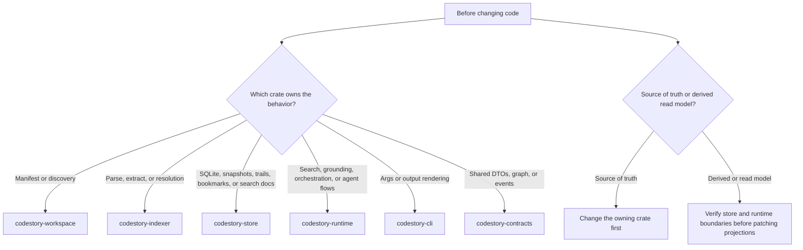

# Contributor Setup

## First Commands

Run these from the repo root:

```sh
cargo fmt --check
cargo check
cargo test -p codestory-cli
```

Run them serially. This workspace shares Cargo build locks.

If you touch graph extraction or semantic resolution, plan to run the fidelity suites from the testing matrix before you finish.
If you touch runtime search, grounding, or repo-scale indexing behavior, check the testing matrix before you finish so you know whether the repo-scale runtime gate is required or can be deferred on a memory-constrained machine.

## First CLI Loop

After the basic cargo checks, verify the shipped CLI flow with the built binary instead of `cargo run`:

```sh
cargo build --release -p codestory-cli
./target/release/codestory-cli setup embeddings --project . --dry-run
./target/release/codestory-cli index --project . --refresh auto
./target/release/codestory-cli ready --project . --goal local
./target/release/codestory-cli ground --project . --why
./target/release/codestory-cli files --project . --limit 20
./target/release/codestory-cli doctor --project .
```

On Windows PowerShell, use `.\target\release\codestory-cli.exe`.

Read commands default to `--refresh none`. If a read command says the cache is empty, either run `index --refresh full` first or rerun the read command with an explicit refresh mode.
The first loop above exercises local navigation only. Agent-facing `packet` and
`search` evidence require full retrieval sidecars; prepare the sidecar lane
below before treating those commands as product-quality proof.

## Hybrid Retrieval Setup

Use the managed full-sidecar path before debugging ranking quality:

- managed real-model setup: `node scripts/setup-retrieval-env.mjs --fetch-embed-model`, then `codestory-cli retrieval bootstrap --project .`
- default symbol-doc scope: durable symbols only; set `CODESTORY_SEMANTIC_DOC_SCOPE=all` when you intentionally need the broad all-symbol diagnostic symbol-doc set
- default dense policy: `graph_first_v1` embeds only selected dense anchors; private trivial code remains searchable through symbol docs, lexical source, and graph expansion
- default semantic alias mode: compact aliases; set `CODESTORY_SEMANTIC_DOC_ALIAS_MODE=no_alias` or `current_alias` only when reproducing benchmark rows
- embedding throughput tuning: `CODESTORY_LLM_DOC_EMBED_BATCH_SIZE` and local llama.cpp sidecar settings

Hash embeddings, ONNX-only flows, and lexical-only switches are diagnostic or
historical comparison modes only; they are not valid agent-facing retrieval
setup.

After bootstrap, run a target-repo sidecar index before using packet/search:

```sh
./target/release/codestory-cli index --project . --refresh full
./target/release/codestory-cli retrieval index --project . --refresh full
./target/release/codestory-cli retrieval status --project . --format json
./target/release/codestory-cli ready --project . --goal agent
```

`index`, `ground`, `search`, `context`, and `doctor` report the active retrieval mode plus any degraded-state reason when retrieval state is available, so confirm that output before assuming the ranking logic regressed. Agent-facing retrieval requires `retrieval_mode=full`.

## Recommended Reading Order

Build a mental model in this order before editing the biggest implementation paths:

1. [README](../../README.md)
2. [Architecture overview](../architecture/overview.md)
3. [Runtime execution path](../architecture/runtime-execution-path.md)
4. [Indexing pipeline](../architecture/indexing-pipeline.md)
5. the subsystem page for the owning crate
6. [Debugging guide](debugging.md)
7. [Testing matrix](testing-matrix.md)

## Mental Model

Before changing code, answer these two questions:

1. Which crate owns the behavior?
2. Is the change source-of-truth logic or a derived/read-model concern?



Use this mapping:

- manifest or discovery issue: `codestory-workspace`
- parse, extract, or resolution issue: `codestory-indexer`
- SQLite, snapshots, trails, bookmarks, or search docs: `codestory-store`
- search ranking, grounding, orchestration, or agent flows: `codestory-runtime`
- args or output rendering: `codestory-cli`
- shared DTOs or graph/event types: `codestory-contracts`

## Before Large Changes

Read these pages first:

- `docs/architecture/overview.md`
- `docs/architecture/runtime-execution-path.md`
- `docs/architecture/indexing-pipeline.md`
- the subsystem page for the owning crate
- `docs/contributors/debugging.md`
- `docs/contributors/testing-matrix.md`

## Cache And Refresh Notes

- default cache layout: user cache root + hashed project path
- explicit `--cache-dir`: use the exact directory you passed
- `cache identity`: reports the root-derived project id, canonical repository id, Git remote/tree freshness input, cache schema version, and portable-reuse eligibility without changing cache files
- Child worktree reuse: run `codestory-cli cache rehydrate --from-project <main-or-parent-worktree> --project <child-worktree>` before the first child-thread index. The command copies the source CodeStory cache only when both worktrees are clean, share the same `origin` URL, have the same Git tree, the source SQLite schema matches the running CLI, and the target cache directory is empty.
- Rehydrated caches reuse path-bound SQLite graph/search/doc rows under the child worktree path, then invalidate copied index artifact cache rows and retrieval manifests. Run the printed `index --refresh full` and `retrieval index --refresh full` commands so those surfaces rebuild under the child worktree identity.
- If `cache rehydrate` reports `skipped`, use the printed rebuild commands. This is CodeStory cache reuse only; it does not configure Rust compilation caching such as `sccache`.
- `index --refresh auto`: chooses full on an empty cache and incremental after that
- `ground`, `search`, `context`, `symbol`, `trail`, `snippet`, `query`, `explore`, `serve`: default to `--refresh none`
- `drill`: defaults to `--refresh full` so report bundles are mechanically fresh
- `drill --jobs N` and `drill-suite --jobs N`: only use workers with `--refresh none`; refresh/indexing runs stay serialized
- use `--refresh full` after deleting the cache directory, after schema-affecting changes, or when stale state is suspected
