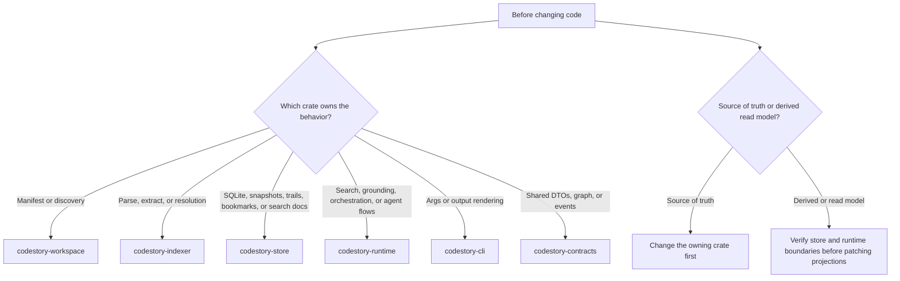

# Contributor Setup

## First Commands

Run these from the repo root:

```powershell
cargo fmt --check
cargo check
cargo test
```

Run them serially. This workspace shares Cargo build locks.

## Mental Model

Before changing code, answer these two questions:

1. Which crate owns the behavior?
2. Is the change source-of-truth logic or a derived/read-model concern?



Use this mapping:

- manifest or discovery issue: `codestory-workspace`
- parse, extract, or resolution issue: `codestory-indexer`
- SQLite, snapshots, trails, bookmarks, or search docs: `codestory-store`
- search ranking, grounding, orchestration, or agent flows: `codestory-runtime`
- args or output rendering: `codestory-cli`
- shared DTOs or graph/event types: `codestory-contracts`

## Before Large Changes

Read these pages first:

- `docs/architecture/overview.md`
- `docs/architecture/invariants.md`
- the subsystem page for the owning crate
- `docs/contributors/testing-matrix.md`
