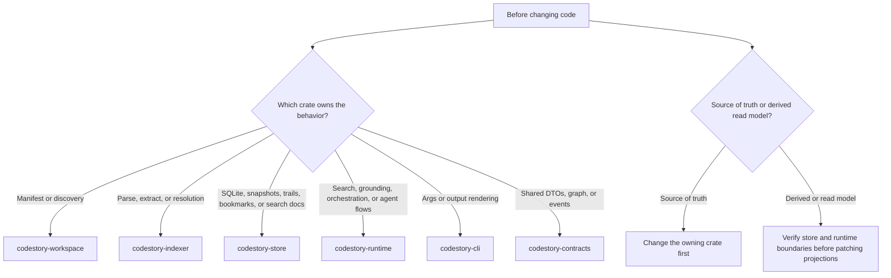

# Contributor Setup

## First Commands

Run these from the repo root:

```powershell
cargo fmt --check
cargo check
cargo test -p codestory-cli
```

Run them serially. This workspace shares Cargo build locks.

If you touch graph extraction or semantic resolution, plan to run the fidelity suites from the testing matrix before you finish.
If you touch runtime search, grounding, or repo-scale indexing behavior, check the testing matrix before you finish so you know whether the repo-scale runtime gate is required or can be deferred on a memory-constrained machine.

## First CLI Loop

After the basic cargo checks, verify the shipped CLI flow with the built binary instead of `cargo run`:

```powershell
cargo build --release -p codestory-cli
.\target\release\codestory-cli.exe index --project . --refresh auto
.\target\release\codestory-cli.exe search --project . --query WorkspaceIndexer
```

Read commands default to `--refresh none`. If a read command says the cache is empty, either run `index --refresh full` first or rerun the read command with an explicit refresh mode.

## Hybrid Retrieval Setup

Use one of these modes before debugging ranking quality:

- fast local-dev semantic mode: `CODESTORY_EMBED_RUNTIME_MODE=hash`
- local model artifacts: set `CODESTORY_EMBED_MODEL_PATH` to the ONNX model; `CODESTORY_EMBED_TOKENIZER_PATH` defaults to a sibling `tokenizer.json`
- lexical-only mode: `CODESTORY_HYBRID_RETRIEVAL_ENABLED=false`

`index`, `ground`, and `search` report the active retrieval mode plus any fallback reason, so confirm that output before assuming the ranking logic regressed.

## Recommended Reading Order

Build a mental model in this order before editing the biggest implementation paths:

1. [README](../../README.md)
2. [Architecture overview](../architecture/overview.md)
3. [Runtime execution path](../architecture/runtime-execution-path.md)
4. [Indexing pipeline](../architecture/indexing-pipeline.md)
5. the subsystem page for the owning crate
6. [Debugging guide](debugging.md)
7. [Testing matrix](testing-matrix.md)

## Mental Model

Before changing code, answer these two questions:

1. Which crate owns the behavior?
2. Is the change source-of-truth logic or a derived/read-model concern?



Use this mapping:

- manifest or discovery issue: `codestory-workspace`
- parse, extract, or resolution issue: `codestory-indexer`
- SQLite, snapshots, trails, bookmarks, or search docs: `codestory-store`
- search ranking, grounding, orchestration, or agent flows: `codestory-runtime`
- args or output rendering: `codestory-cli`
- shared DTOs or graph/event types: `codestory-contracts`

## Before Large Changes

Read these pages first:

- `docs/architecture/overview.md`
- `docs/architecture/runtime-execution-path.md`
- `docs/architecture/indexing-pipeline.md`
- the subsystem page for the owning crate
- `docs/contributors/debugging.md`
- `docs/contributors/testing-matrix.md`

## Cache And Refresh Notes

- default cache layout: user cache root + hashed project path
- explicit `--cache-dir`: use the exact directory you passed
- `index --refresh auto`: chooses full on an empty cache and incremental after that
- `ground`, `search`, `symbol`, `trail`, `snippet`: default to `--refresh none`
- use `--refresh full` after deleting the cache directory, after schema-affecting changes, or when stale state is suspected
