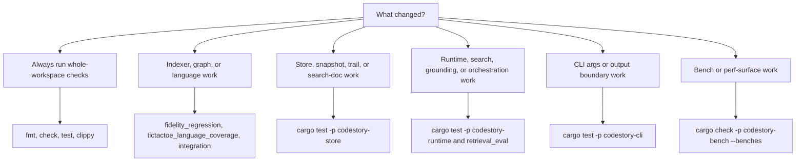

# Testing Matrix



## Whole Workspace

```powershell
cargo fmt --check
cargo check
cargo test
cargo clippy --all-targets -- -D warnings
```

## Indexer And Graph Fidelity

```powershell
cargo test -p codestory-indexer --test fidelity_regression
cargo test -p codestory-indexer --test tictactoe_language_coverage
cargo test -p codestory-indexer --test integration
```

## Store Changes

```powershell
cargo test -p codestory-store
```

## Runtime Changes

```powershell
cargo test -p codestory-runtime
cargo test -p codestory-runtime --test retrieval_eval
```

## CLI Boundary And Output Changes

```powershell
cargo test -p codestory-cli
```

## Bench Surface Checks

```powershell
cargo check -p codestory-bench --benches
```
