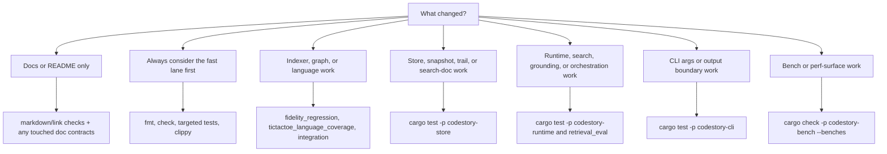

# Testing Matrix

Run Cargo verifications serially in this repo. The workspace shares build locks.



## Whole Workspace

```powershell
cargo fmt --check
cargo check
cargo test
cargo clippy --all-targets -- -D warnings
```

These are the default checks for any contributor change.

## Docs-Only Fast Path

If you only changed `README.md` or `docs/**`, use the smallest credible lane:

```powershell
cargo fmt --check
cargo test -p codestory-cli --test onboarding_contracts
```

Only escalate to broader cargo checks if the doc change depends on new code behavior or command output.

## Indexer And Graph Fidelity

```powershell
cargo test -p codestory-indexer --test fidelity_regression
cargo test -p codestory-indexer --test tictactoe_language_coverage
cargo test -p codestory-indexer --test integration
```

Run these whenever the change affects parsing, extraction, semantic resolution, or graph fidelity.
Use the full test binaries above instead of filtered `cargo test` invocations.

## Store Changes

```powershell
cargo test -p codestory-store
```

## Runtime Changes

```powershell
cargo test -p codestory-runtime
cargo test -p codestory-runtime --test retrieval_eval
```

Run `retrieval_eval` when search or grounding quality may have changed.
The repo-scale runtime integration test is ignored by default because it indexes the full
`codestory` workspace and can exhaust memory on developer machines.
Only run it as an explicit heavy lane:

```powershell
$env:CODESTORY_RUN_REPO_SCALE_TEST = "1"
cargo test -p codestory-runtime --test integration test_repo_scale_call_resolution -- --ignored --nocapture
```

## CLI Boundary And Output Changes

```powershell
cargo test -p codestory-cli
```

Prefer this lane before `cargo test` for the whole workspace when the change is isolated to CLI args, rendering, or contract envelopes.

Runtime-backed CLI fixture flows are a separate heavier lane:

```powershell
cargo test -p codestory-cli --test runtime_backed_flows -- --ignored
```

Run that lane only when the change crosses CLI and runtime behavior together, such as auto-refresh handling or file-filtered symbol resolution.

## Bench Surface Checks

```powershell
cargo check -p codestory-bench --benches
```
