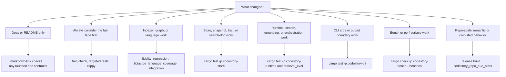

# Testing Matrix

Run Cargo verifications serially in this repo. The workspace shares build locks.



## Whole Workspace

```powershell
cargo fmt --check
cargo check
cargo test
cargo clippy --all-targets -- -D warnings
```

These are the default checks for any contributor change.

## Docs-Only Fast Path

If you only changed `README.md` or `docs/**`, use the smallest credible lane:

```powershell
cargo fmt --check
cargo test -p codestory-cli --test onboarding_contracts
```

Only escalate to broader cargo checks if the doc change depends on new code behavior or command output.

## Indexer And Graph Fidelity

```powershell
cargo test -p codestory-indexer --test fidelity_regression
cargo test -p codestory-indexer --test tictactoe_language_coverage
cargo test -p codestory-indexer --test integration
```

Run these whenever the change affects parsing, extraction, semantic resolution, or graph fidelity.
Use the full test binaries above instead of filtered `cargo test` invocations.

## Store Changes

```powershell
cargo test -p codestory-store
```

## Runtime Changes

```powershell
cargo test -p codestory-runtime
cargo test -p codestory-runtime --test retrieval_eval
```

Run `retrieval_eval` when search or grounding quality may have changed.
The repo-scale runtime integration test is ignored by default because it indexes the full
`codestory` workspace and can exhaust memory on developer machines.
Only run it as an explicit heavy lane:

```powershell
$env:CODESTORY_RUN_REPO_SCALE_TEST = "1"
cargo test -p codestory-runtime --test integration test_repo_scale_call_resolution -- --ignored --nocapture
```

## Repo-Scale Semantic And Cold-Start Checks

Run this lane when default `index` behavior, semantic doc persistence, embedding reuse, or cold-start performance changes:

```powershell
cargo build --release -p codestory-cli
cargo test -p codestory-cli --test codestory_repo_e2e_stats -- --ignored --nocapture
```

Append the emitted headline metrics to `docs/testing/codestory-e2e-stats-log.md`. Include graph seconds, semantic seconds, semantic docs reused, semantic docs embedded, total index seconds, and whether `retrieval.semantic_ready` was true.

The 2026-04-18 repo-scale baseline for the default durable semantic scope is `38.43s` cold index, `2.92s` graph phase, `32.07s` semantic phase, and `3,690` embedded semantic docs. A repeat full refresh on the same cache was `7.56s` with `3,690` docs reused and `0` embedded.

## CLI Boundary And Output Changes

```powershell
cargo test -p codestory-cli
```

Prefer this lane before `cargo test` for the whole workspace when the change is isolated to CLI args, rendering, or contract envelopes.

Runtime-backed CLI fixture flows are a separate heavier lane:

```powershell
cargo test -p codestory-cli --test runtime_backed_flows -- --ignored
```

Run that lane only when the change crosses CLI and runtime behavior together, such as auto-refresh handling or file-filtered symbol resolution.

## Bench Surface Checks

```powershell
node scripts/semantic-doc-leakage-check.mjs
cargo check -p codestory-bench --benches
```

When changing embedding backends, model profiles, pooling, prefixes, batching,
hardware-provider settings, or generated semantic-doc text, run the semantic-doc
leakage check before trusting benchmark scores. It fails when production
semantic-doc concept phrases copy or closely overlap benchmark query text. Use
`CODESTORY_EMBED_RESEARCH_QUERY_SPLIT=dev` for exploratory tuning and
`CODESTORY_EMBED_RESEARCH_QUERY_SPLIT=holdout` for promotion evidence; dev-only
rows have `promotion_eligible=false` and must not be promoted. Cache replay is
blocked unless `CODESTORY_EMBED_RESEARCH_ALLOW_CACHE_REPLAY=1` is set, so stale
semantic-doc caches cannot silently seed a new benchmark lane. Queries that
previously appeared in leaked production semantic-doc aliases are excluded by
default; set `CODESTORY_EMBED_RESEARCH_INCLUDE_TAINTED_QUERIES=1` only when
intentionally reproducing the invalidated historical slice. Also
rerun the speed and retrieval-quality comparison described in
[`embedding-backend-benchmarks.md`](../testing/embedding-backend-benchmarks.md).
Start from the human summary in [`research.md`](../research.md). For new
research lanes, keep the benchmark case shape, quality signal, speed signal,
and decision current in the matrix instead of adding raw run diaries.

For indexing performance work, run the full bench when practical:

```powershell
cargo bench -p codestory-bench --bench indexing
```

For browser-scale stress work, start with the smoke lane and only opt into
larger synthetic repos when the machine and change justify it:

```powershell
cargo bench -p codestory-bench --bench browser_stress
$env:CODESTORY_STRESS_SCALE = "large" # 1k + 10k
$env:CODESTORY_ALLOW_HEAVY_STRESS = "1"
cargo bench -p codestory-bench --bench browser_stress
```

The full `100k` synthetic lane is intentionally opt-in with
`CODESTORY_STRESS_SCALE=full`, `CODESTORY_ALLOW_HEAVY_STRESS=1`, and
`CODESTORY_ALLOW_100K_STRESS=1`. The Criterion concurrency lane is a
browser-service proxy for stdio/HTTP-shaped work, not transport promotion
proof. Synthetic stress results are promotion scouts only; promotion requires
at least one real repository run recorded with the same commit and command
shape. See
[`codestory-stress-lanes.md`](../testing/codestory-stress-lanes.md).
