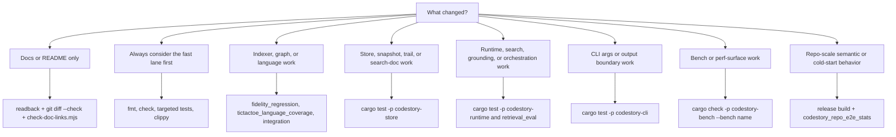

# Testing Matrix

**Audience:** Contributors

Choose the verification lane before running broad checks. Run Cargo
verifications serially in this repo when the lane needs them; the workspace
shares build locks. Examples use POSIX shell syntax. On Windows PowerShell, use
environment assignments such as `$env:NAME = "value"`.



## Verification Lane Summary

Run Cargo commands serially in this repo.

| Lane | Commands |
| --- | --- |
| Docs only | `git diff --check`, `node .github/scripts/check-doc-links.mjs` |
| Routine code | `cargo fmt --check`, `cargo check`, `cargo test`, `cargo clippy --workspace --all-targets --all-features -- -D warnings` |
| Concurrent publication | `cargo test -p codestory-cli --test stdio_protocol_contracts two_stdio_processes_observe_only_complete_generations_during_real_refresh -- --nocapture`; `rust-ci.yml` repeats this focused contract on Ubuntu, Windows, and macOS |
| Publication fault recovery | `cargo test -p codestory-runtime publication_transitions_fail_or_cancel_atomically -- --nocapture`; `cargo test -p codestory-store staged_promotion_abort_recovers_old_or_complete_new_and_cleans_artifacts -- --nocapture`; `rust-ci.yml` repeats both proofs on Ubuntu, Windows, and macOS |
| Release-blocking fidelity | `cargo test -p codestory-indexer --test fidelity_regression`, `cargo test -p codestory-indexer --test tictactoe_language_coverage`, `cargo test -p codestory-runtime --test retrieval_eval` |
| Heavy repo-scale timing | `cargo build --release -p codestory-cli`, then `cargo test -p codestory-cli --test codestory_repo_e2e_stats -- --ignored --nocapture` |

Append fresh headline rows to
[`codestory-e2e-stats-log.md`](../testing/codestory-e2e-stats-log.md) when
default indexing, semantic persistence, embedding reuse, or cold-start behavior
changes.

## Whole Workspace

```sh
cargo fmt --check
cargo check
cargo test
cargo clippy --workspace --all-targets --all-features -- -D warnings
```

These are the default broad checks for code changes after the lane picker says
workspace-wide proof is useful.

CLI integration tests must launch `codestory-cli` through
`tests/test_support::cli_command` (or `command` for a supplied binary). The
helper assigns a process-and-test-thread state root and explicitly isolates the
cache, stdio cache, install identity, and plugin data. Do not serialize the
workspace suite or clean the real user cache to make a test pass. Broker tests
that cross a worker-thread boundary must carry their injected test cache root
into that thread. The `test-support` feature only exposes isolation controls;
the CLI test binary explicitly activates automatic named-thread isolation.
Stdio fixtures must drain spawned repair workers before their temporary project
and state roots are removed. A teardown timeout terminates the process tree,
preserves the fixture roots for diagnosis, and fails the test.

Use the isolation contract as the focused regression gate:

```sh
cargo test -p codestory-cli --test test_state_isolation
cargo test -p codestory-cli --bin codestory-cli observe_broker_snapshot_
```

The first command exercises a controlled decoy user profile and fails if CLI
state escapes the injected root or an integration test constructs the CLI
directly. The second command keeps the historically competing broker snapshot
tests in one default-concurrency run.

Do not use `cargo test --workspace --all-targets` as the routine broad test
gate. `--all-targets` expands into benchmark targets; Criterion benches are
compiled or run through the bench lane below.

## Release And Version Bumps

`crates/codestory-cli/Cargo.toml` is the release version source. When bumping a
release version, update every `codestory-*` workspace crate version and
`Cargo.lock` in the same change.

```sh
node .github/scripts/check-workflow-policy.mjs
python .github/scripts/check-codestory-release.py --version <version>
```

After a `main` release, run the release version check on `dev/codestory-next`
with the released version before starting the next release lane.

After merging a `dev/codestory-next` promotion PR into `main`, verify the dev
branch survived the merge and still matches `main`:

```sh
git ls-remote --heads origin main dev/codestory-next
git rev-list --left-right --count origin/main...origin/dev/codestory-next
```

If GitHub deletes `dev/codestory-next`, restore it from the promoted `main`
commit before treating the release as complete.

Do not create or push `v*` tags manually. A synchronized version bump merged to
`main` runs the auto-release workflow, which creates the GitHub tag, release,
cross-platform `codestory-cli` archives, and `SHA256SUMS.txt`.

Binary release assets are packaging evidence only. They are not packet/search
readiness proof; keep using the sidecar evidence tiers below before claiming
agent-facing packet/search readiness.

Release and post-publish agent proof must also exercise the installed plugin
launcher with `--plugin-root plugins/codestory`. The packaged proof fails if
the MCP `resources/list` response does not expose both `codestory://status` and
`codestory://agent-guide`, and its `plugin-stdio-status.json` artifact records
the active plugin runtime plus observed and missing server-advertised MCP
resources. This proves the installed plugin launcher advertises the resources;
it is not Codex host/model visibility proof.

Packaged acceptance uses the same six native hosted-runner cells before and
after publication. Pull requests that change release, packaging, installer, or
plugin-launch surfaces call the same read-only reusable packaged-proof workflow
as the release, so the native matrix is reviewed before publication without
granting release permissions to pull-request code:

| Asset | Native runner | Required packaged proof |
| --- | --- | --- |
| Linux x64 | `ubuntu-latest` | Version, help, stdio shape, and the full-sidecar agent proof |
| Linux arm64 | `ubuntu-24.04-arm` | Version, help, and stdio shape |
| Windows x64 | `windows-latest` | Version, help, stdio shape, installer ownership self-test, managed provisioning, local ground, and repair handoff |
| Windows arm64 | `windows-11-arm` | Version, help, and stdio shape |
| macOS x64 | `macos-15-intel` | Version, help, and stdio shape |
| macOS arm64 | `macos-15` | Version, help, and stdio shape |

The Windows managed handoff proves that the packaged CLI can be installed by
the plugin, serve status, use the local graph, and publish a background repair
reservation. It does not prove full sidecars or GPU execution. macOS x64
package execution does not make Apple Silicon acceleration claims. macOS arm64
package execution does not close #887; live managed Metal endpoint survival
still needs reporter or equivalent Apple Silicon hardware evidence. Current
Ubuntu execution does not prove older-glibc compatibility.

Release closeout is not complete until every published asset cell passes and
the corresponding CodeStory plugin-source update is committed or merged in
`TheGreenCedar/AgentPluginMarketplace`, followed by marketplace refresh and
managed-plugin version/status readback. Source CI cannot substitute for that
external pointer and installed-runtime proof.

## Docs-Only Fast Path

If you only changed documentation or plugin doc surfaces, use the smallest credible
lane. Scope matches the markdown link checker:

- `README.md`
- `docs/**` (including templates)
- `plugins/codestory/README.md`
- `plugins/codestory/docs/**`
- `plugins/codestory/skills/**`

```sh
git diff --check
node .github/scripts/check-doc-links.mjs
```

When plugin adapter files change, also run:

```sh
node --test plugins/codestory/tests/plugin-static.test.mjs
```

Read the changed pages back before finishing. Only escalate to broader Cargo
checks if the doc change depends on new code behavior or command output.

Do not add unit tests that assert documentation prose or required phrases.
Structure gates only: links, whitespace, plugin/runtime shape.

## Indexer And Graph Fidelity

```sh
cargo test -p codestory-indexer --test fidelity_regression
cargo test -p codestory-indexer --test tictactoe_language_coverage
cargo test -p codestory-indexer --test integration
cargo test -p codestory-indexer --test trait_interface_resolution
```

Run these whenever the change affects parsing, extraction, semantic resolution, or graph fidelity.
Use the full test binaries above instead of filtered `cargo test` invocations.
Use [language-support.md](../architecture/language-support.md) when deciding
whether a language claim is parser-backed graph, structural collector, or only
a candidate parser compatibility record.

The opt-in OSS corpus lane checks every public language-support profile against a
pinned medium-sized open source project and compares a raw filesystem baseline
with CodeStory indexing of the same file set:

```sh
CODESTORY_RUN_OSS_LANGUAGE_CORPUS=1 cargo test -p codestory-indexer --test oss_language_corpus -- --ignored --nocapture
```

See [oss-language-corpus.md](../testing/oss-language-corpus.md) for PowerShell commands,
language filtering, cache configuration, and the JSONL report path.

That corpus is not the strict agent A/B comparison. For language-level
packet-runtime promotion evidence, run the manifest-backed holdout suite:

```sh
cargo build --release -p codestory-cli
node scripts/codestory-agent-ab-benchmark.mjs \
  --packet-runtime \
  --packet-runtime-mode both \
  --task-suite language-expansion-holdout \
  --repeats 3 \
  --materialize-repos \
  --jobs 4 \
  --prepare-codestory-jobs 2 \
  --codestory-cli ./target/release/codestory-cli \
  --out-dir target/agent-benchmark/language-expansion-publishable-full-form-command-shapes \
  --timeout-ms 180000 \
  --max-source-reads-after-packet 0 \
  --publishable
```

The packet-runtime artifact bundle must cover cold and warm modes, three repeats, row
concurrency `--jobs 4`, prepared sidecars, full sidecar provenance, no
`--allow-failures`, no quality misses, no sufficiency gaps, no post-packet
source reads for packet-only promotion, and no SLA misses.
Keep `--prepare-codestory-jobs` lower or capped; examples use `2` unless the
prep lane is intentionally serial.

With/without CodeStory A/B artifacts remain useful development comparisons for
elapsed time, tokens, estimated cost, observed tool calls, command counts,
source reads, post-packet source reads, and manifest quality gates. Stale
`--reuse-baseline-from` or fixed no-CodeStory comparisons are diagnostic unless
fingerprint-compatible, and they are never enough for packet-runtime promotion
by themselves.

## Store Changes

```sh
cargo test -p codestory-store
```

## Runtime Changes

```sh
cargo test -p codestory-runtime
cargo test -p codestory-runtime --test retrieval_eval
```

Run `retrieval_eval` when search or grounding quality may have changed. By default it verifies
that plain indexing fails closed for sidecar-primary search. To run the full quality assertions,
prepare real sidecars and set `CODESTORY_RETRIEVAL_EVAL_FULL_TESTS=1`.
The repo-scale runtime integration test is ignored by default because it indexes the full
`codestory` workspace and can exhaust memory on developer machines.
Only run it as an explicit heavy lane:

```sh
export CODESTORY_RUN_REPO_SCALE_TEST=1
cargo test -p codestory-runtime --test integration test_repo_scale_call_resolution -- --ignored --nocapture
```

## Repo-Scale Semantic And Cold-Start Checks

Run this lane when default `index` behavior, symbol-doc persistence, dense-anchor
persistence/reuse, embedding reuse, or cold-start performance changes:

```sh
cargo build --release -p codestory-cli
cargo test -p codestory-cli --test codestory_repo_e2e_stats -- --ignored --nocapture
```

The real-repo drill portion fails closed unless `CODESTORY_REAL_REPO_DRILL_CASES`
points at a prepared manifest. Use `CODESTORY_ALLOW_SKIP_REAL_REPO_DRILL_CASES=1`
only to make that separate drill skip explicit during local release-evidence
collection. A skipped drill means the release evidence is not real-repo drill
proof; it does not rename the `proof_tier` emitted by the stats JSON.

Append the emitted headline and phase metrics to
`docs/testing/codestory-e2e-stats-log.md`. Include graph seconds, semantic
seconds, symbol docs written, dense docs skipped, dense reason counts, dense
docs reused, dense docs embedded, total index seconds,
`repeat_full_refresh_seconds`, repeat graph/semantic/cache/search timings,
`retrieval_index_seconds`, `retrieval_status_seconds`, `report_seconds`,
`proof_tier`, and whether
`sidecar_status_after_retrieval_index` plus `search.sidecar_shadow_retrieval_mode`
were `full`. The log is telemetry only and cannot become a release baseline by
appending a row. Use the approved profile and release decision command in
[`performance-review-playbook.md`](../testing/performance-review-playbook.md).
The harness still emits its prior latest-row warnings and repeat-refresh
blocker during the transition; release workflow authorization comes only from
the attested gate below.

Release-readiness evidence is tiered:

Linux accelerator cells have the same evidence boundary. CI runs prove resolver,
manifest, compose, and log-marker contracts only; they do not prove CUDA, HIP,
Vulkan, SYCL, or OpenVINO live GPU execution unless the run is explicitly backed
by a GPU runner artifact. For Linux sidecar backend changes, attach manual or
nightly evidence for every backend described as live-supported. Contract-only
cells must stay labeled as contract-only in PRs, issues, and release notes.

| Evidence tier | Required proof | Release meaning |
| --- | --- | --- |
| Stats-only / degraded sidecar | Diagnostic timing or contract evidence without prepared full sidecars, or stats output whose `proof_tier` is `stats_only` | Useful local regression signal only; not release proof for packet/search readiness. The current passing `codestory_repo_release_e2e_emits_stats` harness asserts full sidecar status instead of completing as a passing no-full-sidecar row. |
| Full sidecar | `codestory_repo_release_e2e_emits_stats` emits `proof_tier: "full_sidecar"` after the project-local SQLite lexical shard, SCIP, and required dense-anchor Qdrant/llama.cpp are prepared; `retrieval index --refresh full` succeeds; `retrieval status --format json` reports `retrieval_mode: "full"` with current symbol-doc and dense-anchor manifest fields; and search shadow mode is `full` | Required before claiming agent-facing packet/search readiness on the current workspace. This is the normal tier for a passing stats JSON object from the release e2e stats harness. |
| Real-repo drill | `CODESTORY_REAL_REPO_DRILL_CASES` points at prepared manifests and the drill cases run without skip allowances | Required before claiming the release was exercised beyond the CodeStory checkout. |
| Promotion-grade benchmark | Full holdout packet-runtime rows cover cold and warm modes with three repeats, `--jobs 4`, prepared sidecars, `--publishable`, explicit `--max-source-reads-after-packet 0`, no `--allow-failures`, full sidecar provenance, no quality misses, no sufficiency gaps, and no SLA misses. Fixed-baseline A/B rows are supporting diagnostics only unless fingerprint-compatible. | Required for performance or retrieval-quality promotion claims. |

Packet/drill adapter promotion proof is a separate executable gate over one
already-finalized local sidecar generation:

```sh
node scripts/prove-drill-packet-parity.mjs \
  --project . \
  --question "How does indexing feed packet retrieval?" \
  --anchor WorkspaceIndexer \
  --output-dir target/drill-packet-parity
```

The gate records both retrieval-status reads, the packet and drill command
transcript, generation identity, and artifact names in
`drill-packet-parity-evidence.json`. It fails before packet/drill execution when
`retrieval_mode` is not `full`, and reports the exact degraded reason instead of
promoting contract fixtures to live sidecar evidence. A passing run requires the
generation to remain unchanged and packet/drill sufficiency, citations, explicit
probes, and follow-up commands to match. It also rejects supplemental, anchor, or
separate bridge commands in the drill report. Evidence status is `blocked` only
for an observed non-full preflight; command, parsing, parity, and artifact errors
are `failed`.

When logging release evidence, state the highest tier reached and the exact
skip env vars used. The stats JSON reports `proof_tier` as the highest tier
proven by that stats object. If `CODESTORY_ALLOW_SKIP_REAL_REPO_DRILL_CASES=1`
was used, record that the real-repo drill was intentionally skipped, but preserve
the stats JSON tier exactly; for example, a passing full-sidecar stats object
remains `full_sidecar`, not `stats_only`. Full-sidecar stats must
not be promoted to real-repo drill or promotion-grade evidence by themselves.

Release-significant performance decisions are fail-closed. Normalize the raw
stats and packet-runtime artifacts into the seven-metric candidate described in
the performance playbook, then run
`scripts/codestory-release-evidence-gate.mjs`. The selected machine profile
must be approved, release-eligible, pinned to attested raw evidence, and match
the candidate's corpus, cache, and machine fingerprint. Candidate artifacts can
be produced on the same clean full SHA by the explicit manual/reusable
`release-candidate-evidence.yml` workflow. This infrastructure is not wired to
the release workflow until a live eligible baseline exists. A rejected metric
blocks the release unless a non-expired exception binds the exact candidate
hash, baseline id/hash, profile, metric, measured value, threshold, owner, ISO
date, and rationale. Preserve the emitted decision JSON; it carries status,
metric, decision, commit, and artifact paths/hashes.

## CLI Boundary And Output Changes

```sh
cargo test -p codestory-cli
```

Prefer this lane before `cargo test` for the whole workspace when the change is isolated to CLI args, rendering, or contract envelopes.

For CI agents or container images that need a single machine-readable local
readiness check, run:

```sh
codestory-cli smoke --project <repo> --profile ci-agent --format json
```

The profile indexes the local graph, grounds the repo, resolves one indexed
symbol, runs `affected` on a fake changed path, and reports sidecar full mode
only when the existing sidecar status already proves it. Non-full sidecars are
listed under `skipped_optional_surfaces` with repair hints.

Runtime-backed CLI fixture flows are a separate heavier lane:

```sh
cargo test -p codestory-cli --test runtime_backed_flows -- --ignored
```

Run that lane only when the change crosses CLI and runtime behavior together, such as auto-refresh handling or file-filtered symbol resolution.

The local real-repo agent-quality lane is ignored by default and must evaluate
at least one sibling repository when run:

```sh
cargo test -p codestory-bench --test agent_quality_eval -- --ignored --nocapture
```

Set `CODESTORY_ALLOW_SKIP_LOCAL_REAL_AGENT_QUALITY=1` only when intentionally
collecting skip-only local evidence because none of the sibling repositories are
present. A zero-evaluated run is not quality proof.

## Bench Surface Checks

```sh
node scripts/lint-retrieval-generalization.mjs
cargo check -p codestory-bench --bench <name>
```

Criterion benches opt out of broad workspace test selection. Run them
explicitly with `cargo bench -p codestory-bench --bench <name>` when the lane
needs performance numbers. Use the same explicit `--bench <name>` form for
compile-only proof; aggregate `--benches` does not select benches that opt out
of broad workspace test selection.

When changing embedding backends, model profiles, pooling, prefixes, batching,
hardware-provider settings, generated symbol-doc text, or dense-anchor text, run
the semantic-doc leakage check before trusting benchmark scores. It fails when
production generated-doc concept phrases copy or closely overlap benchmark query
text. Also rerun the speed and retrieval-quality comparison described in
[`embedding-backend-benchmarks.md`](../testing/embedding-backend-benchmarks.md).
Start from the human summary in [`research.md`](../research.md). For new
research lanes, keep the benchmark case shape, quality signal, speed signal,
and decision current in the matrix instead of adding raw run transcripts.

For indexing performance work, run the full bench when practical:

```sh
cargo bench -p codestory-bench --bench indexing
```

For browser-scale stress work, start with the smoke lane and only opt into
larger synthetic repos when the machine and change justify it:

```sh
cargo bench -p codestory-bench --bench browser_stress
export CODESTORY_STRESS_SCALE=large # 1k + 10k
export CODESTORY_ALLOW_HEAVY_STRESS=1
cargo bench -p codestory-bench --bench browser_stress
```

The full `100k` synthetic lane is intentionally opt-in with
`CODESTORY_STRESS_SCALE=full`, `CODESTORY_ALLOW_HEAVY_STRESS=1`, and
`CODESTORY_ALLOW_100K_STRESS=1`. The Criterion concurrency lane is a
browser-service proxy for stdio/HTTP-shaped work, not transport promotion
proof. Synthetic stress results are promotion scouts only; promotion requires
at least one real repository run recorded with the same commit and command
shape. See
[`codestory-stress-lanes.md`](../testing/codestory-stress-lanes.md).
