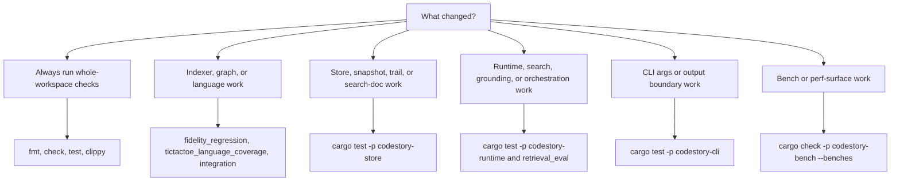

# Testing Matrix

Run Cargo verifications serially in this repo. The workspace shares build locks.



## Whole Workspace

```powershell
cargo fmt --check
cargo check
cargo test
cargo clippy --all-targets -- -D warnings
```

These are the default checks for any contributor change.

## Indexer And Graph Fidelity

```powershell
cargo test -p codestory-indexer --test fidelity_regression
cargo test -p codestory-indexer --test tictactoe_language_coverage
cargo test -p codestory-indexer --test integration
```

Run these whenever the change affects parsing, extraction, semantic resolution, or graph fidelity.
Use the full test binaries above instead of filtered `cargo test` invocations.

## Store Changes

```powershell
cargo test -p codestory-store
```

## Runtime Changes

```powershell
cargo test -p codestory-runtime
cargo test -p codestory-runtime --test retrieval_eval
```

Run `retrieval_eval` when search or grounding quality may have changed.

## CLI Boundary And Output Changes

```powershell
cargo test -p codestory-cli
```

## Bench Surface Checks

```powershell
cargo check -p codestory-bench --benches
```
