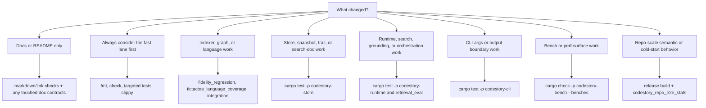

# Testing Matrix

Run Cargo verifications serially in this repo. The workspace shares build locks.
Examples use POSIX shell syntax. On Windows PowerShell, use environment
assignments such as `$env:NAME = "value"`.



## Whole Workspace

```sh
cargo fmt --check
cargo check
cargo test
cargo clippy --all-targets -- -D warnings
```

These are the default checks for any contributor change.

## Docs-Only Fast Path

If you only changed `README.md` or `docs/**`, use the smallest credible lane:

```sh
cargo fmt --check
cargo test -p codestory-cli --test onboarding_contracts
```

Only escalate to broader cargo checks if the doc change depends on new code behavior or command output.

## Indexer And Graph Fidelity

```sh
cargo test -p codestory-indexer --test fidelity_regression
cargo test -p codestory-indexer --test tictactoe_language_coverage
cargo test -p codestory-indexer --test integration
```

Run these whenever the change affects parsing, extraction, semantic resolution, or graph fidelity.
Use the full test binaries above instead of filtered `cargo test` invocations.

## Store Changes

```sh
cargo test -p codestory-store
```

## Runtime Changes

```sh
cargo test -p codestory-runtime
cargo test -p codestory-runtime --test retrieval_eval
```

Run `retrieval_eval` when search or grounding quality may have changed. By default it verifies
that plain indexing fails closed for sidecar-primary search. To run the full quality assertions,
prepare real sidecars and set `CODESTORY_RETRIEVAL_EVAL_FULL_TESTS=1`.
The repo-scale runtime integration test is ignored by default because it indexes the full
`codestory` workspace and can exhaust memory on developer machines.
Only run it as an explicit heavy lane:

```sh
export CODESTORY_RUN_REPO_SCALE_TEST=1
cargo test -p codestory-runtime --test integration test_repo_scale_call_resolution -- --ignored --nocapture
```

## Repo-Scale Semantic And Cold-Start Checks

Run this lane when default `index` behavior, symbol-doc persistence, dense-anchor
persistence/reuse, embedding reuse, or cold-start performance changes:

```sh
cargo build --release -p codestory-cli
cargo test -p codestory-cli --test codestory_repo_e2e_stats -- --ignored --nocapture
```

The real-repo drill portion fails closed unless `CODESTORY_REAL_REPO_DRILL_CASES`
points at a prepared manifest. Use `CODESTORY_ALLOW_SKIP_REAL_REPO_DRILL_CASES=1`
only to make that separate drill skip explicit during local release-evidence
collection. A skipped drill means the release evidence is not real-repo drill
proof; it does not rename the `proof_tier` emitted by the stats JSON.

Append the emitted headline metrics to `docs/testing/codestory-e2e-stats-log.md`. Include graph seconds, semantic seconds, symbol docs written, dense docs skipped, dense reason counts, dense docs reused, dense docs embedded, total index seconds, `repeat_full_refresh_seconds`, `retrieval_index_seconds`, `retrieval_status_seconds`, `report_seconds`, `proof_tier`, any `warnings`, and whether `sidecar_status_after_retrieval_index` plus `search.sidecar_shadow_retrieval_mode` were `full`.

Release-readiness evidence is tiered:

| Evidence tier | Required proof | Release meaning |
| --- | --- | --- |
| Stats-only / degraded sidecar | Diagnostic timing or contract evidence without prepared full sidecars, or stats output whose `proof_tier` is `stats_only` | Useful local regression signal only; not release proof for packet/search readiness. The current passing `codestory_repo_release_e2e_emits_stats` harness asserts full sidecar status instead of completing as a passing no-full-sidecar row. |
| Full sidecar | `codestory_repo_release_e2e_emits_stats` emits `proof_tier: "full_sidecar"` after local Zoekt, SCIP, and required dense-anchor Qdrant/llama.cpp are prepared; `retrieval index --refresh full` succeeds; `retrieval status --format json` reports `retrieval_mode: "full"` with current symbol-doc and dense-anchor manifest fields; and search shadow mode is `full` | Required before claiming agent-facing packet/search readiness on the current workspace. This is the normal tier for a passing stats JSON object from the release e2e stats harness. |
| Real-repo drill | `CODESTORY_REAL_REPO_DRILL_CASES` points at prepared manifests and the drill cases run without skip allowances | Required before claiming the release was exercised beyond the CodeStory checkout. |
| Promotion-grade benchmark | Baseline and candidate benchmark rows are captured with sidecar status, search shadow mode, and no-regression threshold | Required for performance or retrieval-quality promotion claims. |

When logging release evidence, state the highest tier reached and the exact
skip env vars used. The stats JSON reports `proof_tier` as the highest tier
proven by that stats object. If `CODESTORY_ALLOW_SKIP_REAL_REPO_DRILL_CASES=1`
was used, record that the real-repo drill was intentionally skipped, but preserve
the stats JSON tier exactly; for example, a passing full-sidecar stats object
remains `full_sidecar`, not `stats_only`. Warning-free full-sidecar stats must
not be promoted to real-repo drill or promotion-grade evidence by themselves.

The stats JSON also reports `warnings` for performance thresholds that should
stay visible in logged evidence:

| Warning | Threshold |
| --- | --- |
| Total index time | `index_seconds > 600` |
| Semantic phase time | `semantic_phase_seconds > 500` |
| AST-first cold index gate | cold CodeStory product index is not under 180s or `semantic_embedding_ms` is not at least 70% below same-run baseline |

Preserve those warning strings when copying the run into release evidence. An
empty `warnings` array only means the measured run stayed under these warning
thresholds; it does not raise the proof tier.

For the current repo-scale baseline, use the latest row in
[`codestory-e2e-stats-log.md`](../testing/codestory-e2e-stats-log.md). Older
rows, including the 2026-04-18 durable-scope measurements, are historical
examples only; do not copy them into current performance claims.

## CLI Boundary And Output Changes

```sh
cargo test -p codestory-cli
```

Prefer this lane before `cargo test` for the whole workspace when the change is isolated to CLI args, rendering, or contract envelopes.

Runtime-backed CLI fixture flows are a separate heavier lane:

```sh
cargo test -p codestory-cli --test runtime_backed_flows -- --ignored
```

Run that lane only when the change crosses CLI and runtime behavior together, such as auto-refresh handling or file-filtered symbol resolution.

## Bench Surface Checks

```sh
node scripts/semantic-doc-leakage-check.mjs
cargo check -p codestory-bench --benches
```

When changing embedding backends, model profiles, pooling, prefixes, batching,
hardware-provider settings, generated symbol-doc text, or dense-anchor text, run the semantic-doc
leakage check before trusting benchmark scores. It fails when production
generated-doc concept phrases copy or closely overlap benchmark query text. Use
`CODESTORY_EMBED_RESEARCH_QUERY_SPLIT=dev` for exploratory tuning and
`CODESTORY_EMBED_RESEARCH_QUERY_SPLIT=holdout` for promotion evidence; dev-only
rows have `promotion_eligible=false` and must not be promoted. Cache replay is
blocked unless `CODESTORY_EMBED_RESEARCH_ALLOW_CACHE_REPLAY=1` is set, so stale
generated-doc caches cannot silently seed a new benchmark lane. Queries that
previously appeared in leaked production semantic-doc aliases are excluded by
default; set `CODESTORY_EMBED_RESEARCH_INCLUDE_TAINTED_QUERIES=1` only when
intentionally reproducing the invalidated historical slice. Also
rerun the speed and retrieval-quality comparison described in
[`embedding-backend-benchmarks.md`](../testing/embedding-backend-benchmarks.md).
Start from the human summary in [`research.md`](../research.md). For new
research lanes, keep the benchmark case shape, quality signal, speed signal,
and decision current in the matrix instead of adding raw run transcripts.

For indexing performance work, run the full bench when practical:

```sh
cargo bench -p codestory-bench --bench indexing
```

For browser-scale stress work, start with the smoke lane and only opt into
larger synthetic repos when the machine and change justify it:

```sh
cargo bench -p codestory-bench --bench browser_stress
export CODESTORY_STRESS_SCALE=large # 1k + 10k
export CODESTORY_ALLOW_HEAVY_STRESS=1
cargo bench -p codestory-bench --bench browser_stress
```

The full `100k` synthetic lane is intentionally opt-in with
`CODESTORY_STRESS_SCALE=full`, `CODESTORY_ALLOW_HEAVY_STRESS=1`, and
`CODESTORY_ALLOW_100K_STRESS=1`. The Criterion concurrency lane is a
browser-service proxy for stdio/HTTP-shaped work, not transport promotion
proof. Synthetic stress results are promotion scouts only; promotion requires
at least one real repository run recorded with the same commit and command
shape. See
[`codestory-stress-lanes.md`](../testing/codestory-stress-lanes.md).
