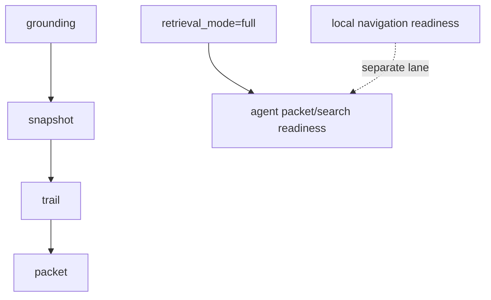

# Glossary

- grounding: the process of turning indexed code state into concise, relevant context for a question or tool action
- snapshot: a derived SQLite-backed grounding view that can be rebuilt from the primary graph tables
- projection: derived persisted data such as callable projection state or ranked grounding summaries
- staged snapshot: the temporary SQLite database built during full refresh before publish replaces the live cache
- refresh baseline: the persisted file inventory and metadata used to decide what an incremental refresh must index or remove
- trail: a focused graph walk rooted at one symbol, usually caller/callee or neighborhood oriented
- runtime: the orchestration surface that coordinates project opening, indexing, search, grounding, trail generation, and system actions
- workspace: the manifest plus filesystem discovery layer that decides which files belong to the project
- contracts: shared graph, DTO, and event types that are safe to depend on across boundaries
- repo-text hit: a direct file-content match surfaced alongside indexed-symbol search results
- retrieval mode: retrieval status contract for sidecar evidence; `retrieval_mode=full` is required for agent packet/search readiness
- symbol doc: deterministic generated per-symbol text stored in SQLite for graph-native lexical retrieval; it is not embedded by default
- dense anchor: a policy-selected symbol, component report, or unstructured doc that receives a vector embedding
- local navigation readiness: the local cache, graph, lexical index, and DB-backed navigation commands are usable
- agent packet/search readiness: sidecar packet/search evidence is trustworthy only when retrieval status reports `retrieval_mode=full`
- target context: DB-first evidence for one concrete target; not a replacement for broad packet, search, or drill questions
- semantic ready: local diagnostic state where dense-anchor retrieval is enabled, an embedding runtime is available when dense anchors exist, and persisted dense anchors match the active policy; not agent packet/search readiness
- cache root: the directory that owns one project cache; by default this is under the user cache directory, but `--cache-dir` can override it
