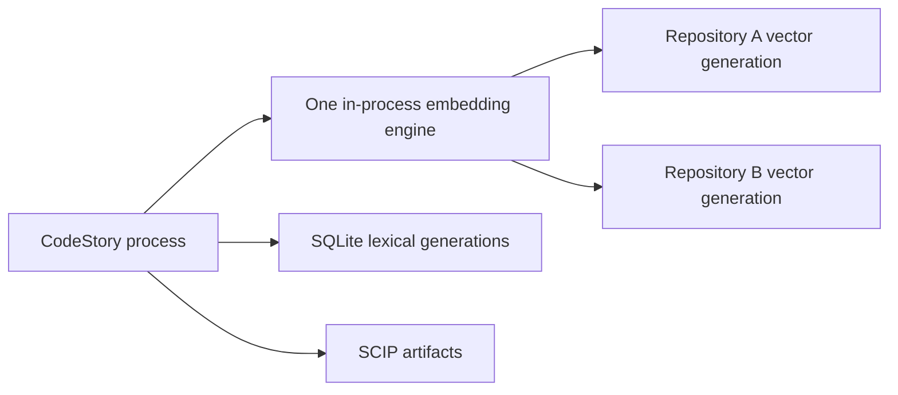

# In-process retrieval engine

CodeStory ships one executable. The executable contains the checksum-pinned
BGE-base-en-v1.5 Q8 GGUF model and statically linked llama.cpp/ggml runtime.
There is no embedding service to install, download, start, repair, or stop.

The first semantic request in a process initializes one embedding engine. Every
repository opened by that process shares the same model and accelerator
context. When llama.cpp needs a filesystem path for mmap, CodeStory publishes
the embedded model atomically into a disposable content-addressed cache. A
restart may reuse that verified materialization; it never fetches runtime
assets from the network.

`retrieval_mode: "full"` means the current lexical, vector, and SCIP
generations agree with the source publication and the in-process engine
identity. It is an infrastructure gate, not an answer-quality claim.



## Normal operation

Call the intended CodeStory tool. Project activation, indexing, and embedding
initialization are automatic. A cold request may return a bounded same-tool
retry while preparation completes. The plugin never asks the user to approve
retrieval infrastructure.

Normal plugin output reports whether retrieval is ready. Backend, adapter, model
digest, ggml build identity, and smoke timing stay in the explicit live-process
maintainer diagnostic:

```sh
resources/read codestory://diagnostics/retrieval-engine
```

`doctor` and `retrieval status` remain observational one-shot checks. They do
not initialize an engine merely to populate diagnostics.

## Execution policy

| Host | Default production backend | Required evidence |
| --- | --- | --- |
| macOS | Metal | Physical Apple adapter, full model offload, timed live embedding smoke |
| Windows | Vulkan | Physical adapter, software-adapter rejection, timed live embedding smoke |
| Linux | Vulkan | Physical adapter, software-adapter rejection, timed live embedding smoke |

CodeStory rejects WARP, llvmpipe, lavapipe, and other software adapters for an
accelerated claim. Production never silently falls back to CPU. Hosted CI may
set `CODESTORY_EMBED_ALLOW_CPU=1`; diagnostics then report `cpu_explicit`
instead of `accelerated`.

Engine readiness requires:

- the exact embedded model digest;
- the linked ggml build identity;
- the selected backend and physical adapter identity;
- a timed live embedding smoke; and
- an explicit `accelerated` or `cpu_explicit` policy.

Changing the model or ggml producer identity invalidates the semantic
generation. CodeStory rebuilds an older generation once through the normal
activation path; it does not retain compatibility branches.

## Publication and cleanup

The retrieval manifest binds project/workspace identity, the core publication,
the lexical and vector SQLite generations, the in-process embedding producer,
and the SCIP graph artifact. Writers validate a complete candidate before
publication. Readers pin one coherent publication; a concurrent change returns
`cache_busy` and permits one bounded retry.

Use the read-only inventory before deleting generations:

```sh
codestory-cli retrieval inventory --project <repo> --format markdown
```

Apply only its CodeStory-owned plan:

```sh
codestory-cli retrieval inventory --project <repo> --apply --format markdown
```

Cleanup remains generation- and ownership-scoped. Do not delete a user cache
or broadly kill processes.

## Proof boundary

Hosted proof may use explicit CPU operation. Platform acceleration claims need
the packaged executable on real hardware. Acceptance separates cold engine
initialization, warm query latency, bulk indexing throughput, process RSS, GPU
memory, vector parity, retrieval quality, multi-repository reuse, and restart
materialization reuse.

See [retrieval architecture](../testing/retrieval-architecture.md),
[retrieval design](../architecture/retrieval-design.md), and the
[testing matrix](../contributors/testing-matrix.md).
