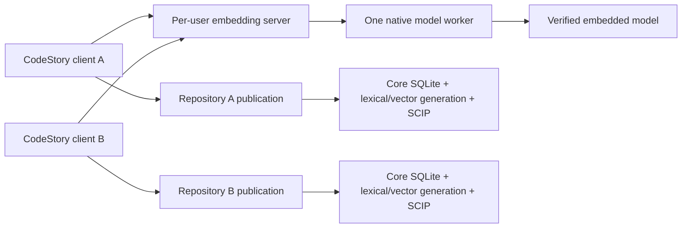
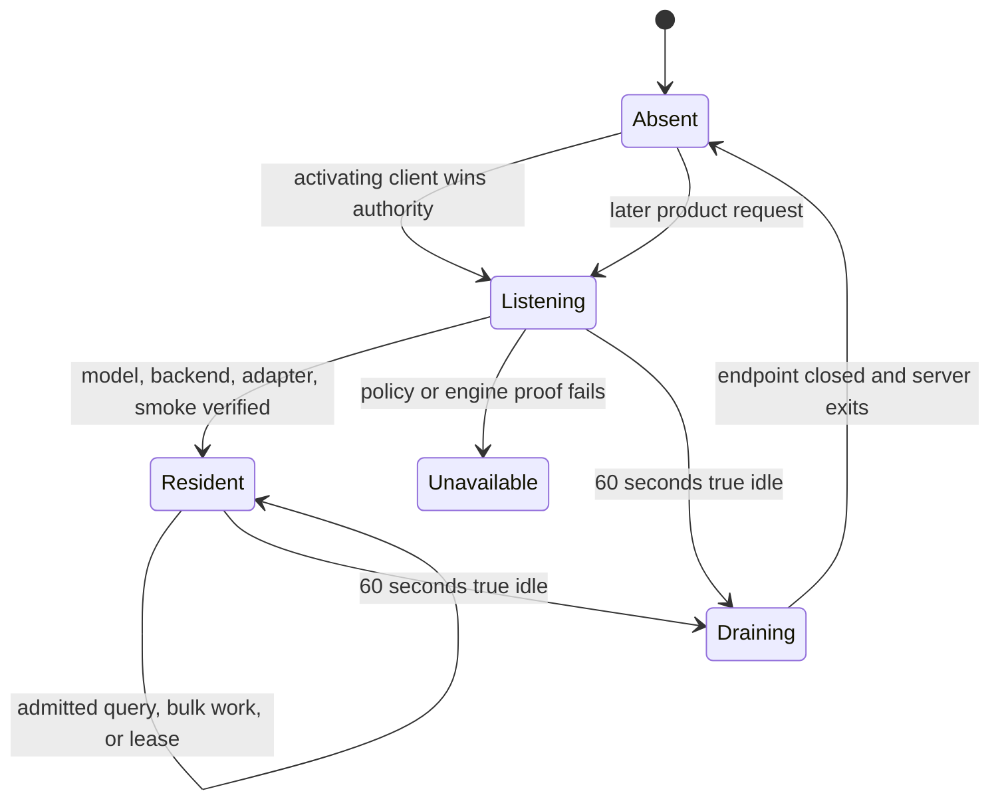

# Per-user embedding server

CodeStory ships semantic retrieval inside the native CLI. The release
executable contains the checksum-pinned CodeRankEmbed Q8 model and links the
llama.cpp/ggml engine. Activating clients connect to a private same-user local
endpoint and, when no authority exists, spawn that exact executable in hidden
server mode. There is no TCP endpoint, backend download, port lease, PID-file
supervisor, or user-controlled repair lifecycle.
Each release archive also contains `codestory-native-manifest.json`, which binds
the executable digest, native format and architecture, linkage/loading mode,
inspected native dependencies, packaged runtime artifacts, compiled backend
set, model, llama source, and producer. It records capability only; live
accelerator execution still requires protected hardware evidence.

This page is for maintainers collecting diagnostics or changing retrieval. The
normal plugin contract is simpler: call the intended repository tool and retry
that same tool while it reports `preparing`.

## Runtime shape



The server is elected lazily on the first semantic operation. Compatible
CodeStory processes for the current OS user share its model, scheduler, and
accelerator context. Repository configuration, caches, generations, and
publication state remain in the clients. Every MCP request carries an absolute
`project` root; the server receives only an opaque admission scope.

Retrieval chooses one explicit backend/device-class request and supplies model,
pooling, dimension, batching, and smoke parameters to the native binding. The
binding reports compiled/runtime capabilities and executes that request
exactly. It never chooses a product fallback. Retrieval applies and validates
the product's L2 vector normalization after native execution and owns the
persisted model, prefix, pooling, normalization, dimension, batching, fallback,
and vector-schema evidence. The binding retains only the compiled compatibility
facts needed to execute the model.

macOS keeps Metal built in. Windows and Linux packages place core, CPU, and
Vulkan runtime modules beside the executable and load them at engine startup.
The base executable does not depend on the Vulkan loader, so help, status, local
navigation, and explicit CPU execution remain available when that loader is
absent. Packaging verifies the actual PE import table, ELF `DT_NEEDED` entries,
or Mach-O load commands rather than trusting build markers alone.

When llama.cpp needs a path for memory mapping, CodeStory verifies the embedded
bytes and atomically materializes them under a content-addressed cache name. A
later process may reuse that file after verifying its digest and size. This is
cache materialization, not a runtime download.

## First-use state machine



Repository activation and engine initialization are separate:

1. Local discovery and indexing publish a complete core database.
2. The per-user server verifies its model and execution policy.
3. Retrieval builds lexical, vector, and SCIP artifacts for that repository.
4. The writer validates a complete candidate and atomically publishes its
   manifest.
5. Packet/search readers pin one coherent core and retrieval publication.

A cold request can return a bounded same-tool retry while these steps run. An
existing complete publication remains readable during refresh. Concurrent
publication drift returns `cache_busy` and permits one bounded retry rather
than mixing generations.

## Readiness contract

Engine readiness binds:

- the exact model digest and size;
- the linked llama.cpp/ggml build identity;
- the selected backend and physical adapter;
- `accelerated` or explicit `cpu_explicit` policy;
- a timed live embedding smoke;
- a successful encode counter and backend-observed execution device/backend,
  nodes, resident accelerator tensor count/bytes, and layer placement; and
- the process engine identity and model-load count.

`retrieval_mode: "full"` additionally means the current core, lexical, vector,
and SCIP generations agree with the source and engine producer identity. It is
an infrastructure gate. Answer sufficiency and citation resolution remain
separate result-level checks.

An older semantic generation with a different producer identity is rebuilt once
through normal activation. CodeStory does not serve it through a compatibility
branch.

## Execution policy

| Platform | Production path | Release claim |
| --- | --- | --- |
| macOS Apple Silicon | Metal | Physical Apple adapter, full layer offload, timed live smoke |
| macOS Intel | No Metal claim | Explicit CPU is maintainer/CI only |
| Windows | Vulkan | Physical adapter, software-adapter rejection, full layer offload, timed live smoke |
| Linux | Vulkan-capable package | No GPU claim without protected real-hardware evidence |

Windows source and package proof builds pin `CMAKE_GENERATOR=Ninja`; hosted
native-build caches include the selected generator and CMake/Ninja versions.
When protected Windows proof builds from source, it records those tool versions
in its host artifact. This is build determinism evidence and does not upgrade a
hosted CPU result into a Vulkan runtime claim.

WARP, llvmpipe, lavapipe, and other software adapters cannot satisfy an
accelerated policy. Production never silently falls back to CPU. Hosted CI may
set:

```sh
CODESTORY_EMBED_ALLOW_CPU=1
```

That path must report `cpu_explicit` and carries no Metal or Vulkan claim.

## Diagnostics

`doctor`, `retrieval status`, and MCP status are observational. They do not
spawn or wake the server, initialize the model, extend idle lifetime, or start
a retrieval build merely to fill diagnostic fields.

```sh
codestory-cli doctor --project <repo> --format json
codestory-cli retrieval status --project <repo> --format json
codestory-cli retrieval inventory --project <repo> --format markdown
```

For a live MCP process that has initialized the engine, issue an MCP
`resources/read` request with URI:

```text
codestory://diagnostics/retrieval-engine
```

The resource is intentionally omitted from ordinary user routing. It reports
the endpoint authority, listener, server process, scheduler, engine owner and
native worker, load generation, backend, adapter, model/build identity, policy,
smoke timing, backend-observed execution and residency, successful encodes,
model loads, and materialization reuse. It never reports project paths or
request text. Process-memory and GPU-memory deltas are diagnostics, not
accelerator authorization.

## Failure isolation

| Failure | Product behavior | Maintainer action |
| --- | --- | --- |
| Engine still initializing | Same tool returns `preparing` with a retry delay | Let the owner finish; do not start another engine |
| Unsupported or software adapter | Broad search returns unavailable; local map remains usable | Capture diagnostics and verify the packaged platform policy |
| Queue full or soft deadline elapsed | Typed capacity state reports class, capacity, depth, opaque active phase, retry delay, and a useful retry condition | Retry the same product call after the named condition; do not run doctor or reindex |
| Incompatible server is fully idle | The server closes admission and exits before the exact requesting CLI can win authority | Retry the same operation |
| Incompatible server has active work or leases | Request returns typed `after_owner_idle` state; no second server starts | Wait for the named idle condition |
| Server process crashes | A pure embedding RPC may reconnect and replay once; lease operations do not replay | Let the whole product operation retry when its publication lease was lost |
| Native worker stops making progress | The independent watchdog fail-stops the server | Retain the event evidence; the next product call elects a replacement |
| Whole server is frozen | Client returns bounded `owner_unresponsive`; it does not unlink, kill, take over, or start a second engine | Restore or terminate the exact frozen process deliberately |
| Model materialization mismatch | Engine fails closed before use | Preserve the path and digest evidence; let the next verified materialization replace only owned state |
| Retrieval producer changed | Old semantic generation is not admitted | Run normal full retrieval publication and verify the new identity |
| Core or retrieval publication changes during query | Query returns `cache_busy` | Retry once against the new complete publication |
| Persisted generation is corrupt or incomplete | Broad search is blocked; prior complete generation remains eligible | Inspect status and rebuild only the named repository generation |

Do not diagnose an acceleration failure by enabling CPU. Do not delete the
entire user cache, kill unrelated processes, or infer ownership from a path
name alone.

## Publication and cleanup

The retrieval manifest binds project/workspace identity, the core generation,
the lexical/vector SQLite generation, the per-user server producer, and the SCIP
artifact. Writers stage and validate a full candidate before changing the live
pointer. Readers hold publication and generation leases for the duration of a
query.

Inventory cleanup before applying it:

```sh
codestory-cli retrieval inventory --project <repo> --format markdown
codestory-cli retrieval inventory --project <repo> --apply --format markdown
```

Deletion is root-handle-relative and generation-scoped. Apply only plans whose
ownership identity is current and unambiguous.

## Proof boundary

Hosted CPU proof validates source, package, protocol, same-user IPC, and the
explicit CPU runtime path. An acceleration claim requires the same manifest-
bound package on physical hardware. Installed-runtime qualification additionally
requires two independent plugin hosts, all preregistered server fault scenarios,
frozen thresholds, and exact source/tree/archive/executable/host/session/
protocol/constant identities. See
[the qualification contract](../testing/per-user-embedding-server-qualification.md).

See [retrieval architecture](../testing/retrieval-architecture.md),
[retrieval design](../architecture/retrieval-design.md), and the
[testing matrix](../contributors/testing-matrix.md).
