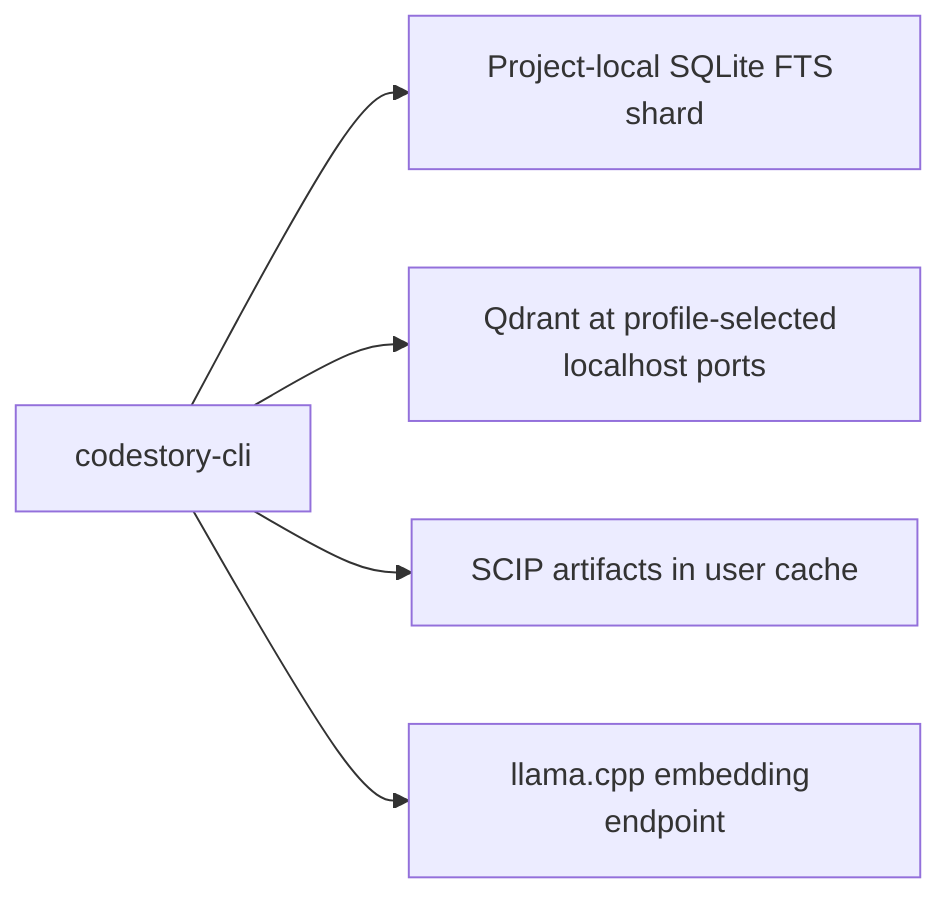

# Retrieval sidecars operations

Project-local SQLite FTS, Qdrant, SCIP, and llama.cpp back agent `packet`, `search`,
and `context`. They are required for `agent_packet_search` infrastructure
readiness: `retrieval status` must report `retrieval_mode: "full"` before those
surfaces can claim full sidecar retrieval.

A healthy SQLite cache alone is not enough. Full sidecars also do not prove
answer quality by themselves; answer quality still needs the matching
packet-runtime, drill, or benchmark evidence tier.

**Runtime truth and surface gating:** When plugin MCP is live, read
`codestory://status` first and obey `allowed_surfaces` plus `retrieval_mode`.
Field semantics and operator repair prompts live in
[users/troubleshooting.md](../users/troubleshooting.md) and
[glossary.md](../glossary.md#retrieval-mode). This runbook owns bootstrap,
index, inventory, maintainer internals, and promotion-adjacent ops — not a
duplicate status-field matrix.

For local-only audits, do not run sidecar repair just because `packet`, `search`,
or `context` is blocked. Use this runbook when the task needs one of those
surfaces or when status says `agent_packet_search` should be repaired.
`context` is not a local-only browse surface.

Design: [`retrieval-design.md`](../architecture/retrieval-design.md).
Promotion checks: [`retrieval-architecture.md`](../testing/retrieval-architecture.md).



## Agent readiness repair

Use this section when an agent tool says `packet`, `search`, or `context` is
blocked, or when `doctor` reports `agent_packet_search` needs repair. Keep local
navigation and agent retrieval separate: a ready SQLite graph can support
`ground`, `files`, and symbol navigation while sidecar packet/search remains
blocked.

Start with the active runtime surface. When plugin MCP is live, read
`codestory://status`, follow `recommended_next_calls`, call MCP `sidecar_setup repair`
when recommended, and reread `codestory://status`. The CLI commands below are
maintainer/debug transcripts, not the supported agent repair path:

```sh
codestory-cli agent preflight --project <repo> --format json
codestory-cli doctor --project <repo> --format markdown
codestory-cli retrieval status --project <repo> --format json
```

When plugin MCP is live, read `codestory://status` first and use its
`allowed_surfaces` values as the tool boundary. For field semantics and
first-response repair prompts, use
[users/troubleshooting.md](../users/troubleshooting.md). Treat status as the
active runtime source when it is available.

| State | Meaning | Operator action |
|-------|---------|-----------------|
| `local_navigation=ready`, `agent_packet_search=ready`, `sidecar_mode=full` | Local graph and sidecar packet/search infrastructure are ready | Use packet/search/context as infrastructure-eligible, then prove answer quality with source, packet-runtime, drill, or benchmark evidence |
| `local_navigation=ready`, `agent_packet_search=repairing` | Agent sidecar repair is active and status should include the current `phase`, `profile`, `run_id`, and `namespace` | Wait or reread `codestory://status`; do not start a second agent repair for the same run |
| `sidecar_setup.last_worker_result.outcome=failed` or `abandoned` | The background repair worker reached a durable terminal state without completing | Match `attempt_id` and, when present, branch on `terminal_envelope.error.code` and its failed layer. For a legacy persisted result without an envelope, use `wait_error` and bounded tails as compatibility diagnostics |
| `local_navigation=ready`, `agent_packet_search=repair_retrieval` | SQLite graph is usable, but sidecar retrieval is missing, stale, or unhealthy | Use local graph surfaces for source navigation; call MCP `sidecar_setup repair` from status before packet/search claims |
| `local_navigation=repair_local` | Core index or cache is missing or stale | Follow `recommended_next_calls`, then reread status; use CLI local repair commands only for maintainer transcripts |
| `sidecar_mode` not `full` | Packet/search sidecars are diagnostic only | Call MCP `sidecar_setup repair`, then reread status; maintainers can inspect `retrieval status` and rerun explicit sidecar commands if needed |
| `doctor` ready but a packet/search command returns `retrieval_unavailable` | Runtime/status disagreement or sidecar process drift | Capture the failing command output, `doctor`, and `retrieval status`; repair the named layer before retrying |

Layer repair should follow the first failing layer, not a broad rebuild:

| Failing layer | Evidence to capture | Small repair |
|---------------|---------------------|--------------|
| Active runtime or plugin adapter | `codestory://status` fields, `server_executable`, `cli_version`, `plugin_runtime`, `allowed_surfaces` | Reload or reinstall the active CLI/plugin runtime, then reread status |
| Core SQLite graph | `doctor` cache/index checks and indexed file counts | Follow status `recommended_next_calls`; CLI transcript: `codestory-cli ready --goal local --repair --project <repo> --format json` |
| SQLite lexical shard | `retrieval status` lexical coverage, generation/input binding, and shard health | Rerun `retrieval index --refresh full`; old JSONL shards are rebuilt, not queried |
| Qdrant dense sidecar | Qdrant health, collection name, point count, dense-anchor count, backend/dimension fields | Fix Qdrant/model/backend state; move the Qdrant cache aside only if repeated health checks fail |
| SCIP graph artifacts | `scip_unavailable`, graph artifact hash/path, manifest contract | Rerun `retrieval index --refresh full`; inspect SCIP cache paths if it repeats |
| Embedding endpoint | `CODESTORY_EMBED_LLAMACPP_URL`, sidecar health, model/backend/dimension fields | Start or reconfigure llama.cpp, then rerun retrieval index/status |
| Manifest contract | `manifest_contract`, source root, input hash, generation, schema, graph hash, counts, lane provenance | Rerun `retrieval index --project <repo> --refresh full` |

A legacy semantic diagnostic warning against `127.0.0.1:8080` is not by itself a
packet/search blocker when `doctor` reports `sidecar_retrieval: mode=full` and
the sidecar health probe succeeds against the configured endpoint. Keep the
warning in the evidence bundle; do not treat it as proof that a separate
runtime fix has landed.

Attach these artifacts to issues or PRs that claim readiness repair:

- `codestory://status` transcript when MCP is live, or the full
  `agent preflight` JSON when it is not.
- The matching `sidecar_setup.last_worker_result` when background repair fails,
  including its `attempt_id`, exit code, truncated-output flags, and shared
  `terminal_envelope` when the result was written by a current runtime.
- `doctor --format markdown` or JSON output, including readiness verdicts and
  legacy/managed embedding diagnostics.
- `retrieval status --format json`, including `retrieval_mode`,
  `degraded_reason`, and `manifest_contract`.
- The exact failing `packet`, `search`, or `context` command output when a
  ready status disagrees with a tool call.
- Any cache directory moved aside during reset, plus the status output after the
  replacement index is healthy.

## Operator repair path

### Prerequisites

- Rust toolchain with `cargo`, or an already-built `codestory-cli` binary.
- Docker Desktop or Docker Engine for automated Qdrant and llama.cpp
  sidecars.
- Node.js 18+ if you need `scripts/setup-retrieval-env.mjs` to fetch or verify
  the pinned GGUF.
- For manual Local profile only, the default localhost ports are Qdrant HTTP
  `6333`, Qdrant gRPC `6334`, and llama.cpp embeddings `8080`; lexical search
  has no service port.
  Managed Agent profiles allocate or reuse namespace-specific ports; read them
  from status rather than assuming the Local defaults.
- GGUF embedding model available through `CODESTORY_EMBED_MODEL_DIR`, or fetched
  with the setup wrapper.

Manual sidecar setup is allowed only when equivalent local Qdrant and
llama.cpp services are already healthy. Agent-facing retrieval is invalid until
the CLI status proof below reports `full`.

### Minimum environment

For product sidecar retrieval, leave most knobs unset. These endpoint/port
overrides are Local/manual controls; Agent allocation remains dynamic unless an
explicit override or persisted Agent state selects a port.

| Variable | Minimum operator use |
|----------|----------------------|
| `CODESTORY_EMBED_MODEL_DIR` | Host path containing `bge-base-en-v1.5.Q8_0.gguf` for the compose embed service |
| `CODESTORY_EMBED_BACKEND` | `llamacpp`; unset also means product llama.cpp mode for retrieval commands |
| `CODESTORY_EMBED_LLAMACPP_URL` | Local embedding endpoint, default `http://127.0.0.1:8080/v1/embeddings` |
| `CODESTORY_EMBED_LLAMACPP_DEVICE` | Optional llama.cpp accelerator request override; leave unset for the platform resolver |
| `CODESTORY_EMBED_LLAMACPP_N_GPU_LAYERS` | Optional llama.cpp GPU layer request, default `99` when CPU is not explicitly allowed |
| `CODESTORY_EMBED_DEVICE_STATE` | Optional diagnostic assertion for observed device state: `accelerated`, `cpu`, or unset/unknown; it does not satisfy broker GPU proof |
| `CODESTORY_EMBED_ALLOW_CPU` | Set to `1` only when intentional CPU-backed retrieval is acceptable on this machine |
| `CODESTORY_EMBED_DEVICE_POLICY` | Optional policy alias; set `allow_cpu` instead of `CODESTORY_EMBED_ALLOW_CPU=1` when CPU mode is intentional |
| `CODESTORY_QDRANT_HTTP_PORT` | Override Qdrant HTTP port when `6333` is unavailable |
| `CODESTORY_QDRANT_GRPC_PORT` | Override Qdrant gRPC port when `6334` is unavailable |

If CPU is not explicitly allowed, CodeStory asks the platform resolver for an
accelerated llama.cpp backend. On macOS arm64, bootstrap/repair installs and
launches the managed native Metal `llama-server` with
`launch_mode=native_spawned`; a Linux Docker/Colima embed service cannot satisfy
a `vulkan:Vulkan0` request on Apple Silicon. Use
`node scripts/setup-retrieval-env.mjs --fetch-llama-server --fetch-only` only to
prewarm the managed Metal cache cell. Set `CODESTORY_EMBED_NATIVE_LLAMA_SERVER`
only when overriding the managed binary with an absolute path.

On Windows x64, the native llama.cpp resolver selects the manifest-backed b9902
Vulkan cell by default and launches it with `Vulkan0` plus `99` GPU layers. A
previous b9058 managed-cache install remains a recognized legacy cell only when
its install manifest and executable checksum match.

On Linux, accelerator-required setup remains Docker Compose based. The supported
default cells are explicit Vulkan contracts for x64 and arm64, backed by the
same b9902 Ubuntu Vulkan release artifacts used for launch-contract metadata.
When Vulkan is selected, CodeStory writes a generated `/dev/dri` compose
override only after the host render node exists; if `/dev/dri` is missing,
bootstrap fails with `linux_accelerator_device_missing` instead of silently
starting an unaccelerated embed container. CUDA, HIP/ROCm, SYCL, and OpenVINO
are tracked as contract-only Linux x64 cells until package, launch, and live GPU
evidence exist.

| Linux host | Resolver request | Launch contract | Proof required before full readiness |
|------------|------------------|-----------------|--------------------------------------|
| x64 generic or AMD without HIP proof | `vulkan:Vulkan0` | Docker Compose plus generated `/dev/dri` override | native/container logs show Vulkan device use and offloaded layers |
| arm64 with render node | `vulkan:Vulkan0` | Docker Compose plus generated `/dev/dri` override | native/container logs show Vulkan device use and offloaded layers |
| NVIDIA/CUDA opt-in | `cuda` when `CODESTORY_EMBED_DEVICE_PROVIDER` names NVIDIA/CUDA | Contract-only until a CUDA image or external endpoint is proven | CUDA log markers plus offloaded layers from a real GPU run |
| HIP/ROCm, SYCL, OpenVINO opt-in | matching provider override | Contract-only until packaging and launch args are proven | backend-specific log markers plus offloaded layers from a real GPU run |

On other GPU setups, run an already-working native or external llama.cpp
embedding endpoint and point CodeStory at it with
`CODESTORY_EMBED_LLAMACPP_URL`; set the device/layer variables only when the
resolver request does not match that endpoint.

If device state is unknown, full packet/search readiness fails closed by
default. Use the CPU opt-in only as an explicit operator decision; otherwise
configure/verify accelerated llama.cpp execution and rerun repair. A
`CODESTORY_EMBED_DEVICE_STATE=accelerated` assertion remains diagnostic; only
runtime log observation plus a successful live timed embed smoke verifies GPU
proof.

Keep endpoint and cache-root settings out of project `.codestory.toml` files.
Use trusted user config, explicit CLI flags, or environment variables for those
trust boundaries.

### Bootstrap sidecars

From the CodeStory repository root:

```sh
node scripts/setup-retrieval-env.mjs --fetch-embed-model
# macOS arm64 Metal native sidecar only:
node scripts/setup-retrieval-env.mjs --fetch-llama-server --fetch-only
cargo run -p codestory-cli -- retrieval bootstrap --project <repo> --format json
```

Use the environment variables from the minimum table only when the defaults do
not match your machine. On Windows PowerShell, set them with `$env:NAME =
"value"` and use `.\target\release\codestory-cli.exe` if you are running a
built binary.

`retrieval bootstrap` may start Docker Compose, create sidecar cache dirs, write
`retrieval-sidecars.json`, and repair CodeStory-owned local sidecar state. For a
no-change prerequisite check, run:

```sh
node scripts/setup-retrieval-env.mjs --check-only
```

Useful bootstrap flags:

| Flag | Purpose |
|------|---------|
| `--skip-compose` | Cache dirs and state file only; use only when equivalent sidecars are already running |
| `--wait-secs <n>` | Health wait timeout, default `90`; `0` means no wait |
| `--compose-file <path>` | Override `docker/retrieval-compose.yml` |

### Index and prove full mode

Plain `codestory-cli index` builds the core SQLite code index only. It can make
local navigation usable, but it does not generate sidecar artifacts or prove
packet/search readiness.

Run the full sidecar path for the target workspace:

```sh
cargo run -p codestory-cli -- index --project <repo> --refresh full
cargo run -p codestory-cli -- retrieval index --project <repo> --refresh full
cargo run -p codestory-cli -- retrieval status --project <repo> --format json
```

The proof is the final status JSON:

- `retrieval_mode` is exactly `"full"`.
- `capabilities.lexical`, `capabilities.semantic`, and `capabilities.graph`
  match the active manifest policy.
- `manifest_contract` is present and matches the current source root, input
  hash, generation, schema version, graph hash, symbol-doc count, dense-anchor
  count, and lane provenance.

Under `graph_first_v1`, a generation can be full with zero dense anchors. In
that case Qdrant is reported as policy-skipped instead of probing a missing
collection. That is still full mode only when SQLite lexical, SCIP, and the manifest
contract are complete.

### Non-full status actions

Non-`full` modes are diagnostic only. Product packet/search paths must fail
closed and must not claim sidecar-backed evidence.

| Status or condition | Meaning | Operator action |
|---------------------|---------|-----------------|
| `retrieval_manifest_missing` | Sidecars may be running, but no finalized manifest proves this workspace | Run `retrieval index --project <repo> --refresh full`, then rerun status |
| `unavailable` or lexical shard invalid | SQLite lexical shard is missing, malformed, or stale | Rerun retrieval index, then inspect lexical coverage and generation/input binding in status |
| `lexical_source_coverage_incomplete` | The indexed lexical subset remains usable, while oversized or unreadable paths are named diagnostically | Inspect the bounded path samples; fix file access or size only when the omitted paths matter |
| `lexical_source_coverage_empty` | Files were discovered but every source was oversized or unreadable, so lexical retrieval is unavailable | Fix at least one relevant source input, then rerun retrieval index/status |
| `no_semantic`, `lexical_only`, or Qdrant down when dense anchors are expected | Semantic sidecar is unavailable or stale | Fix Qdrant/model/backend, rerun bootstrap and retrieval index, then rerun status |
| `no_scip` | Graph artifacts are missing or stale | Rerun retrieval index; inspect SCIP artifact paths if it repeats |
| Obsolete, stale, or partial manifest | Source, schema, graph, symbol-doc, dense-anchor, or backend contract drifted | Rerun `retrieval index --project <repo> --refresh full` |
| `full` with dense anchors `0` | Valid graph-first policy skip | No Qdrant repair needed; verify SQLite lexical, SCIP, and manifest contract fields |

Traces must include `retrieval_mode` and `degraded_reason`. A non-`full` mode is
not an answer-quality claim and not a product packet/search success.

### Cleanup and reset

Generated sidecar artifacts are disposable local cache state. To recover from a
bad setup:

Start with the read-only inventory dry-run:

```powershell
codestory-cli retrieval inventory --project <repo> --format markdown
codestory-cli retrieval inventory --project <repo> --format json
```

The inventory lists CodeStory-owned sidecar namespaces, state paths, cleanup
commands, Compose projects, matching containers/networks, visible ports, and
the required `bge-base-en-v1.5.Q8_0.gguf` model check. It also reports the
project's generation bundles as active, verified rollback, or reclaimable with
retained and reclaimable byte totals. It classifies namespaces as `live`,
`stale`, `orphaned`, `incomplete`, or `unknown` with safe-candidate and blocking
reasons. The default command is a dry-run: it does not run Docker prune, remove
containers, delete networks, clear state files, or delete generations. When
the active manifest or sidecar proof is unavailable or malformed, generation
pruning is explicitly suppressed rather than inferred.

To let the CLI remove only CodeStory-owned inventory safe candidates, review the
dry-run output first and then pass the explicit apply flag:

```powershell
codestory-cli retrieval inventory --project <repo> --format markdown
codestory-cli retrieval inventory --project <repo> --format json
codestory-cli retrieval inventory --project <repo> --apply --format markdown
codestory-cli retrieval inventory --project <repo> --apply --format json
```

`--apply` removes only namespaces classified as inventory safe candidates and
applies the generation plan shown by the dry-run. Generation cleanup requires a
fully healthy active manifest, retains every manifest-referenced active
generation sharing that sidecar scope plus at most one health-verified
rollback, and removes only matching stale Qdrant, SCIP, and lexical artifacts
under the per-project publication lock. Live namespaces,
incomplete state, unknown ownership, protection-scan errors, and malformed
generation entries stay blocked with explicit reasons. The apply path does not
run Docker prune, broad Docker cleanup, or host/global network deletion.

1. Run the dry-run inventory in Markdown and JSON.
2. Confirm the safe candidates and blocked reasons.
3. Run `retrieval inventory --apply` only for operator-approved cleanup.
4. Rerun `retrieval bootstrap`.
5. Rerun `retrieval index --project <repo> --refresh full`.
6. Confirm `retrieval status --project <repo> --format json` reports the
   expected mode.

`retrieval down` clears the sidecar state file only. Stop Docker/Compose
separately if containers must be removed.

Agent namespaces hold renewable ten-minute port leases in
`<cache>/sidecars/port-allocations.json`. Each lease records its namespace,
non-PID owner token, process ID for diagnostics, acquisition/renewal/expiry
timestamps, and selected ports. Runtime construction and sidecar startup renew
the same owner token; every renewal must present the token retained by that
immutable runtime, and bootstrap renews periodically across storage repair,
model preparation, and container startup. Under the registry lock, missing
owners and expired leases are reclaimed only while their ports are free; bound
ports remain fail-closed.
The registry, owner records, and per-namespace recovery leases use atomic
replacement. If the compact registry is malformed, CodeStory reconstructs it
from valid recovery leases and refuses allocation when those records are also
malformed. Normal allocation prunes inactive records, so registry size tracks
active namespaces instead of permanent history. Reclamation removes a namespace
directory only when it is empty; state and sidecar data are never recursively
deleted by lease cleanup.
Test harnesses and their ephemeral namespaces must use an explicit isolated
cache root; lease registries are cache-root scoped and never shared across
those roots.

Native embedding output uses `llama-server-native.log` for the current launch
and `llama-server-native.previous.log` for at most the final 256 KiB of the
previous launch. A verified new spawn truncates the current log after publishing
that bounded tail when the files are writable; housekeeping failures are
reported on stderr and do not block the server launch. Readiness inspects at
most the final 512 KiB of current output, so a long-running server cannot make
status latency scale with the full log.

Cache-root and profile layout:

| Scope | Location |
|-------|----------|
| Explicit override | `CODESTORY_CACHE_ROOT` wins for CLI, broker, and sidecar state |
| Windows default | `%LOCALAPPDATA%\codestory\codestory\cache` |
| macOS default | `~/Library/Caches/dev.codestory.codestory` |
| Linux default | `$XDG_CACHE_HOME/codestory`, normally `~/.cache/codestory` |
| Local profile | `<cache>/{lexical,qdrant,scip,retrieval-sidecars.json}` with configurable Qdrant/embed ports |
| Managed Agent profile | `<cache>/sidecars/<namespace>/{lexical,qdrant,scip,retrieval-sidecars.json}` with dynamic or persisted Qdrant/embed ports |
| Agent port registry | `<cache>/sidecars/port-allocations.json`, with atomic `port-leases/<namespace>.json` recovery records |

Downloaded model artifacts under `CODESTORY_EMBED_MODEL_DIR` or
`target/retrieval-models` are accepted only after pinned size and SHA-256
verification by the setup wrapper. Remove that model directory to uninstall the
downloaded GGUF.

## Operator troubleshooting

For session-level repair prompts and status-field interpretation, start with
[users/troubleshooting.md](../users/troubleshooting.md). Use this table for
sidecar-layer symptoms during ops work:

| Symptom | Likely cause | Action |
|---------|--------------|--------|
| `retrieval up` port in use | Stale process, container, or namespace ownership | Read selected profile/namespace ownership and cleanup command from status; run only the bounded cleanup for that state, then rerun bootstrap |
| SQLite lexical shard unavailable | Shard missing, malformed, or stale | Rerun retrieval index and inspect the lexical readiness detail |
| `lexical_source_coverage_incomplete` with lexical capability present | Partial source coverage; indexed files remain queryable | Inspect the omitted/unreadable path samples and repair only relevant inputs |
| `lexical_source_coverage_empty` | Every discovered source was omitted; the empty shard is diagnostic only | Fix source size/access and rebuild before claiming retrieval readiness |
| Qdrant unhealthy | Wrong image tag, stale collection, volume permissions, or model/backend mismatch | Rerun bootstrap; if repeated, move the Qdrant cache aside and rebuild |
| Qdrant unavailable while dense-anchor count is `0` | Expected graph-first policy skip | Verify SQLite lexical, SCIP, and manifest contract fields |
| SCIP `scip_unavailable` | Graph artifacts missing | Rerun retrieval index and inspect the SCIP cache path |
| Smoke latency is high | Cold cache or oversized fixture | Retry once; then inspect tier envelope evidence |

## Maintainer internals

Operators should not need this section for basic recovery. Use it when changing
sidecar implementation, CI policy, retention behavior, or promotion gates.

### Version pins

| Dependency | Pin policy | Pinned identity | Notes |
|------------|------------|-----------------|-------|
| SQLite lexical | Bundled `rusqlite`/SQLite FTS5 | `sqlite-fts5-v1` | One immutable `lexical-index.sqlite3` per sidecar generation; no daemon |
| Qdrant | Digest-pinned container image | `qdrant/qdrant:v1.12.5@sha256:05fecce7dce45d1254e0468bc037e8210e187fd56fa847688b012293d5f08aae` | HTTP `6333`, gRPC `6334` |
| llama.cpp embed | Digest-pinned container image | `ghcr.io/ggml-org/llama.cpp:server@sha256:f16ca66f3ba316b7a7a16003ddfa88d29c3404fbe86550da086736864c11574c` | Used only when the embedding launch mode is Docker Compose |
| SCIP | CodeStory graph artifact emitter | `graph-<hash>` | Generated local graph artifacts under the sidecar generation |

CI `retrieval-sidecar-smoke` should use the same pins as local development.
`retrieval bootstrap --format json`, `retrieval status --format json`, and the
sidecar state file expose `sidecar_images` so smoke artifacts record the exact
image identities used for packet/search readiness.

To refresh an image pin safely:

1. Inspect the candidate tag with Docker manifest tooling, for example
   `docker buildx imagetools inspect qdrant/qdrant:v1.12.5`.
2. Copy the top-level `Digest:` value for multi-arch images or the manifest
   digest for single-manifest images.
3. Update `docker/retrieval-compose.yml`,
   `crates/codestory-retrieval/src/config.rs`, this table, and any manual
   fallback command that names the image.
4. Run `docker compose -f docker/retrieval-compose.yml config`,
   `cargo test -p codestory-retrieval`, `cargo test -p codestory-cli --test
   retrieval_bootstrap_contracts`, and the `retrieval-sidecar-smoke` workflow
   before treating packet/search evidence as refreshed.

### Manifest and generation contract

CodeStory 0.14 separates three identities:

- `project_id` identifies the logical repository when a canonical Git remote is
  available, otherwise it falls back to the workspace id.
- `workspace_id` is the existing FNV-1a hash of the canonical workspace root and
  scopes live processes, locks, ports, and local state.
- `artifact_scope_id` uses `project_id` only when portable reuse is eligible;
  dirty or unidentified workspaces fail closed to `workspace_id`.

Existing namespace and manifest paths are not renamed during the 0.14 upgrade.
Sidecar artifacts are content-addressed by:

```text
sidecar_generation = <artifact-scope-id>-<input-hash-prefix>
```

The input hash covers local source lexical input, generated `symbol_search_doc`
virtual docs, component-report virtual docs, dense-anchor rows, semantic file
roles, embedding backend and dimension, semantic policy version, dense reason
counts, and sidecar schema version.

`retrieval status` and `retrieval query` fail closed when the manifest is
obsolete or stale. Runtime paths must not infer or reuse bare project-id
sidecars. `retrieval index --refresh auto` may repair stale stored symbol-doc or
dense-anchor contracts by retrying once with a full refresh when finalization
detects the manifest would be unavailable immediately. Explicit `--refresh none`
and failed explicit refreshes still fail closed.

Finalization writes new generations instead of mutating the active generation:

- SQLite lexical shard: `lexical/shards/<sidecar-generation>/lexical-index.sqlite3`
- Qdrant collection: `codestory_<project-id>_<input-hash-prefix>`
- SCIP artifacts: `scip/<sidecar-generation>/`

If a previous `retrieval index` emitted artifacts but failed before manifest
persist, finalization probes the would-be generation before rebuilding. Qdrant
reuse requires an exact point count at least as large as the current dense-anchor
count; a one-point or partial collection is rebuilt instead of being blessed by
semantic smoke alone.

### Bootstrap storage repair

Before Compose starts, bootstrap may repair Qdrant storage:

1. Protection scan builds a protected set from default user cache DBs, active
   `--cache-dir`, and active project storage. Only manifest-recorded generated
   collections are protected.
2. Offline cleanup runs only when Qdrant HTTP is unreachable. It removes invalid
   CodeStory collection dirs and migrates obsolete stub markers.
3. Bootstrap does not prune valid generated collections. Bounded retention runs
   only after a replacement generation reaches full mode and its manifest is
   published, or through the operator-reviewed `retrieval inventory --apply`
   path. The publication path retains the active Qdrant, SCIP, and lexical
   manifest-referenced active generations sharing its sidecar scope plus at
   most one health-verified rollback; protection-scan, inventory, or deletion
   errors preserve active generations and are reported in retention
   diagnostics.

Non-`codestory_*` collection dirs are never deleted by this repair path.

### Query and embedding contracts

The default `docker/retrieval-compose.yml` stack starts product sidecars
directly. Historical compose-profile overrides, hash-vector modes, stubbed
sidecars, and partial sidecars are diagnostic only and cannot produce
`retrieval_mode: "full"` for product packet/search evidence.

Qdrant document vectors are copied from managed local `llm_symbol_doc`
dense-anchor rows when the stored embedding contract is product BGE base profile:
`bge-base-en-v1.5`, `768` dimensions, and the llama.cpp product backend. Query vectors
come from the local llama.cpp sidecar so retrieval remains sidecar-backed and
can smoke-test the live collection. Wrong model dimensions fail loudly.

Qdrant query-time search uses:

```text
POST /collections/{collection}/points/query
```

The response must contain `result.points[]`; older response shapes are contract
drift. Exact symbol queries are served from exact sidecar evidence first: once
SCIP or lexical stages produce an exact symbol anchor, semantic and graph
expansion lanes are skipped for that query.

### CI policy

`retrieval-sidecar-smoke` is a reduced CI contract lane, not the operator repair
path and not a full sidecar proof. Linux carries generic
lint/runtime/search/retrieval contract slices plus the non-live packet/search
fixture and baseline gate (`cargo test -p codestory-cli --test packet_search_eval`).
Windows carries the
manifest-missing bootstrap/status shape only when manually dispatched or when a
PR has the `ci:windows-smoke` label.

The reduced CI sequence does not start real sidecars, fetch
`bge-base-en-v1.5.Q8_0.gguf`, build the project manifest required for full mode,
or prove answer quality. Full-mode gates must start real sidecars, provision the
GGUF model, index a fixture or target workspace, and verify:

```text
retrieval_mode == "full"
```

Live full-mode contracts are ignored or env-gated by default. Run them only
after dependencies are prepared, with `CODESTORY_STDIO_FULL_RETRIEVAL_TESTS=1`
or `CODESTORY_RETRIEVAL_EVAL_FULL_TESTS=1` set for the relevant contract lane.

Use CI trigger paths and exact pass criteria from
[`.github/workflows/retrieval-sidecar-smoke.yml`](../../.github/workflows/retrieval-sidecar-smoke.yml),
not from this operator runbook.

### Benchmark-only holdouts

Holdout repository prefetch belongs to benchmark lanes, not sidecar recovery.
Do not ask operators to materialize holdout repos while repairing local
packet/search sidecars.

## Related docs

- [`retrieval-architecture.md`](../testing/retrieval-architecture.md) - proof tiers, promotion checklist, and north-star SLOs
- [`retrieval-design.md`](../architecture/retrieval-design.md) - mode definitions, cost envelopes, and promotion guards
- [`docker/retrieval-compose.yml`](../../docker/retrieval-compose.yml) - local sidecar compose stack
- [`docker/retrieval.env.example`](../../docker/retrieval.env.example) - environment template
