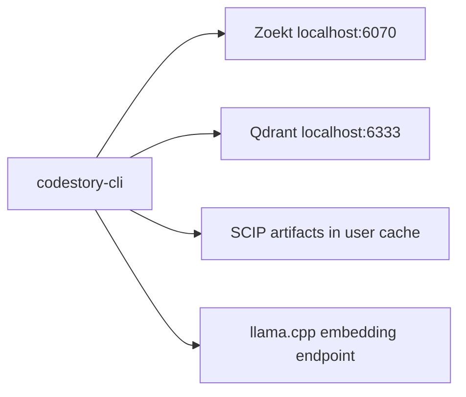

# Retrieval sidecars operations

Local Zoekt, Qdrant, SCIP, and llama.cpp sidecars back agent `packet`, `search`,
and `context`. They are required for `agent_packet_search` infrastructure
readiness: `retrieval status` must report `retrieval_mode: "full"` before those
surfaces can claim full sidecar retrieval.

A healthy SQLite cache alone is not enough. Full sidecars also do not prove
answer quality by themselves; answer quality still needs the matching
packet-runtime, drill, or benchmark evidence tier.

| Runtime truth | Allows | Blocks |
| --- | --- | --- |
| `codestory://status` | Current MCP `server_version`, `cli_version`, `server_executable`, `server_executable_sha256`, `sidecar_contract_version`, `plugin_runtime`, `build_source`, `repo_ref`, and `allowed_surfaces`; use this first when plugin MCP is live. | Guessing the active runtime from source checkout, marketplace cache, or PATH alone. |
| `allowed_surfaces.<surface>.allowed` for `ground`, `files`, `symbol`, `definition`, `trail`, `references`, `snippet`, `affected`, `symbols`, `get_node`, `neighbors`, `shortest_path`, and `query_subgraph` | The named MCP local graph surface only; check each surface's own `.allowed` bit before calling it. | Other local surfaces, `packet`, `search`, or `context`. |
| `allowed_surfaces.packet.allowed`, `allowed_surfaces.search.allowed`, and `allowed_surfaces.context.allowed` with `retrieval_mode=full` | `packet`, `search`, and `context` for broad candidate discovery and bounded evidence packets. | Answer-quality claims without packet-runtime, drill, benchmark, or source evidence. |

For local-only audits, do not run sidecar repair just because `packet`, `search`,
or `context` is blocked. Use this runbook when the task needs one of those
surfaces or when status says `agent_packet_search` should be repaired.
`context` is not a local-only browse surface.

Design: [`retrieval-design.md`](../architecture/retrieval-design.md).
Promotion checks: [`retrieval-architecture.md`](../testing/retrieval-architecture.md).



## Operator repair path

### Prerequisites

- Rust toolchain with `cargo`, or an already-built `codestory-cli` binary.
- Docker Desktop or Docker Engine for automated Qdrant, Zoekt, and llama.cpp
  sidecars.
- Node.js 18+ if you need `scripts/setup-retrieval-env.mjs` to fetch or verify
  the pinned GGUF.
- Localhost ports available: Zoekt `6070`, Qdrant HTTP `6333`, Qdrant gRPC
  `6334`, and llama.cpp embeddings `8080`.
- GGUF embedding model available through `CODESTORY_EMBED_MODEL_DIR`, or fetched
  with the setup wrapper.

Manual sidecar setup is allowed only when equivalent local Zoekt, Qdrant, and
llama.cpp services are already healthy. Agent-facing retrieval is invalid until
the CLI status proof below reports `full`.

### Minimum environment

For product sidecar retrieval, leave most knobs unset. Set these only when the
defaults do not match your machine:

| Variable | Minimum operator use |
|----------|----------------------|
| `CODESTORY_EMBED_MODEL_DIR` | Host path containing `bge-base-en-v1.5.Q8_0.gguf` for the compose embed service |
| `CODESTORY_EMBED_BACKEND` | `llamacpp`; unset also means product llama.cpp mode for retrieval commands |
| `CODESTORY_EMBED_LLAMACPP_URL` | Local embedding endpoint, default `http://127.0.0.1:8080/v1/embeddings` |
| `CODESTORY_ZOEKT_PORT` | Override Zoekt HTTP port when `6070` is unavailable |
| `CODESTORY_QDRANT_HTTP_PORT` | Override Qdrant HTTP port when `6333` is unavailable |
| `CODESTORY_QDRANT_GRPC_PORT` | Override Qdrant gRPC port when `6334` is unavailable |

Keep endpoint and cache-root settings out of project `.codestory.toml` files.
Use trusted user config, explicit CLI flags, or environment variables for those
trust boundaries.

### Bootstrap sidecars

From the CodeStory repository root:

```sh
node scripts/setup-retrieval-env.mjs --fetch-embed-model
cargo run -p codestory-cli -- retrieval bootstrap --project <repo> --format json
```

Use the environment variables from the minimum table only when the defaults do
not match your machine. On Windows PowerShell, set them with `$env:NAME =
"value"` and use `.\target\release\codestory-cli.exe` if you are running a
built binary.

`retrieval bootstrap` may start Docker Compose, create sidecar cache dirs, write
`retrieval-sidecars.json`, and repair CodeStory-owned local sidecar state. For a
no-change prerequisite check, run:

```sh
node scripts/setup-retrieval-env.mjs --check-only
```

Useful bootstrap flags:

| Flag | Purpose |
|------|---------|
| `--skip-compose` | Cache dirs and state file only; use only when equivalent sidecars are already running |
| `--wait-secs <n>` | Health wait timeout, default `90`; `0` means no wait |
| `--compose-file <path>` | Override `docker/retrieval-compose.yml` |

### Index and prove full mode

Plain `codestory-cli index` builds the core SQLite code index only. It can make
local navigation usable, but it does not generate sidecar artifacts or prove
packet/search readiness.

Run the full sidecar path for the target workspace:

```sh
cargo run -p codestory-cli -- index --project <repo> --refresh full
cargo run -p codestory-cli -- retrieval index --project <repo> --refresh full
cargo run -p codestory-cli -- retrieval status --project <repo> --format json
```

The proof is the final status JSON:

- `retrieval_mode` is exactly `"full"`.
- `capabilities.lexical`, `capabilities.semantic`, and `capabilities.graph`
  match the active manifest policy.
- `manifest_contract` is present and matches the current source root, input
  hash, generation, schema version, graph hash, symbol-doc count, dense-anchor
  count, and lane provenance.

Under `graph_first_v1`, a generation can be full with zero dense anchors. In
that case Qdrant is reported as policy-skipped instead of probing a missing
collection. That is still full mode only when Zoekt, SCIP, and the manifest
contract are complete.

### Non-full status actions

Non-`full` modes are diagnostic only. Product packet/search paths must fail
closed and must not claim sidecar-backed evidence.

| Status or condition | Meaning | Operator action |
|---------------------|---------|-----------------|
| `retrieval_manifest_missing` | Sidecars may be running, but no finalized manifest proves this workspace | Run `retrieval index --project <repo> --refresh full`, then rerun status |
| `unavailable` or Zoekt down | Lexical sidecar is unavailable | Free port `6070` or fix Zoekt, rerun bootstrap, then rerun index/status |
| `no_semantic`, `lexical_only`, or Qdrant down when dense anchors are expected | Semantic sidecar is unavailable or stale | Fix Qdrant/model/backend, rerun bootstrap and retrieval index, then rerun status |
| `no_scip` | Graph artifacts are missing or stale | Rerun retrieval index; inspect SCIP artifact paths if it repeats |
| Obsolete, stale, or partial manifest | Source, schema, graph, symbol-doc, dense-anchor, or backend contract drifted | Rerun `retrieval index --project <repo> --refresh full` |
| `full` with dense anchors `0` | Valid graph-first policy skip | No Qdrant repair needed; verify Zoekt, SCIP, and manifest contract fields |

Traces must include `retrieval_mode` and `degraded_reason`. A non-`full` mode is
not an answer-quality claim and not a product packet/search success.

### Cleanup and reset

Generated sidecar artifacts are disposable local cache state. To recover from a
bad setup:

1. Stop the relevant Docker/sidecar services.
2. Move the affected CodeStory-owned Qdrant, Zoekt, or SCIP cache directory
   aside under the cache root.
3. Rerun `retrieval bootstrap`.
4. Rerun `retrieval index --project <repo> --refresh full`.
5. Delete the backup only after status reports the expected mode.

`retrieval down` clears the sidecar state file only. Stop Docker/Compose
separately if containers must be removed.

Default Windows cache locations:

| Service | Default port | Data dir |
|---------|--------------|----------|
| Zoekt web/search | `6070` | `%LOCALAPPDATA%\codestory\cache\zoekt\` |
| Qdrant HTTP | `6333` | `%LOCALAPPDATA%\codestory\cache\qdrant\` |
| Qdrant gRPC | `6334` | `%LOCALAPPDATA%\codestory\cache\qdrant\` |
| SCIP artifacts | n/a | `%LOCALAPPDATA%\codestory\cache\scip\<sidecar-generation>\` |
| Sidecar state | n/a | `%LOCALAPPDATA%\codestory\cache\retrieval-sidecars.json` |

Downloaded model artifacts under `CODESTORY_EMBED_MODEL_DIR` or
`target/retrieval-models` are accepted only after pinned size and SHA-256
verification by the setup wrapper. Remove that model directory to uninstall the
downloaded GGUF. Managed ONNX assets from `setup embeddings` are separate and do
not substitute for llama.cpp sidecar retrieval.

## Operator troubleshooting

| Symptom | Likely cause | Action |
|---------|--------------|--------|
| `retrieval up` port in use | Stale process or container | Run `retrieval down`; inspect `docker ps`, Task Manager, or `ps`; free the port |
| Zoekt unhealthy or unreachable | Server not started or shard missing | Start Zoekt on `6070`, rerun retrieval index |
| Qdrant unhealthy | Wrong image tag, stale collection, volume permissions, or model/backend mismatch | Rerun bootstrap; if repeated, move the Qdrant cache aside and rebuild |
| Qdrant unavailable while dense-anchor count is `0` | Expected graph-first policy skip | Verify Zoekt, SCIP, and manifest contract fields |
| SCIP `scip_unavailable` | Graph artifacts missing | Rerun retrieval index and inspect the SCIP cache path |
| Smoke latency is high | Cold cache or oversized fixture | Retry once; then inspect tier envelope evidence |

## Maintainer internals

Operators should not need this section for basic recovery. Use it when changing
sidecar implementation, CI policy, retention behavior, or promotion gates.

### Version pins

| Dependency | Pin policy | Pinned version | Notes |
|------------|------------|----------------|-------|
| Zoekt real | `COMPOSE_PROFILES=real` | `zoekt-20250506123554` | `sourcegraph/zoekt-webserver:0.0.0-20250506123554-490422d1adb4` plus lexical shards |
| Qdrant | Fixed container image tag | `qdrant/qdrant:v1.12.5` | HTTP `6333`, gRPC `6334` |
| SCIP | CodeStory graph artifact emitter | `graph-<hash>` | Generated local graph artifacts under the sidecar generation |

CI `retrieval-sidecar-smoke` should use the same pins as local development.

### Manifest and generation contract

Project id is a stable FNV-1a hex hash of the canonical repo root, matching CLI
cache hashing. Sidecar artifacts are content-addressed by:

```text
sidecar_generation = <project-id>-<input-hash-prefix>
```

The input hash covers local source lexical input, generated `symbol_search_doc`
virtual docs, component-report virtual docs, dense-anchor rows, semantic file
roles, embedding backend and dimension, semantic policy version, dense reason
counts, and sidecar schema version.

`retrieval status` and `retrieval query` fail closed when the manifest is
obsolete or stale. Runtime paths must not infer or reuse bare project-id
sidecars. `retrieval index --refresh auto` may repair stale stored symbol-doc or
dense-anchor contracts by retrying once with a full refresh when finalization
detects the manifest would be unavailable immediately. Explicit `--refresh none`
and failed explicit refreshes still fail closed.

Finalization writes new generations instead of mutating the active generation:

- Zoekt shard: `zoekt/shards/<sidecar-generation>/`
- Qdrant collection: `codestory_<project-id>_<input-hash-prefix>`
- SCIP artifacts: `scip/<sidecar-generation>/`

If a previous `retrieval index` emitted artifacts but failed before manifest
persist, finalization probes the would-be generation before rebuilding. Qdrant
reuse requires an exact point count at least as large as the current dense-anchor
count; a one-point or partial collection is rebuilt instead of being blessed by
semantic smoke alone.

### Bootstrap storage repair

Before Compose starts, bootstrap may repair Qdrant storage:

1. Protection scan builds a protected set from default user cache DBs, active
   `--cache-dir`, and active project storage. Only manifest-recorded generated
   collections are protected.
2. Offline cleanup runs only when Qdrant HTTP is unreachable. It removes invalid
   CodeStory collection dirs and migrates obsolete stub markers.
3. Retention may prune unprotected `codestory_*` collections beyond the cap
   (`64`). If scan errors exist, retention deletes are skipped unless
   `CODESTORY_RETRIEVAL_PRUNE_ON_SCAN_ERROR=1`.

Non-`codestory_*` collection dirs are never deleted by this repair path.

### Query and embedding contracts

The default `docker/retrieval-compose.yml` stack starts product sidecars
directly. Historical compose-profile overrides, hash-vector modes, stubbed
sidecars, and partial sidecars are diagnostic only and cannot produce
`retrieval_mode: "full"` for product packet/search evidence.

Qdrant document vectors are copied from managed local `llm_symbol_doc`
dense-anchor rows when the stored embedding contract is product BGE base profile:
`bge-base-en-v1.5`, `768` dimensions, ONNX or llama.cpp backend. Query vectors
come from the local llama.cpp sidecar so retrieval remains sidecar-backed and
can smoke-test the live collection. Wrong model dimensions fail loudly.

Qdrant query-time search uses:

```text
POST /collections/{collection}/points/query
```

The response must contain `result.points[]`; older response shapes are contract
drift. Exact symbol queries are served from exact sidecar evidence first: once
SCIP or lexical stages produce an exact symbol anchor, semantic and graph
expansion lanes are skipped for that query.

### CI policy

`retrieval-sidecar-smoke` is a reduced CI contract lane, not the operator repair
path and not a full sidecar proof. Linux carries generic
lint/runtime/search/retrieval contract slices. Windows carries the
manifest-missing bootstrap/status shape only when manually dispatched or when a
PR has the `ci:windows-smoke` label.

The reduced CI sequence does not start real sidecars, fetch
`bge-base-en-v1.5.Q8_0.gguf`, build the project manifest required for full mode,
or prove answer quality. Full-mode gates must start real sidecars, provision the
GGUF model, index a fixture or target workspace, and verify:

```text
retrieval_mode == "full"
```

Live full-mode contracts are ignored or env-gated by default. Run them only
after dependencies are prepared, with `CODESTORY_STDIO_FULL_RETRIEVAL_TESTS=1`
or `CODESTORY_RETRIEVAL_EVAL_FULL_TESTS=1` set for the relevant contract lane.

Use CI trigger paths and exact pass criteria from
[`.github/workflows/retrieval-sidecar-smoke.yml`](../../.github/workflows/retrieval-sidecar-smoke.yml),
not from this operator runbook.

### Benchmark-only holdouts

Holdout repository prefetch belongs to benchmark lanes, not sidecar recovery.
Do not ask operators to materialize holdout repos while repairing local
packet/search sidecars.

## Related docs

- [`retrieval-architecture.md`](../testing/retrieval-architecture.md) - proof tiers, promotion checklist, and north-star SLOs
- [`retrieval-design.md`](../architecture/retrieval-design.md) - mode definitions, cost envelopes, and promotion guards
- [`docker/retrieval-compose.yml`](../../docker/retrieval-compose.yml) - local sidecar compose stack
- [`docker/retrieval.env.example`](../../docker/retrieval.env.example) - environment template
