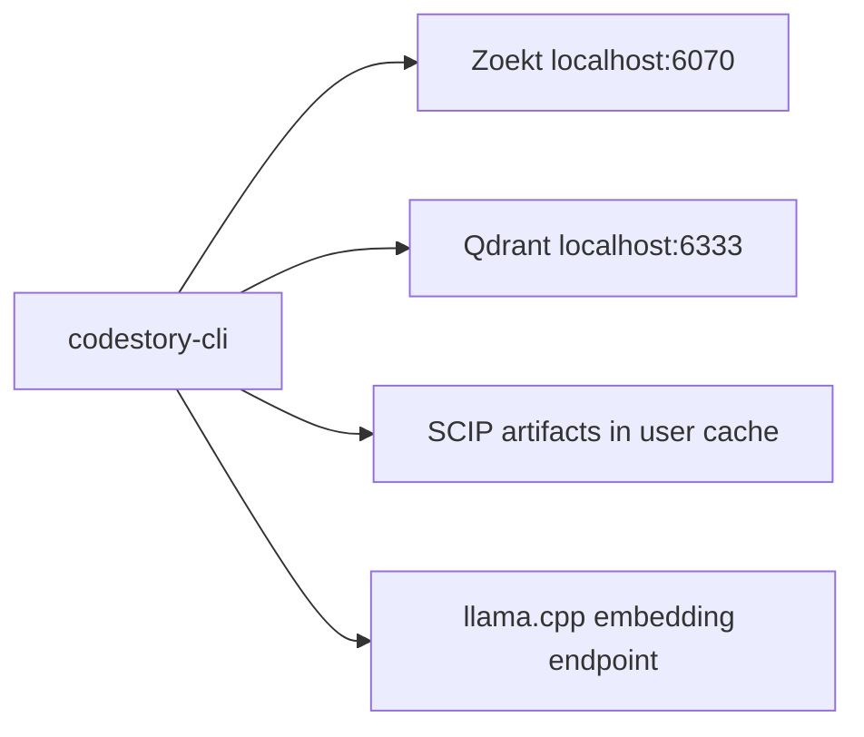

# Retrieval sidecars — Operations runbook

Local Zoekt, Qdrant, SCIP, and llama.cpp processes for agent `packet` and
`search`. Data dirs live under the user cache; default ports are 6070 (Zoekt)
and 6333 (Qdrant).

Required for `agent_packet_search` infrastructure readiness
(`retrieval_mode=full`). A healthy SQLite cache alone does not satisfy that
lane, and full sidecars do not by themselves promote answer quality.

Design: [`retrieval-design.md`](../architecture/retrieval-design.md).
Promotion checks: [`retrieval-architecture.md`](../testing/retrieval-architecture.md).



---

## Prerequisites

- Rust toolchain with `cargo` (primary path)
- Docker Desktop or Docker Engine for automated Qdrant, Zoekt, and embed sidecars
- Optional: Node.js 18+ for `scripts/setup-retrieval-env.mjs` wrapper
- Manual sidecar path: Zoekt webserver on `6070` and Qdrant on `6333` without Docker; all sidecars must still be healthy before agent-facing retrieval is valid
- Network: localhost only for sidecars; holdout clone needs outbound git

---

## Quick start: one command

From the CodeStory repository root (Windows, macOS, Linux):

```sh
cargo run -p codestory-cli -- retrieval bootstrap --project . --format json
```

This starts or checks the local sidecar services for the CodeStory checkout; it
does not by itself finalize the retrieval manifest for every target workspace.
The `--project .` is intentional here. For another repo, pass that repo path to
`--project`.

Plain `codestory-cli index` builds the core SQLite code index only. It can make
the local navigation lane usable, but it does not generate sidecar artifacts or
prove agent packet/search infrastructure readiness. Use
`codestory-cli retrieval index --project <repo>` to generate Zoekt, Qdrant, and
SCIP sidecar artifacts, then use `codestory-cli retrieval status --project
<repo> --format json` to verify `retrieval_mode: "full"` before using
agent-facing packet/search evidence. Packet answer quality still requires the
matching packet-runtime or drill evidence tier.

First-run evidence path:

```sh
node scripts/setup-retrieval-env.mjs --fetch-embed-model
export CODESTORY_EMBED_MODEL_DIR="$(pwd)/target/retrieval-models"
export CODESTORY_EMBED_BACKEND="llamacpp"
export CODESTORY_EMBED_LLAMACPP_URL="http://127.0.0.1:8080/v1/embeddings"
./target/release/codestory-cli retrieval bootstrap --project <repo> --format json
./target/release/codestory-cli index --project <repo> --refresh full
./target/release/codestory-cli retrieval index --project <repo> --refresh full
./target/release/codestory-cli retrieval status --project <repo> --format json
```

On Windows PowerShell, use `.\target\release\codestory-cli.exe` and `$env:...`
assignments for the same flow.

`retrieval status` must show `retrieval_mode: "full"`. Its JSON backend fields
distinguish the active query backend (`query_embedding_backend`), manifest
vector contract (`manifest_vector_embedding_backend`), and stored dense-anchor
producer (`stored_doc_vector_producer_backend`). Under `graph_first_v1`, a
generation can be full with zero dense anchors; in that case status reports the
Qdrant component as policy-skipped rather than querying a missing collection.

Status after bootstrap:

```sh
cargo run -p codestory-cli -- retrieval status --project . --format json
```

Optional aliases are defined in [`.cargo/config.toml`](../../.cargo/config.toml).
They wrap the same project-dot bootstrap and status commands.

**Bootstrap flags** (via `cargo run -p codestory-cli -- retrieval bootstrap ...`):

| Flag | Purpose |
|------|---------|
| `--skip-compose` | Cache dirs + state file only; use only when equivalent local sidecars are already running |
| `--wait-secs <n>` | Health wait timeout (default `90`; `0` = no wait) |
| `--compose-file <path>` | Override `docker/retrieval-compose.yml` |

**Optional Node wrapper** (prerequisite checks, optional holdout clone):

```sh
node scripts/setup-retrieval-env.mjs
node scripts/setup-retrieval-env.mjs --check-only
node scripts/setup-retrieval-env.mjs --skip-compose
node scripts/setup-retrieval-env.mjs --with-holdout-clone
```

| Wrapper flag | Purpose |
|------|---------|
| `--check-only` | Prerequisites report only; exit 1 if required tools missing |
| `--skip-compose` | Passed to bootstrap |
| `--skip-build` | Skip `cargo build` when the wrapper invokes bootstrap directly |
| `--with-holdout-clone` | Also run `scripts/fetch-holdout-repos.mjs` (large git clones under `target/`) |

When `--fetch-embed-model` is present, the wrapper downloads
`bge-base-en-v1.5.Q8_0.gguf` to a process-scoped temporary file, verifies the
exact size (`117974304` bytes) and SHA-256
(`ad1afe72cd6654a558667a3db10878b049a75bfd72912e1dabb91310d671173c`), and only
then renames it into `CODESTORY_EMBED_MODEL_DIR` or `target/retrieval-models`.
Existing model files must pass the same verification. Configured fallback URLs
are mirrors only because the same checksum gates every accepted artifact.

**Direct CLI** (equivalent to alias):

```sh
cargo run -p codestory-cli -- retrieval bootstrap --project .
```

Compose file: [`docker/retrieval-compose.yml`](../../docker/retrieval-compose.yml). Env template:
[`docker/retrieval.env.example`](../../docker/retrieval.env.example).

---

## Version pin policy

| Dependency | Pin policy | Pinned version | Notes |
|------------|------------|----------------|-------|
| Zoekt real | `COMPOSE_PROFILES=real` | `zoekt-20250506123554` | `sourcegraph/zoekt-webserver:0.0.0-20250506123554-490422d1adb4` + lexical shards |
| Qdrant | Fixed container image tag | `qdrant/qdrant:v1.12.5` | HTTP `6333`, gRPC `6334` |
| SCIP | CodeStory graph artifact emitter | `graph-<hash>` | Generated local graph artifacts under the sidecar generation |

Update this table when production Zoekt/SCIP toolchains are wired. CI `retrieval-sidecar-smoke` must use the
same pins as local dev.

---

## Ports and data directories

| Service | Default port | Data dir (Windows) |
|---------|--------------|---------------------|
| Zoekt web/search | `6070` | `%LOCALAPPDATA%\codestory\cache\zoekt\` |
| Qdrant HTTP | `6333` | `%LOCALAPPDATA%\codestory\cache\qdrant\` |
| Qdrant gRPC | `6334` | same |
| SCIP artifacts | n/a (files) | `%LOCALAPPDATA%\codestory\cache\scip\<sidecar-generation>\` |
| Sidecar state | n/a | `%LOCALAPPDATA%\codestory\cache\retrieval-sidecars.json` |

Override ports with `CODESTORY_ZOEKT_PORT`, `CODESTORY_QDRANT_HTTP_PORT`, `CODESTORY_QDRANT_GRPC_PORT`.

Project id is a stable FNV-1a hex hash of the canonical repo root (same scheme as CLI cache hashing).
Sidecar artifacts are content-addressed by `sidecar_generation = <project-id>-<input-hash-prefix>`.
The hash covers local source lexical input, generated `symbol_search_doc` virtual docs,
component-report virtual docs, dense-anchor rows, semantic file roles, embedding
backend/dim, semantic policy version, dense reason counts, and sidecar schema version.
Re-running `retrieval index` with unchanged inputs validates
the live generation and reuses it instead of rewriting Zoekt, Qdrant, or SCIP.

`retrieval status` and `retrieval query` fail closed when the manifest is obsolete or stale. A valid
manifest must include the current sidecar schema version, input hash, derived generation id, derived
Qdrant collection, matching symbol-doc count, matching dense-anchor count, semantic policy version,
graph artifact hash, and dense reason counts. If the SQLite graph projection, symbol docs, dense-anchor
contract, or policy version changes after the manifest is written, rerun `retrieval index`; runtime paths
will not infer or reuse bare project-id sidecars.
`retrieval index --refresh auto` repairs stale stored symbol-doc or dense-anchor contracts by retrying once with a
full refresh when finalization detects that the manifest would be unavailable immediately. Explicit
`--refresh none` and failed explicit refreshes still fail closed instead of serving degraded sidecars.

Confirm bindings with:

```sh
./target/release/codestory-cli retrieval status --project .
```

---

## CLI workflow

### Bootstrap (recommended: Compose + cache dirs + wait)

```sh
cargo build --release -p codestory-cli
./target/release/codestory-cli retrieval bootstrap --project .
```

Starts `docker/retrieval-compose.yml` when Docker is available (`qdrant/qdrant:v1.12.5`, Zoekt
webserver on `6070`, and llama.cpp embeddings on `8080`), writes
`retrieval-sidecars.json`, and waits for Zoekt, Qdrant, and llama.cpp embedding HTTP probes.
Bootstrap removes stale pre-mandatory `codestory-zoekt-stub` containers before starting the
real sidecars. It discovers the embed model directory from `CODESTORY_EMBED_MODEL_DIR`,
`target/retrieval-models`, or `models/gguf/bge-base-en-v1.5` when the GGUF file is present.
The embed service uses the measured local request geometry (`-np 6`, `-b 1024`, `-ub 1024`).
Qdrant document vectors are copied from the already-managed local `llm_symbol_doc` dense-anchor
table when the stored embedding contract is the product BGE base profile
(`bge-base-en-v1.5`, 768 dimensions, ONNX or llama.cpp backend). Under `graph_first_v1`, most code
symbols live only in `symbol_search_doc` and Zoekt; Qdrant contains selected dense anchors such as
entrypoints, public APIs, documented nontrivial symbols, central graph nodes, component reports, and
unstructured docs. The llama.cpp sidecar remains mandatory for query embeddings and live semantic
smoke checks when dense anchors exist, but cold sidecar indexing must not re-embed every code symbol
just to populate Qdrant.
Qdrant query-time search uses the current Query API
`POST /collections/{collection}/points/query` and requires `result.points[]` in the response;
older search response shapes are treated as contract drift. Exact symbol queries are served from
exact sidecar evidence first: once SCIP or lexical stages produce an exact symbol anchor, semantic
and graph expansion lanes are skipped for that query instead of letting broad semantic evidence
displace the exact hit.

Before Compose starts, bootstrap repairs Qdrant storage:

1. **Protection scan** — builds a protected set from:
   - every `codestory.db` under the default user cache root (hashed subdirs),
   - the active `--cache-dir` tree when it differs from the default root (flat `codestory.db` or hashed subdirs),
   - the active project `storage_path` when not already scanned.
   Only manifest-recorded generated collections are protected; bare project-id collections are obsolete diagnostics and may be pruned.
   Unreadable cache roots or DBs are recorded as `storage_repair.scan_errors` in bootstrap output; repair continues with partial protection (bootstrap does **not** abort solely because a cache tree could not be read).

2. **Offline cleanup (Qdrant unreachable only)** — when the Qdrant HTTP probe fails, invalid `collections/codestory_*` dirs without Qdrant config are removed and obsolete in-collection stub markers are migrated to `codestory-stub-markers/`. When Qdrant is reachable, these on-disk steps are skipped to avoid races with a live server. Non-`codestory_*` collection dirs are never deleted by this step.

3. **Retention (fail-closed on scan errors)** — excess `codestory_*` collections beyond the cap (64) may be pruned among **unprotected** collections only, ranked by manifest `built_at_epoch_ms` when known, else directory mtime. When every collection is protected but count exceeds the cap, bootstrap sets `overflow_protected=true` and prunes nothing. When `storage_repair.scan_errors` is non-empty, **all** retention deletes are skipped (`pruned_collections=0`) and `prune_suppressed_reason` is set to `protection_scan_error` unless `CODESTORY_RETRIEVAL_PRUNE_ON_SCAN_ERROR=1` (default off).

While Qdrant is reachable, pruning uses HTTP `DELETE /collections/{name}`; when offline, stale collection dirs are removed on disk.

### Start sidecars (data dirs + state file only)

```sh
./target/release/codestory-cli retrieval up
```

Does **not** start Docker. Use `retrieval bootstrap` or the setup script for automated Compose.

### Health check

```sh
./target/release/codestory-cli retrieval status --project .
```

JSON includes per-component `status`, `latency_ms`, `detail`, `capabilities` flags
(`lexical`, `semantic`, `graph`), and top-level `retrieval_mode`
(`full`, `no_scip`, `no_semantic`, `lexical_only`, `unavailable`). Only `full`
is allowed to serve agent-facing retrieval.

| Component | Healthy when |
|-----------|--------------|
| zoekt | HTTP reachable on `6070`, real shard dir (no `.zoekt-stub` marker) |
| qdrant | when manifest dense-anchor count is >0: collection exists, no stub marker under `{qdrant_data_dir}/codestory-stub-markers/{collection}.qdrant-stub` (obsolete `collections/{collection}/.qdrant-stub` also counts as stubbed), reported point count is at least the manifest dense projection count, and semantic smoke search returns repo-relative paths; when dense-anchor count is 0: reported healthy/semantic with an explicit policy-skipped detail and no collection probe |
| scip | `symbols.index.json`, `index.scip`, and non-empty `revision.txt` exist under the manifest generation, with no `index.scip.stub` |

### Mandatory sidecars

The default `docker/retrieval-compose.yml` stack starts the required product sidecars directly.
Historical compose-profile overrides and hash-vector modes are rejected by product bootstrap/index
paths. Stubbed, hash-vector, or partial sidecars report a non-`full` mode and fail closed for agent-facing packet/search
paths. Sidecar-primary packet runs require a project-scoped lexical shard, live llama.cpp
semantic state, and SCIP graph artifacts. `CODESTORY_RETRIEVAL=0` is unsupported.
Managed `setup embeddings` output is not a substitute for this lane: it may
install local semantic assets, but it does not start llama.cpp, build the
retrieval manifest, or make `retrieval status` report `full`.

**Shipped component status:**

| Component | Status |
|-----------|--------|
| Zoekt | `retrieval index` builds `lexical-index.jsonl` shards for the active sidecar generation; client searches the manifest generation |
| Qdrant | 768-d bge-base vectors copied from stored local dense anchors are mandatory when dense anchors exist; `semantic=true` only after smoke search succeeds against the manifest collection and manifest records the product embedding backend. If `graph_first_v1` selects zero dense anchors, Qdrant is intentionally skipped and full mode remains valid only with complete graph/lexical artifacts |
| SCIP | Graph symbols emitted to `symbols.index.json` + `index.scip` under the active sidecar generation from the full SQLite symbol projection |

### Real embeddings (bge-base-en-v1.5 + llama.cpp)

Promotion uses **768-d** vectors. Qdrant document vectors come from stored
dense anchors with product-compatible vector metadata. Query vectors come from
the local llama.cpp sidecar so retrieval remains sidecar-backed and can
smoke-test the live collection. With real vectors enabled, an unset retrieval
backend means this product llama.cpp contract; explicit ONNX or hash modes are
diagnostic only and never produce `retrieval_mode=full`.

1. Download GGUF (once): `node scripts/setup-retrieval-env.mjs --fetch-embed-model`
   verifies the pinned size/SHA-256 before the model is accepted.
2. Export (see [`docker/retrieval.env.example`](../../docker/retrieval.env.example)):
   - `CODESTORY_EMBED_MODEL_DIR=<repo>/target/retrieval-models`
   - `CODESTORY_EMBED_BACKEND=llamacpp` (recommended explicit product mode; unset is also product mode for retrieval commands)
   - `CODESTORY_EMBED_LLAMACPP_URL=http://127.0.0.1:8080/v1/embeddings`
3. `./target/release/codestory-cli retrieval bootstrap --project <repo> --format json`
   starts Qdrant, Zoekt webserver, and `codestory-embed` on `:8080`.
4. Dim smoke: `curl -s http://127.0.0.1:8080/v1/embeddings -H "Content-Type: application/json" -d "{\"input\":[\"function\"]}"` → embedding length **768**
5. `retrieval index --project <repo> --refresh full` (manifest records `embedding_backend`, `embedding_dim`, `sidecar_input_hash`, `sidecar_generation`, the generated Qdrant collection, `symbol_doc_count`, `dense_projection_count`, `semantic_policy_version`, `graph_artifact_hash`, and dense reason counts; the input hash includes symbol-doc and dense-anchor metadata plus the embedding contract)
6. `retrieval status` → `retrieval_mode: full` and `capabilities.semantic=true`

Wrong model dim with `CODESTORY_EMBED_BACKEND=llamacpp` fails loudly (no hash substitution).

### Index project

```sh
./target/release/codestory-cli retrieval index --project . --refresh auto
```

Runs workspace index (same as `codestory index`) then persists `retrieval_index_manifest` in
`codestory.db`. Zoekt, Qdrant, and SCIP are mandatory; missing sidecars or empty sidecar
artifacts fail the command instead of writing stub markers.

Index finalization writes new generations instead of mutating the manifest generation in place:

- Zoekt shard: `zoekt/shards/<sidecar-generation>/`
- Qdrant collection: `codestory_<project-id>_<input-hash-prefix>`
- SCIP artifacts: `scip/<sidecar-generation>/`

The manifest is updated only after the generated sidecars are emitted. If the manifest hash,
schema version, symbol-doc count, dense-anchor count, semantic policy version, graph artifact hash,
dense reason counts, embedding backend/dim, and live health still match, finalization
returns the existing manifest and skips the rebuild path. This is the intended fast path for
iterative evidence loops with `--refresh none` after a successful generation build.

If a previous `retrieval index` attempt emitted generated artifacts but failed before manifest
persist, finalization probes the would-be generation before rebuilding. Healthy Zoekt shards,
complete Qdrant collections, and SCIP artifacts are reused independently. Qdrant reuse requires an
exact point count at least as large as the current dense-anchor count; a one-point or otherwise
partial collection is rebuilt instead of being blessed by semantic smoke alone. When dense-anchor
count is zero, Qdrant reuse is skipped explicitly and cannot mask stale graph/lexical artifacts.

### Stop sidecars (state file only)

```sh
./target/release/codestory-cli retrieval down
```

### Standalone Query

```sh
./target/release/codestory-cli retrieval query "ExtensionService" --project .
```

---

## Preflight smoke contract

Use the full sequence locally before index/query changes. The CI job
`retrieval-sidecar-smoke` keeps default PR feedback on the fast Linux contract
lane because full index/query on the monorepo can exceed runner budgets and CI
does not fetch the GGUF embedding model. Linux carries the generic
lint/runtime/search/retrieval contract slices. Windows keeps the path-sensitive
manifest-missing bootstrap/status shape, but it runs only on `workflow_dispatch`
or when a PR has the `ci:windows-smoke` label. Superseded PR runs are canceled
automatically so a new push does not leave an older smoke run burning runner
time.

**Local full sequence:**

1. `retrieval up` - exit 0
2. `retrieval status` - JSON with expected shape; non-`full` status is a failure for agent use
3. `retrieval index --project <fixture>` - manifest row in SQLite only when all sidecars are real
4. `retrieval query "<smoke query>"` - standalone sidecar query
5. `retrieval down` - clean shutdown

**CI reduced sequence:**

Linux `linux-contracts`:

1. generalization lint - exit 0
2. Targeted runtime sidecar and packet contract filters - exit 0:
   - `cargo test -p codestory-runtime --lib agent::retrieval_primary::tests`
   - `cargo test -p codestory-runtime --lib agent::packet_search::tests`
   - `cargo test -p codestory-runtime --lib agent::packet_claim_profiles::tests`
   - `cargo test -p codestory-runtime --lib search_rejects_natural_language_queries_without_full_sidecars`
   - `cargo test -p codestory-runtime --lib search_results_ignores_repo_text_hits_without_full_sidecars`
   - `cargo test -p codestory-runtime --lib repo_text_auto_fallback_is_not_product_search_without_full_sidecars`
3. `cargo test -p codestory-cli --test stdio_protocol_contracts` - exit 0
4. `cargo test -p codestory-cli --test search_json_output` - exit 0 for non-live fail-closed search contracts
5. `cargo test -p codestory-retrieval` - exit 0

Windows `windows-manifest-missing` (manual or `ci:windows-smoke` label):

1. `cargo test -p codestory-cli --test retrieval_bootstrap_contracts` - exit 0;
   this integration suite runs the clean pre-index bootstrap/status shape and
   asserts `degraded_reason == "retrieval_manifest_missing"` without reporting
   `retrieval_mode=full`

The reduced CI sequence is not a full sidecar smoke and it is not a full runtime
library sweep. It verifies generic runtime/stdio/search/retrieval contract slices
on Linux. When the optional Windows lane runs, it creates local cache/state
directories plus verifies manifest-missing status JSON on Windows. It does not start sidecars, fetch
`bge-base-en-v1.5.Q8_0.gguf`, build the project manifest required for
`retrieval_mode=full`, or run every `codestory-runtime --lib` test. The included
`retrieval_bootstrap_contracts` suite builds the CLI through Cargo's
integration-test path instead of a standalone release build step. The included
`search_json_output` suite covers non-live fail-closed search behavior; it does
not claim stdio, CLI, or runtime full-mode success. Full-mode gates must start
real sidecars, provision the GGUF model, index a fixture or target workspace, and
verify `retrieval_mode == "full"`. A full runtime library sweep remains a
promotion/pre-merge lane for broad runtime work:

```sh
cargo test -p codestory-runtime --lib
```

The Rust fixture guard for the generalization lint is also a deep/manual lane,
not a default PR smoke step. Run it when changing the lint itself or its fixture
coverage:

```sh
cargo test -p codestory-runtime --test retrieval_generalization_guard
```

The live full-mode contracts are ignored or env-gated by default and should be
run explicitly only after those dependencies are prepared: set
`CODESTORY_STDIO_FULL_RETRIEVAL_TESTS=1` before running stdio full-mode contracts
with `-- --ignored --nocapture`,
`cargo test -p codestory-cli --test search_json_output -- --ignored --nocapture search_json_emits_sidecar_primary_results_without_repo_text_fallback`
and the ignored `retrieval_eval_*` tests with `CODESTORY_RETRIEVAL_EVAL_FULL_TESTS=1`.

**Failure policy:** PRs touching `codestory-retrieval` or sidecar wiring fail CI if smoke fails.

**CI trigger paths:** match
[`.github/workflows/retrieval-sidecar-smoke.yml`](../../.github/workflows/retrieval-sidecar-smoke.yml)
`paths:` filters — `crates/codestory-retrieval/**`, `crates/codestory-contracts/**`,
`crates/codestory-store/Cargo.toml`, `crates/codestory-store/src/**`, `crates/codestory-cli`
retrieval/stdio sources (`retrieval.rs`, `main.rs`, `args.rs`, `runtime.rs`, `stdio_*.rs`),
`crates/codestory-cli/tests/retrieval_bootstrap_contracts.rs`,
`search_json_output.rs`, `stdio_protocol_contracts.rs`, `crates/codestory-runtime/src/**`,
`crates/codestory-indexer/Cargo.toml`, `crates/codestory-indexer/src/lib.rs`,
`scripts/lint-retrieval-generalization.mjs`, `scripts/**retrieval**`,
`docs/ops/retrieval-sidecars.md`, `docs/architecture/retrieval-*.md`,
`docs/testing/retrieval-architecture.md`, `docker/retrieval-compose.yml`, and the workflow file itself.

**CI pass criteria (`retrieval-sidecar-smoke`):**

1. Linux generalization lint exits 0.
2. Linux Rust cache restore/save completes or gracefully misses without masking later failures.
3. Linux targeted runtime sidecar and packet contract filters exit 0.
4. `cargo test -p codestory-cli --test stdio_protocol_contracts` exits 0.
5. `cargo test -p codestory-cli --test search_json_output` exits 0 for non-live fail-closed search contracts.
6. `cargo test -p codestory-retrieval` exits 0.
7. If the Windows lane is requested, Windows Rust cache restore/save completes or gracefully misses without masking later failures.
8. If the Windows lane is requested, `cargo test -p codestory-cli --test retrieval_bootstrap_contracts` exits 0, including the bootstrap/status assertion that reports `degraded_reason == "retrieval_manifest_missing"` and non-`full` mode on a clean temp project before indexing.

Both jobs restore a Rust build cache before Cargo steps; a new cache key may
still pay one cold compile, but later pushes should reuse warmed target and Cargo
dependency state. Cache restore/save steps are non-blocking, and save runs after
failed Cargo steps so follow-up pushes do not repeatedly pay the full cold-compile
cost. The manifest-missing smoke lives in `retrieval_bootstrap_contracts`
so Cargo builds the CLI through the integration-test path instead of paying for a
standalone build step before the tests. The production generalization lint stays
in the generic Linux job; the Rust fixture guard is reserved for lint-rule
changes or promotion review.

**Holdout prefetch (benchmark harness, not sidecar CLI):**

```sh
node scripts/codestory-agent-ab-benchmark.mjs \
  --list --task-suite holdout-retrieval --materialize-repos
```

Clones land in `target/agent-benchmark/repos/` (gitignored).

## Troubleshooting

| Symptom | Likely cause | Action |
|---------|--------------|--------|
| `retrieval up` port in use | stale process | `retrieval down`; check `ps`, Task Manager, or `docker ps` |
| Zoekt unhealthy, unreachable | server not started | start Zoekt on `6070` and rebuild the project shard |
| Qdrant unhealthy | wrong image tag / volume permissions | `docker run -p 6333:6333 qdrant/qdrant:v1.12.5` |
| Qdrant unavailable while manifest dense-anchor count is `0` | expected graph-first policy skip | Verify Zoekt and SCIP are healthy and manifest policy/count/hash fields match; the dense stage will be skipped explicitly |
| SCIP `scip_unavailable` | graph artifacts missing | fix SCIP emission before using agent-facing retrieval |
| Smoke > 100ms / 200ms | cold cache or oversized fixture | retry; check tier envelope |

---

## Mandatory sidecar modes (operator view)

When a sidecar is down, the sidecar executor selects a non-`full` mode per the
[mode matrix](../architecture/retrieval-design.md#mode-matrix). Non-`full` modes
are diagnostic only and fail closed for product packet/search paths.

| Condition | User-visible mode | Action |
|-----------|-------------------|--------|
| Zoekt down | `unavailable` | Fix Zoekt; no product query should run |
| Qdrant down, Zoekt up, dense anchors expected | `no_semantic` or `lexical_only` | Fix Qdrant; no product query should run |
| Qdrant skipped, Zoekt up, SCIP up, dense anchors `0` | `full` | Valid graph/lexical full mode for the active policy; dense query stage is skipped |
| SCIP down | `no_scip` | Fix SCIP artifacts; no product query should run |

Traces must include `retrieval_mode` and `degraded_reason`.

---

## Environment variables

| Variable | Purpose |
|----------|---------|
| `CODESTORY_RETRIEVAL` | unset or `1` uses mandatory sidecar primary when mode is `full`; non-`full` modes fail closed; `0` is unsupported |
| `CODESTORY_RETRIEVAL_SHADOW` | Historical diagnostic trace switch; unsupported in product benchmarks |
| `CODESTORY_RETRIEVAL_REAL_EMBEDDINGS` | defaults to `1`; `0` is unsupported for product dense-anchor indexing or packet/search evidence when dense anchors exist |
| `CODESTORY_EMBED_BACKEND` | unset/default product mode, `llamacpp`, or `llama_cpp` for sidecar query embeddings; explicit `onnx` is non-product for sidecar retrieval and cannot finalize/report full product mode |
| `CODESTORY_EMBED_LLAMACPP_URL` | local OpenAI-compatible llama.cpp embedding endpoint (default `http://127.0.0.1:8080/v1/embeddings`) |
| `CODESTORY_EMBED_MODEL_DIR` | Host path to `bge-base-en-v1.5.Q8_0.gguf` for compose `embed` service |
| `CODESTORY_EMBED_PORT` | llama.cpp server port (default `8080`) |
| `CODESTORY_RETRIEVAL_COMPOSE_PROFILE` | `real` by default; every other value is unsupported for product bootstrap |
| `CODESTORY_ZOEKT_ENABLED` | on by default; `0` is unsupported for product retrieval |
| `CODESTORY_QDRANT_ENABLED` | on by default; `0` is unsupported for product retrieval |
| `CODESTORY_ZOEKT_PORT` | Zoekt HTTP port (default `6070`) |
| `CODESTORY_QDRANT_HTTP_PORT` | Qdrant HTTP (default `6333`) |
| `CODESTORY_QDRANT_GRPC_PORT` | Qdrant gRPC (default `6334`) |
| `CODESTORY_RETRIEVAL_PRUNE_ON_SCAN_ERROR` | `1` allows retention deletes despite protection-scan errors (default off; fail-closed prune) |
| `CODESTORY_EVAL_PROBES` | Test-only benchmark probe catalog switch; production runtime ignores this env var |

Keep endpoint and cache-root settings out of project `.codestory.toml` files.
Project config may describe indexing and semantic-document preferences, but
`cache_dir`, `summary_endpoint`, `summary_model`, and embedding endpoint fields
are trust boundaries. Use trusted user config, explicit CLI flags such as
`--cache-dir`, or environment variables such as `CODESTORY_SUMMARY_ENDPOINT`,
`CODESTORY_SUMMARY_MODEL`, and `CODESTORY_EMBED_LLAMACPP_URL`. Set
`CODESTORY_ALLOW_PROJECT_NETWORK_CONFIG=1` only when intentionally allowing a
project file to provide network endpoints for that run.

---

## Related docs

- [`retrieval-architecture.md`](../testing/retrieval-architecture.md) — proof tiers, promotion checklist, and north-star SLOs
- [`retrieval-design.md`](../architecture/retrieval-design.md) — mode definitions, cost envelopes, and promotion guards
