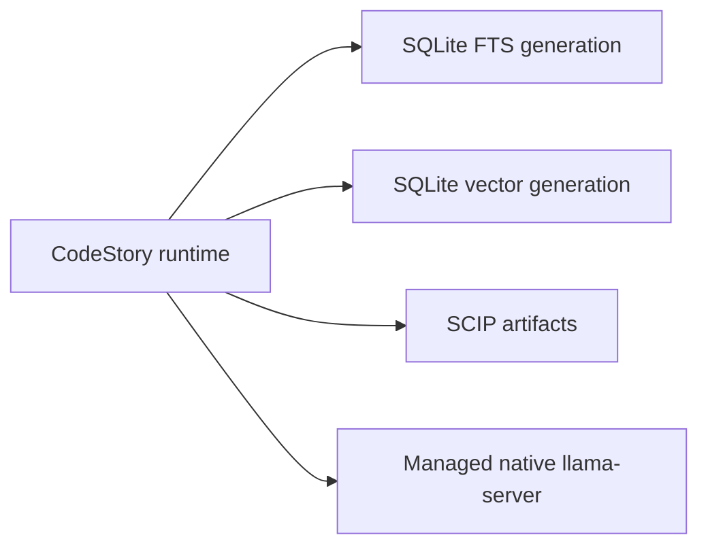

# Managed retrieval operations

CodeStory builds project-local SQLite lexical and vector generations, SCIP
artifacts, and a manifest that binds them to the current source publication.
Query embeddings come from the checksum-pinned native `llama-server` selected
for the host. Normal plugin tools prepare these dependencies automatically.

`retrieval_mode: "full"` means the current manifest, SQLite generations, SCIP
artifacts, embedding runtime, and required accelerator proof all agree. It is
an infrastructure gate, not an answer-quality claim.



Design: [`retrieval-design.md`](../architecture/retrieval-design.md).
Promotion checks: [`retrieval-architecture.md`](../testing/retrieval-architecture.md).

## Agent readiness repair

Agents should call the intended CodeStory tool directly. A cold or stale
project starts one managed preparation operation and returns a same-tool retry.
Read `codestory://status` only when that operation stops converging.

Local navigation and broad retrieval are separate. `ground`, `files`, and
symbol navigation may remain available while packet/search preparation is in
progress or has failed.

For a maintainer transcript:

```sh
codestory-cli agent preflight --project <repo> --format json
codestory-cli doctor --project <repo> --format markdown
codestory-cli retrieval status --project <repo> --format json
```

| State | Meaning | Action |
| --- | --- | --- |
| `local_navigation=ready`, `agent_packet_search=ready`, `retrieval_mode=full` | The current publication and managed runtime agree | Use packet/search; establish answer quality separately |
| `agent_packet_search=repairing` | One owned preparation operation is active | Retry the same tool after its reported delay; do not start another repair |
| `agent_packet_search=repair_retrieval` | Managed preparation terminated without a valid full publication | Inspect the terminal operation and first failed layer |
| `local_navigation=repair_local` | The core project index is missing or stale | Follow `recommended_next_calls`; use `ground` for normal activation |
| `retrieval_mode` is not `full` | Broad retrieval is blocked | Repair the first failed layer; do not treat local graph readiness as semantic readiness |

Capture the operation id, terminal error envelope, `doctor` output, retrieval
status, and exact failing tool response. Do not move aside or delete cache state
until ownership and the failing generation are explicit.

## Operator repair path

The plugin owns setup. Contributors can exercise the same path with:

```sh
cargo run --locked -p codestory-cli -- retrieval bootstrap --project <repo> --format json
cargo run --locked -p codestory-cli -- index --project <repo> --refresh full
cargo run --locked -p codestory-cli -- retrieval index --project <repo> --refresh full
cargo run --locked -p codestory-cli -- retrieval status --project <repo> --format json
```

Bootstrap downloads missing model and backend assets into the machine-wide
managed cache, verifies their declared byte size and SHA-256, and publishes
them atomically. Concurrent first use is serialized. Invalid canonical files
and interrupted partials are quarantined inside their asset directory.

Use `node scripts/setup-retrieval-env.mjs --check-only` for a no-change
contributor preflight. `--fetch-embed-model --fetch-llama-server --fetch-only`
prewarms the same managed assets for offline work.

### Platform policy

| Host | Managed runtime | Required proof |
| --- | --- | --- |
| macOS arm64 | Native Metal | Matching process identity, live embed smoke, positive offload, `gpu_proof=verified` |
| macOS x64 | Native CPU | Matching process identity and live embed smoke; never a Metal claim |
| Windows x64/arm64 | Checksum-pinned native backend selected by metadata | Matching executable, arguments, process-start identity, and provider-specific proof |
| Linux x64/arm64 | Checksum-pinned native backend selected by metadata | Matching executable, arguments, process-start identity, and provider-specific proof |

The managed runtime chooses a dynamic or persisted endpoint. Probes must use
that selected endpoint rather than assuming port `8080`. A dead endpoint,
changed executable, changed arguments, reused PID, or invalid accelerator proof
blocks packet/search even when a stored manifest says `full`.

Environment overrides are maintainer diagnostics, not required setup:

| Variable | Use |
| --- | --- |
| `CODESTORY_EMBED_MODEL_DIR` | Select an explicit trusted model directory |
| `CODESTORY_EMBED_NATIVE_LLAMA_SERVER` | Select an explicit native executable by absolute path |
| `CODESTORY_EMBED_LLAMACPP_URL` | Select a trusted compatible endpoint |
| `CODESTORY_EMBED_ALLOW_CPU=1` or `CODESTORY_EMBED_DEVICE_POLICY=allow_cpu` | Permit intentional CPU operation where policy otherwise requires acceleration |
| `CODESTORY_EMBED_LLAMACPP_DEVICE` | Override the requested provider/device for diagnostics |
| `CODESTORY_EMBED_LLAMACPP_N_GPU_LAYERS` | Override requested GPU layers for diagnostics |

Repository configuration cannot select cache roots, credentials, or network
endpoints by default. `CODESTORY_ALLOW_PROJECT_NETWORK_CONFIG=1` explicitly
trusts every repository opened by that process to select summary and embedding
egress endpoints.

### Full-mode proof

Require all of the following from the final status:

- `retrieval_mode` is exactly `full`.
- The lexical and vector SQLite generation identities match the manifest.
- Symbol-document, dense-anchor, semantic-policy, graph-hash, and dense-reason
  counts match the current publication.
- SCIP artifacts are present and current.
- The selected native embedding process matches its persisted executable,
  arguments, start identity, model, backend, and dimension.
- Accelerator-required hosts report a verified live smoke and positive
  provider/offload evidence. CPU-policy hosts report the explicit CPU policy.

Under `graph_first_v1`, zero dense anchors is valid when the manifest records
that policy result and the lexical and SCIP generations are current.

### Non-full status actions

| Status | First repair |
| --- | --- |
| `retrieval_manifest_missing` | Run full retrieval indexing, then reread status |
| `unavailable` or invalid lexical metadata | Rebuild retrieval; inspect generation and input binding |
| `lexical_source_coverage_incomplete` | Inspect the named omitted paths; repair only inputs that matter |
| `lexical_source_coverage_empty` | Restore at least one readable relevant source input, then rebuild |
| `no_semantic` or `lexical_only` with dense anchors expected | Retry managed preparation and rebuild the SQLite vector generation |
| `no_scip` | Rebuild retrieval and inspect SCIP artifact publication |
| stale or partial manifest | Rebuild from the current core publication |

### Cleanup and reset

Start with the read-only inventory:

```sh
codestory-cli retrieval inventory --project <repo> --format markdown
```

Apply only the plan returned for CodeStory-owned, unreferenced generations:

```sh
codestory-cli retrieval inventory --project <repo> --apply --format markdown
```

Cleanup is generation- and ownership-scoped. It must preserve active and
rollback publications, fail closed on unreadable or ambiguous state, and use
the owned handle-relative deletion boundary. Do not delete a user cache or kill
processes by pathname, port, or PID alone.

## Maintainer internals

### Version pins

| Dependency | Identity source |
| --- | --- |
| SQLite lexical and vectors | Bundled `rusqlite`/SQLite plus the retrieval schema and generation manifest |
| Native llama.cpp runtime | `backend-assets.json` entry for the selected OS, architecture, and provider, including archive/member identity, byte size, and SHA-256 |
| Embedding model | `model-artifacts.json` entry including byte size and SHA-256 |
| SCIP | Current graph artifact hash bound into the retrieval manifest |

Managed assets are machine-wide and immutable. Project publications reference
their verified identities; they do not copy binaries or models into every
repository cache.

### Manifest and generation contract

The retrieval manifest binds:

- logical project, workspace, and artifact-scope identities;
- core generation/run identity and source input fingerprint;
- lexical and vector SQLite generation identity;
- embedding model, backend, dimension, and semantic-policy identity;
- symbol-document and dense-anchor counts plus dense-reason totals; and
- SCIP graph artifact hash.

Writers build and validate a complete candidate before publishing it. Readers
pin one core SQLite snapshot and sidecar-generation lease. If either
publication changes before a result is returned, the request reports
`cache_busy` and may make one bounded retry.

Finalization rescans source inside the publication fence. Source drift leaves
the previous manifest active. Retention treats every current or rollback
manifest and active lease as a root; ambiguous ownership suppresses deletion.

### Query and embedding contracts

Candidate order is exact symbol/AST, lexical source and virtual documents,
graph expansion, then dense-vector augmentation. Dense hits remain diagnostic
unless resolved source or graph evidence covers the claim.

The query vector uses the same managed model/backend/dimension contract as the
stored vector generation. Wrong dimensions, stale generation metadata, failed
process identity, or a dead endpoint fail closed.

### Preflight smoke contract

Hosted smoke validates the manifest-missing fail-closed shape, production-path
lint, and focused runtime/stdio/retrieval contracts. It does not claim live
managed retrieval, accelerator execution, or answer quality.

Full proof must use the packaged native CLI on the target host, prepare the
managed model/backend, publish a complete retrieval generation, require
`retrieval_mode=full`, and run packet/search through the same plugin session.
Protected hardware proof additionally covers cold start, warm reuse, endpoint
death, recovery, and proof-owned cleanup.

### Benchmark-only holdouts

Holdout repository materialization belongs to benchmark lanes, never ordinary
repair. Promotion claims require the proof tier and coherent exact-head run
defined in [`retrieval-architecture.md`](../testing/retrieval-architecture.md).

## Related docs

- [`retrieval-architecture.md`](../testing/retrieval-architecture.md) — proof tiers and promotion checklist
- [`retrieval-design.md`](../architecture/retrieval-design.md) — modes, generation identity, and evidence policy
- [`testing-matrix.md`](../contributors/testing-matrix.md) — platform and release gates
