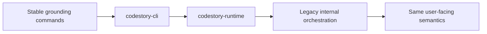

# CLI Parity

The six grounding workflows remain stable on this branch.

## Stable Commands

- `index`
- `ground`
- `search`
- `symbol`
- `trail`
- `snippet`

## Current Notes

- `codestory-cli` now routes through `codestory-runtime` instead of reaching directly into `codestory-app`.
- The runtime still delegates to legacy orchestration internally, so output behavior should remain stable unless called out here.
- Full refresh and incremental refresh keep the same user-facing semantics.

## Known Non-Goals During Cutover

- No new public command verbs are required for the boundary reset.
- No standalone migration-spec tree is maintained; any user-visible CLI behavior change is documented here instead.
