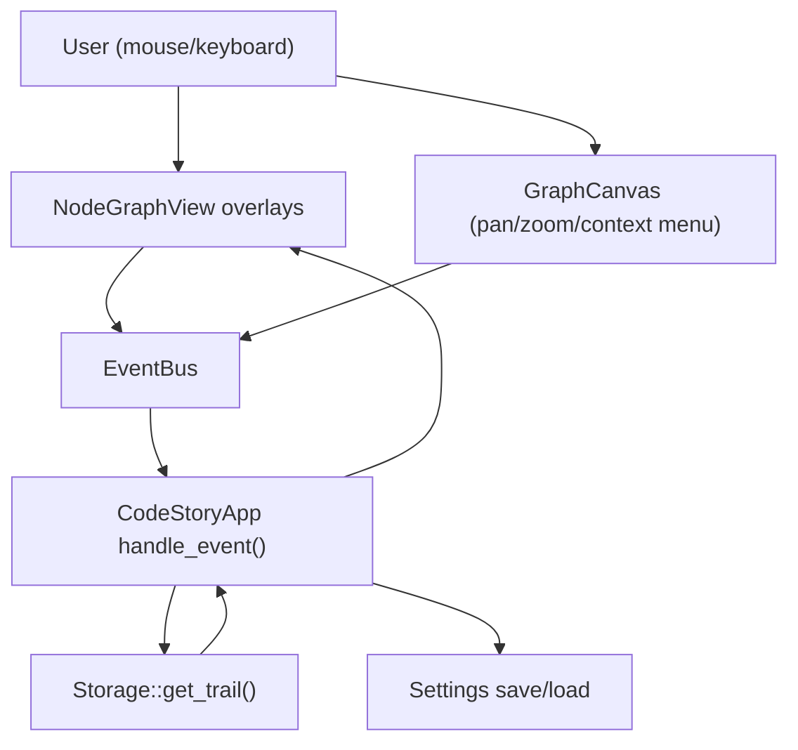

# Architectural Blueprint: Graph Parity (Sourcetrail -> CodeStory)

## 1. Core Objective
Bring CodeStory’s Graph View UI/UX to **pixel-precise parity** with Sourcetrail’s documented behavior and screenshots, focusing on: graph viewport toolbars/controls, zoom/pan interactions, legend behavior, and custom trail workflows including **To Target Symbol** path mode.

Reference baseline:
- `..\Sourcetrail\DOCUMENTATION.md` (Graph View, Custom Trail, Graph Legend, Preferences: Graph Zoom)
- `..\Sourcetrail\docs\documentation\graph_view.png`
- `..\Sourcetrail\docs\documentation\grouping_buttons.png`
- `..\Sourcetrail\docs\documentation\custom_trail.png`
- `..\Sourcetrail\docs\documentation\graph_legend.png`

## 2. System Scope and Boundaries
### In Scope
- Graph View overlay controls parity:
  - Top-left trail toolbar cluster (navigation, custom trail controls, grouping toggles).
  - Bottom-left zoom cluster.
  - Bottom-right legend toggle button + legend overlay.
- Input parity:
  - Mouse wheel preference “Graph Zoom” (wheel pans vs wheel zoom).
  - Keyboard shortcuts for zoom and WASD panning.
- Custom Trail parity:
  - Dialog modes: All Referenced, All Referencing, To Target Symbol.
  - Infinite depth behavior (`∞`).
  - Layout direction selection (Horizontal/Vertical).
  - Node and edge filters.
- Storage/query parity:
  - Trail query supports path-to-target (bounded, safe).

### Out of Scope (for this spec)
- Full Code View pixel parity.
- Search View pixel parity beyond the “legend” keyword trigger.
- SVG export (may be evaluated later).

## 3. Core System Components
| Component Name | Single Responsibility |
|---|---|
| **Graph View UI (NodeGraphView)** | Render the graph viewport and all overlay controls; translate UI actions into `EventBus` events. |
| **Graph Canvas (GraphCanvas)** | Draw nodes/edges, manage pan/zoom + context menus, emit canvas actions. |
| **Custom Trail Dialog** | Collect user intent for custom trails and publish trail events (including target path mode). |
| **Trail Query Engine (Storage)** | Execute bounded trail queries: neighborhood BFS and ToTargetSymbol path trails. |
| **Event Bus (codestory-events)** | Decouple UI input from storage/query and settings updates. |
| **Settings + Preferences** | Persist graph interaction prefs and expose them in Preferences UI. |

## 4. High-Level Data Flow

## 5. Key Integration Points
- **NodeGraphView ↔ EventBus**: publishes `TrailConfigChange`, `Zoom*`, `SetShowLegend`, etc.
- **CustomTrailDialog ↔ EventBus**: publishes `TrailModeEnter`, `SetLayoutDirection`, `TrailConfigChange`.
- **CodeStoryApp ↔ Storage**: calls `Storage::get_trail(&TrailConfig)`.
- **CodeStoryApp ↔ Settings**: persists `NodeGraphSettings` changes (selectively).

