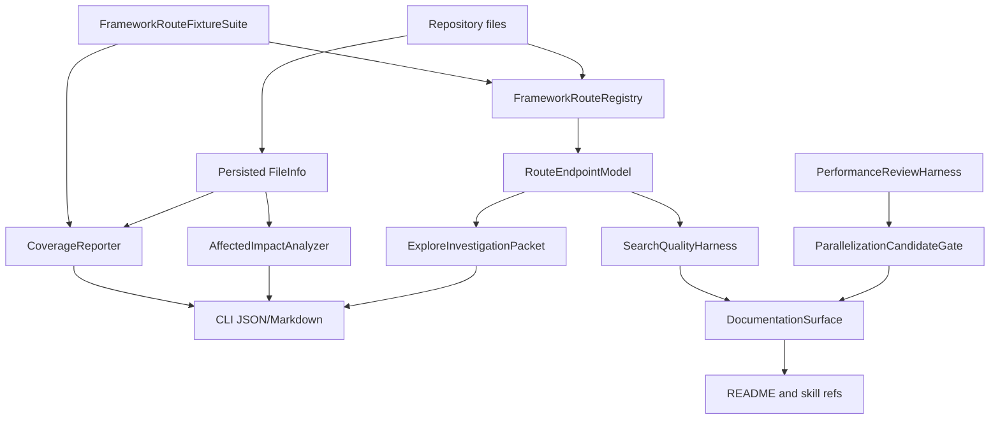

# CLI Navigation Next Wave Blueprint

## 1. Core Objective

Build the next CLI-first CodeStory navigation wave around ten linked improvements: deeper framework route support, wider web-stack coverage, automated coverage reporting, richer `explore` packets, stronger `affected` analysis, measured performance work, targeted parallelization, search-quality evaluation, README/product documentation, and a first-class route/endpoint model. Success means agents can discover routes, files, impacts, bottlenecks, and confidence gaps from the CLI without changing MCP/stdio/server contracts.

## 2. System Scope and Boundaries

### In Scope

- Deepen framework route extraction, handler linking, and route metadata.
- Expand supported web framework fixtures and confidence reporting.
- Improve CLI outputs for `explore`, `affected`, `search`, and documentation workflows.
- Add measurement-first performance and search-quality gates.
- Refresh README and repo-local docs so the CLI-first workflow is obvious.

### Out of Scope

- No MCP tool rename, MCP tool expansion, `projectPath`, or server-side watch behavior.
- No new web cockpit or `browse` command unless the existing browser-surface gate is satisfied separately.
- No broad async runtime migration or speculative parallelization without benchmark evidence.
- No claim of full framework support without fixtures, route coverage evidence, and explicit confidence labels.

## 3. Current Baseline and Evidence

- Framework route extraction already exists in the indexer, with route-like graph nodes, handler-link attempts, OpenAPI endpoint indexing, and a framework coverage playbook under `docs/testing/`.
- CLI-first command behavior already exists for `explore`, `affected`, `files`, `search`, and grounding workflows; this plan deepens those outputs rather than replacing the command surface.
- Prior CodeStory performance work showed that broad semantic-path tuning can regress repo-scale e2e time, so performance and parallelization changes require baseline evidence before implementation.
- README and repo-local skill references are part of the product surface for agents and must be updated only to describe behavior that the CLI and tests actually provide.

## 4. Core System Components

| Component Name | Single Responsibility |
|---|---|
| **FrameworkRouteRegistry** | Own framework-specific route extractors, confidence labels, route normalization, and handler-link candidates. |
| **FrameworkRouteFixtureSuite** | Prove route extraction and handler-link support with per-framework fixtures before support is promoted. |
| **RouteEndpointModel** | Represent route/endpoint metadata as a stable internal graph/read model that can later back CLI JSON without transport churn. |
| **CoverageReporter** | Summarize indexed language/framework/file coverage, unsupported patterns, confidence levels, and fixture/eval status. |
| **ExploreInvestigationPacket** | Produce one-call target investigation packets with route-aware relationship, source, related-file, and budget evidence. |
| **AffectedImpactAnalyzer** | Map changed files to impacted symbols, routes, public APIs, likely tests, and blind spots. |
| **SearchQualityHarness** | Measure search and route recall, MRR, latency, and repo-text fallback quality. |
| **PerformanceReviewHarness** | Capture baseline timings, query counts, lock/contention signals, and candidate optimization results. |
| **ParallelizationCandidateGate** | Reject or promote async/parallel candidates from measured bottleneck evidence, bounded concurrency, and deterministic-output checks. |
| **ValidationRecord** | Store promotion evidence in existing docs, eval output, and PR summaries instead of ad hoc local notes. |
| **DocumentationSurface** | Keep README, CLI docs, repo-local skill refs, and validation playbooks synchronized with the actual CLI workflow. |

## 5. High-Level Data Flow

## 6. Key Integration Points

- **FrameworkRouteRegistry -> RouteEndpointModel**: in-process indexer data structures persisted through existing graph/store paths.
- **FrameworkRouteFixtureSuite -> CoverageReporter**: fixture/eval status determines whether support is supported, partial, heuristic, unsupported, or non-promotable.
- **RouteEndpointModel -> Runtime read APIs**: runtime-owned DTOs and services; CLI commands consume runtime only.
- **CoverageReporter -> CLI**: Markdown/JSON output through existing `files`, search-quality, and docs surfaces.
- **ExploreInvestigationPacket -> CLI**: `codestory-cli explore` remains the primary cockpit output.
- **AffectedImpactAnalyzer -> CLI**: `codestory-cli affected` remains the impact-analysis entrypoint.
- **PerformanceReviewHarness -> ParallelizationCandidateGate**: candidate concurrency work must name the path, bottleneck, concurrency limit, ordering requirements, fallback, and validation evidence.
- **PerformanceReviewHarness/SearchQualityHarness -> ValidationRecord**: benchmark/eval results are recorded in docs and test output, not hidden in ad hoc logs.
