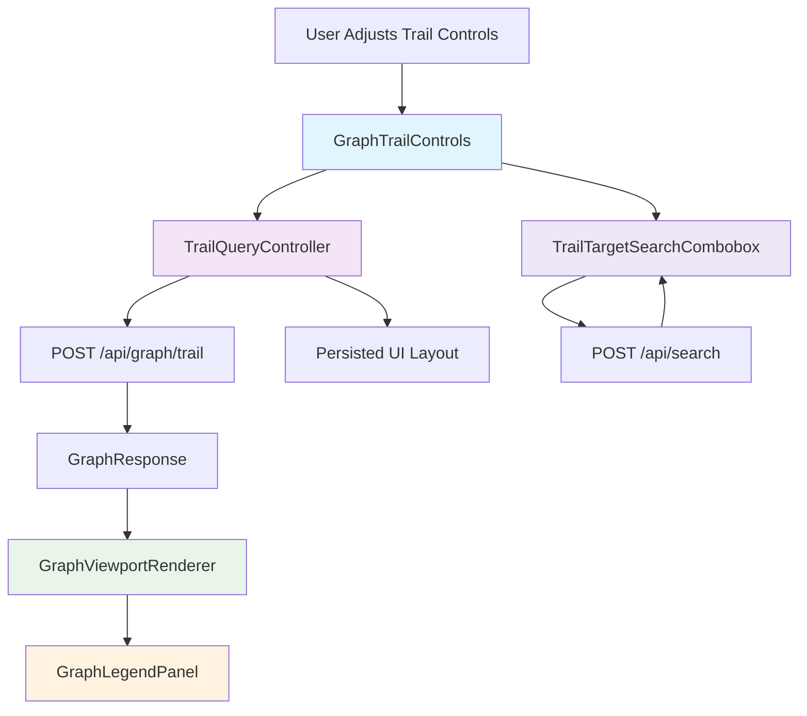

# Architectural Blueprint

## 1. Core Objective
Add a graph trail control experience that lets users switch exploration mode, set depth and direction, filter edge kinds, search/select target symbols for path trails, and understand edge semantics via a legend, while preserving current graph rendering and symbol-focus workflows.

## 2. System Scope and Boundaries

### In Scope
- Add a graph control surface in the Graph Workspace for trail mode, depth, direction, max nodes, and edge-kind filters.
- Add trail-target symbol search for `ToTargetSymbol` mode using existing symbol search APIs.
- Wire UI controls to `/api/graph/trail` and render resulting trail graphs as first-class graph tabs.
- Add an on-canvas legend that explains edge color/style mapping and current visibility counts.
- Persist trail control preferences in saved UI layout and restore them on project reopen.

### Out of Scope
- Changes to backend trail algorithms or schema (`TrailConfigDto` contract remains the same).
- Multi-root trail queries or batch trail comparison views.
- Editable graph topology (manual node/edge creation/deletion).
- Replacing React Flow or redesigning non-graph panes.

## 3. Core System Components
| Component Name | Single Responsibility |
|---|---|
| **GraphTrailControls** | Capture, validate, and emit trail query parameters (mode/depth/direction/filters/target/max-nodes). |
| **TrailQueryController** | Own trail query state, serialize request payloads, call graph APIs, and manage graph-tab lifecycle/errors. |
| **GraphViewportRenderer** | Render UML trail results in React Flow, apply visual filtering behavior, and manage fit/zoom behavior per graph load. |
| **GraphLegendPanel** | Present edge-kind visual mapping and active visibility counts for the currently rendered graph. |
| **TrailTargetSearchCombobox** | Provide keyboard-accessible target symbol search/select behavior for `ToTargetSymbol` mode. |

## 4. High-Level Data Flow

## 5. Key Integration Points
- **GraphTrailControls ↔ TrailQueryController**: React props/callback contract (`onConfigChange`, `onRunTrail`, `onResetDefaults`).
- **TrailQueryController ↔ API Client**: JSON over HTTP (`POST /api/graph/trail`, `POST /api/graph/neighborhood`, `POST /api/search`).
- **GraphViewportRenderer ↔ GraphLegendPanel**: Derived edge-style metadata (kind-to-color/style/count map) passed as props.
- **TrailTargetSearchCombobox ↔ TrailQueryController**: Controlled target symbol model (`target_id`, `target_label`) with keyboard navigation events.
- **Authentication**: No new auth flow; uses existing same-origin app session behavior.
- **Data Format**: Existing DTOs (`TrailConfigDto`, `GraphResponse`, `SearchHit`) serialized as JSON.
