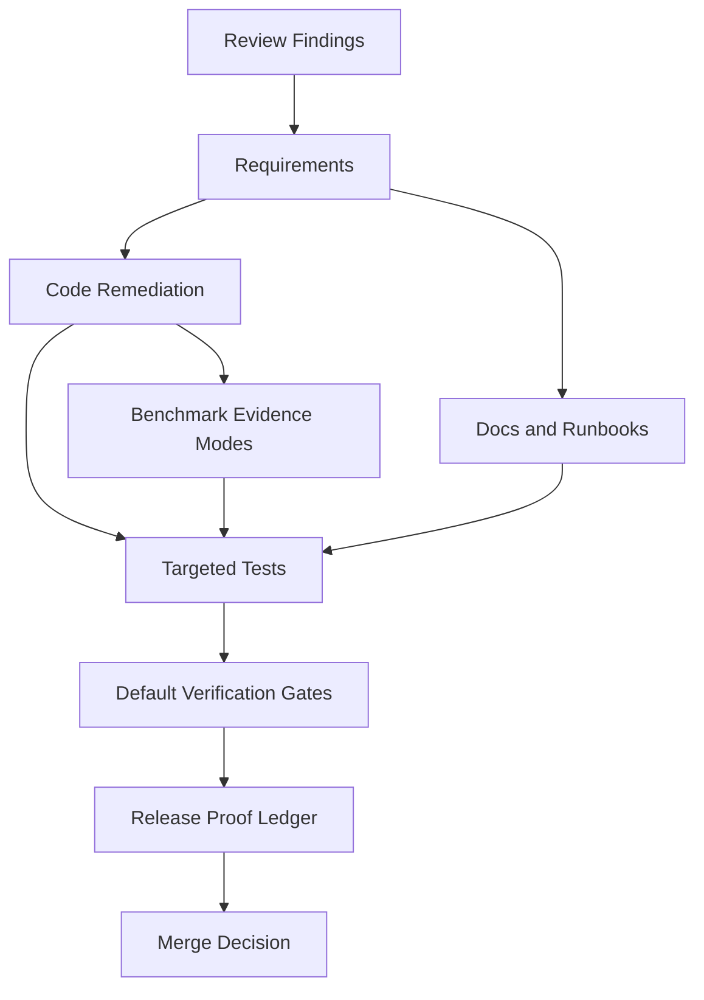

# Branch Perfection Blueprint

## 0. Verifiable Research and Technology Proposal

### Core Problem Analysis

This branch is a broad AST-first retrieval, packet, language-support, and benchmark-evidence branch whose remaining risk is not one isolated feature defect, but a set of proof, boundary, and maintainability gaps that can make the branch look more verified than it is.

The remediation must preserve the branch's intended product improvements while making default tests hermetic, live-service checks explicit, benchmark evidence non-oracular, runtime failures visible, local file boundaries enforced, and release proof current at branch head.

### Verifiable Technology Recommendations

| Technology/Pattern | Rationale and Evidence |
| --- | --- |
| Existing Cargo test harness with explicit ignored/live gates | Cargo's `cargo test` command executes unit and integration tests for the selected package, so the default retrieval crate suite should remain safe to run without live sidecars. [cite:1] Rust supports marking expensive or special-condition tests with `#[ignore]` and running them explicitly with `cargo test -- --ignored`, so live sidecar tests should move behind an explicit opt-in path instead of depending on opportunistic localhost reachability. [cite:2] |
| Existing repo release gate | The repo-local rule requires `cargo build --release -p codestory-cli` followed by `cargo test -p codestory-cli --test codestory_repo_e2e_stats -- --ignored --nocapture` before committing, so branch perfection requires a fresh stats row for `HEAD`, not a prior commit. [repo:AGENTS.md] |
| Existing CodeStory runtime and sidecar architecture | `codestory-runtime` owns orchestration, packet construction, and sidecar search behavior, so sidecar candidate-resolution errors should be handled in runtime error-boundary code rather than hidden in callers. [repo:crates/codestory-runtime/src/agent/retrieval_primary.rs] |
| Existing benchmark harness with stricter evidence modes | The benchmark harness already records packet prelude metadata, manifest quality, and post-packet source-read accounting, so the correct fix is to separate diagnostic/oracle-assisted rows from publishable rows rather than adding a parallel harness. [repo:scripts/codestory-agent-ab-benchmark.mjs] |
| Existing shared language-support registry | The contracts crate already contains language-support profiles, so the long-term architecture should make the registry authoritative for stable language IDs and compatibility claims while moving parser/ruleset construction into smaller language modules. [repo:crates/codestory-contracts/src/language_support.rs] |

### Browsed Sources

- [1] https://doc.rust-lang.org/cargo/commands/cargo-test.html
- [2] https://doc.rust-lang.org/book/ch11-02-running-tests.html

### Local Evidence Sources

- `AGENTS.md`
- `docs/testing/codestory-e2e-stats-log.md`
- `crates/codestory-retrieval/src/query.rs`
- `crates/codestory-runtime/src/agent/retrieval_primary.rs`
- `crates/codestory-runtime/src/lib.rs`
- `scripts/codestory-agent-ab-benchmark.mjs`
- `scripts/codestory-agent-ab-score.mjs`
- `crates/codestory-cli/src/main.rs`
- `scripts/setup-retrieval-env.mjs`
- `crates/codestory-runtime/src/agent/packet_sufficiency.rs`
- `crates/codestory-cli/src/readiness.rs`
- `crates/codestory-runtime/src/agent/packet_claim_profiles.rs`
- `docs/testing/language-expansion-ab-report.md`

## 1. Core Objective

Make the branch mergeable and release-worthy by closing every review finding with code, tests, docs, and fresh branch-head evidence. Success means default verification passes without accidental live-service dependencies, optional live checks are explicit, benchmark evidence cannot be confused with oracle-assisted diagnostics, runtime and security boundaries fail closed, performance risks have budgets, and the branch has a current e2e stats row for `HEAD`.

## 2. System Scope and Boundaries

### In Scope

- Repair default test and lint gates that currently fail.
- Make live sidecar integration tests explicit and deterministic.
- Replace silent sidecar candidate-resolution fallbacks with visible errors.
- Harden benchmark evidence boundaries, packet-gate semantics, and baseline artifact reuse.
- Enforce local file containment for `drill` import-hub discovery.
- Add checksum verification and mirror policy for managed GGUF downloads.
- Stabilize packet sufficiency structured output and benchmark composition scoring.
- Add degraded-path tests for `ready` and structured readiness statuses.
- Add performance budgets, stress tests, and mode separation for packet and sidecar status paths.
- Reduce language-support source-of-truth drift with registry alignment tests and a modular parser plan.
- Correct docs that imply inert eval-probe or smoke-run behavior.
- Run and record the repo-scale release proof at branch head.

### Out of Scope

- Replacing the retrieval sidecar architecture.
- Replacing Cargo, Rust test harnesses, or the existing Node benchmark harness.
- Introducing a new benchmark runner or new external service.
- Claiming broad 18-language packet-quality promotion before the evidence gates pass.
- Shipping new product features unrelated to review remediation.

## 3. Core System Components

| Component Name | Single Responsibility |
| --- | --- |
| **TestGateHygiene** | Keep default Rust and Node verification deterministic, offline-safe, and green. |
| **ReleaseProofLedger** | Ensure branch-head release proof is fresh, recorded, and clearly scoped. |
| **SidecarErrorBoundary** | Propagate sidecar candidate-resolution and search failures as explicit unavailable states. |
| **BenchmarkEvidenceBoundary** | Separate diagnostic/oracle-assisted benchmark rows from publishable product evidence. |
| **LocalFileBoundary** | Prevent CodeStory CLI and scripts from reading or copying paths outside trusted roots. |
| **ModelArtifactIntegrity** | Verify downloaded retrieval model artifacts before storing or using them. |
| **PacketSufficiencyContract** | Emit deterministic, typed, and semantically honest packet sufficiency fields. |
| **ReadinessContract** | Exercise and expose degraded index, sidecar, and cache-busy readiness states. |
| **PerformanceBudgetContract** | Keep interactive paths bounded and isolate deep-quality work behind explicit modes. |
| **LanguageSupportContract** | Align registry, workspace discovery, parser routing, docs, and tests. |
| **ProductSemanticsContract** | Keep production packet claims general, source-derived, and separate from benchmark fixtures. |
| **DocumentationContract** | Keep runbooks, branch action plans, and test docs consistent with actual commands. |

## 4. High-Level Data Flow

## 5. Key Integration Points

- **TestGateHygiene <-> ReleaseProofLedger**: Cargo and Node commands produce pass/fail evidence used by the release ledger.
- **SidecarErrorBoundary <-> ReadinessContract**: Runtime sidecar failures must surface as structured unavailable or repair states.
- **BenchmarkEvidenceBoundary <-> PacketSufficiencyContract**: Benchmark scoring must consume typed packet fields, not prose display strings.
- **LocalFileBoundary <-> BenchmarkEvidenceBoundary**: Reused benchmark artifacts must be copied only from trusted run directories.
- **ModelArtifactIntegrity <-> DocumentationContract**: Setup docs must state checksum and mirror behavior exactly as implemented.
- **LanguageSupportContract <-> ProductSemanticsContract**: Language support claims must not imply packet-quality or library-specific semantic coverage without evidence.

## 6. Quality Gates

- Default `cargo test -p codestory-retrieval` passes without requiring live sidecars.
- `cargo clippy --workspace --all-targets -- -D warnings` passes.
- `cargo check --workspace`, `cargo fmt --check --verbose`, and focused indexer/runtime/CLI tests pass.
- Publishable benchmark rows cannot use manifest-derived expected anchors unless explicitly labeled diagnostic and excluded from promotion.
- Packet sufficiency output is deterministic across repeated runs on identical packet input.
- `ready` has tests for happy, stale, unavailable sidecar, and cache-busy surfaces.
- Branch-head `codestory_repo_e2e_stats` is appended to `docs/testing/codestory-e2e-stats-log.md`.
