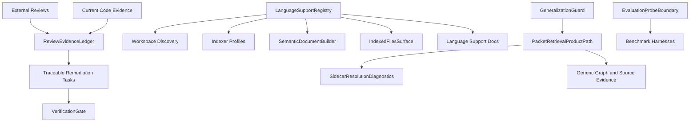

# Architectural Blueprint

## 1. Core Objective

Restore trust in the AST-first retrieval branch by removing benchmark-family steering from production behavior, deriving support claims from one shared language registry, exposing unresolved retrieval evidence honestly, and pinning verification gates that prove the new parser-backed languages work without hardcoded benchmark shortcuts.

## 2. System Scope and Boundaries

### In Scope

- Remove Chinook, MDN, Okio, Monolog, and Alamofire exact-family steering from production packet answer assembly.
- Preserve benchmark/eval probes only behind explicit eval-only boundaries.
- Add a shared language-support contract that feeds workspace discovery, indexer support profiles, runtime semantic docs, CLI `files` output, and docs.
- Add unresolved sidecar candidate diagnostics for packet batches and make sufficiency treat unresolved-only evidence as a gap.
- Clarify whole-index versus filtered counts in the `files` API and CLI output.
- Add tests, lints, and docs that make recurrence difficult.

### Out of Scope

- Full dynamic parser loading through shared libraries.
- Replacing every language-specific AST walker in one pass.
- Claiming cross-package, polymorphic, framework-handler, or inheritance-heavy receiver resolution without new tests.
- Broad module decomposition of `orchestrator.rs`, `lib.rs`, or `main.rs` beyond extraction needed to remove overfit code safely.
- Changing sidecar storage schema unless diagnostics cannot be represented in the current packet trace/output model.

## 3. Core System Components

| Component Name | Single Responsibility |
| --- | --- |
| **ReviewEvidenceLedger** | Preserve reviewer findings, local code evidence, and explicit scope decisions for the remediation. |
| **PacketRetrievalProductPath** | Assemble production packet answers using graph, sidecar, semantic, and generic source-shape evidence only. |
| **EvaluationProbeBoundary** | Keep benchmark-family probes and repo-specific expected paths out of production packet behavior. |
| **LanguageSupportRegistry** | Define language names, extensions, support modes, evidence tiers, and user-facing claim labels once. |
| **SemanticDocumentBuilder** | Emit semantic document text with language labels derived from the shared registry. |
| **IndexedFilesSurface** | Report indexed file inventory with clear whole-index and filtered/visible counts. |
| **SidecarResolutionDiagnostics** | Record per-query sidecar candidate, resolved-hit, and unresolved-candidate state for packet batches. |
| **ReceiverResolutionRoadmap** | Track receiver-call and parameter-extraction debt without overstating current support. |
| **GeneralizationGuard** | Fail CI when benchmark-family literals re-enter production retrieval/indexing code. |
| **VerificationGate** | Run the narrow and branch-scale checks required before implementation can be considered done. |

## 4. High-Level Data Flow

## 5. Key Integration Points

- **LanguageSupportRegistry -> Workspace Discovery**: `codestory-workspace` reads shared extension metadata from `codestory-contracts`.
- **LanguageSupportRegistry -> Indexer Profiles**: `codestory-indexer` maps shared registry entries to parser/rule construction while keeping tree-sitter handles indexer-local.
- **LanguageSupportRegistry -> SemanticDocumentBuilder**: `codestory-runtime` labels embedded symbol docs through registry lookups instead of a smaller local extension table.
- **PacketRetrievalProductPath -> EvaluationProbeBoundary**: production packet assembly cannot reference benchmark-family literals; eval-only code may reference manifest-declared probes.
- **SidecarResolutionDiagnostics -> PacketRetrievalProductPath**: packet traces preserve unresolved-only sidecar subqueries and packet sufficiency treats them as missing evidence.
- **IndexedFilesSurface -> CLI**: API and markdown/JSON output distinguish whole-index inventory from filtered visible rows.
- **GeneralizationGuard -> CI/Local Verification**: the lint scans production Rust retrieval/indexing surfaces after masking tests.
