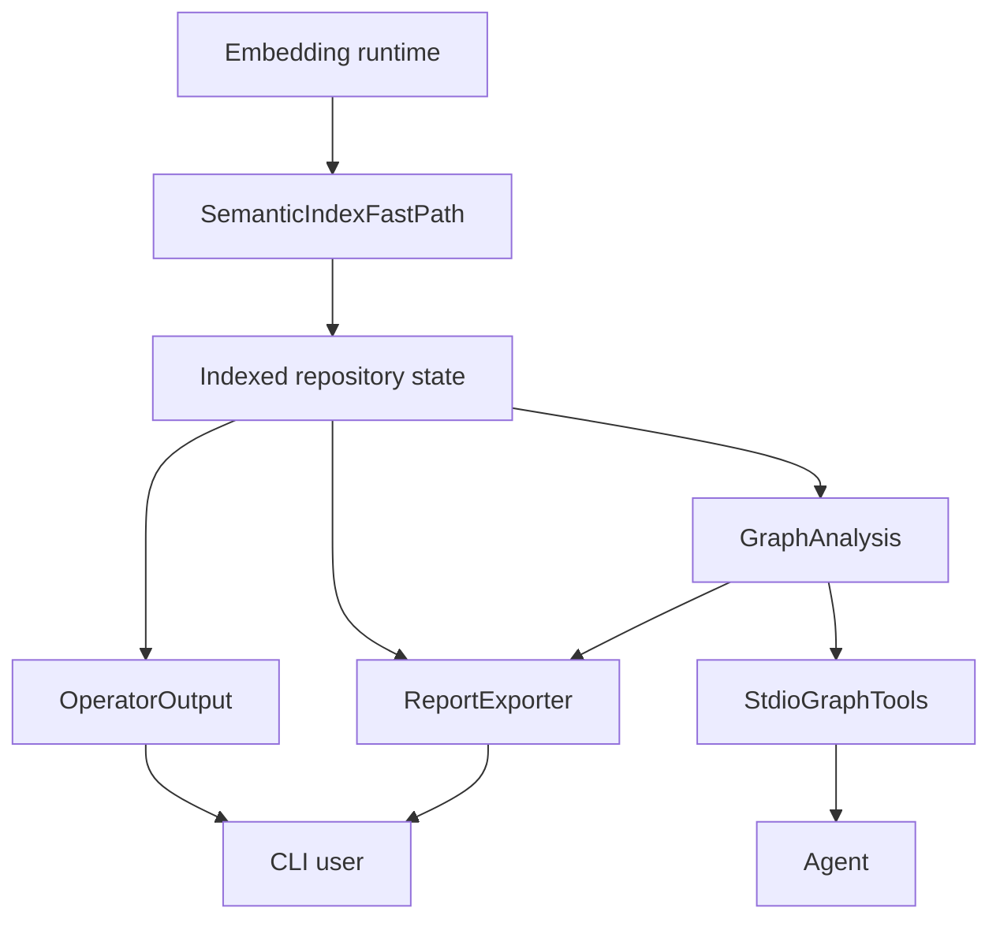

# CodeStory Delight and Speed Roadmap Implementation Plan

> **Historical planning artifact:** This file records the plan that produced PR
> #23. Checkbox state reflects the original task breakdown, not current
> implementation status. Use the PR diff and review notes as the as-built source
> of truth.

**Goal:** Turn the multi-angle review into independently shippable CodeStory improvements that make the product clearer, more delightful, and materially faster.

**Architecture:** Keep CodeStory's current Rust/SQLite/Tantivy/sidecar architecture. Add trust/readiness fixes first, then semantic indexing speed work, then Graphify-inspired report/export artifacts and graph analysis primitives.

**Tech Stack:** Rust 2024 workspace, Clap CLI, SQLite-backed store, Tantivy/local search, llama.cpp/ONNX embedding runtime paths, Markdown/JSON/DOT/Mermaid outputs, repo-local docs and grounding skill references.

---

## Planning Notes

This is a plan suite, not a single implementation PR. The review spans independent subsystems, so each epic below should land as a separate vertical slice with its own tests, docs, and review evidence.

Do not run expensive gates while reading or refining this plan. During implementation, use the narrow commands listed in each task first, then run the repo-required full gate only when preparing a commit that changes default indexing, semantic persistence, embedding reuse, or cold-start behavior.

## Source-Backed Product Premises

- Graphify's README emphasizes one command that produces `graph.html`, `GRAPH_REPORT.md`, and `graph.json`; CodeStory should copy that artifact clarity, not the implementation architecture.
- Graphify's CLI reference exposes simple `build`, `query`, `path`, `explain`, `export`, and hook verbs; CodeStory already has richer evidence paths, but they need a simpler report/export doorway.
- Graphify's how-it-works documentation highlights multi-pass extraction, community detection, confidence labels, caching, and token savings; CodeStory can reproduce the useful product outcomes from its existing graph and store.
- Graphify's architecture is Python/dictionary/NetworkX oriented; CodeStory should keep its Rust/runtime/store architecture and add analysis/export layers over existing persisted state.

Sources:

- https://github.com/safishamsi/graphify
- https://graphify.net/graphify-cli-commands.html
- https://github.com/safishamsi/graphify/blob/v8/docs/how-it-works.md
- https://raw.githubusercontent.com/safishamsi/graphify/main/ARCHITECTURE.md

## Epic Breakdown

### Epic 1: Readiness and Trust Are Impossible to Misread

**Splitting pattern:** Simple/Complex, plus business-rule variations for local navigation readiness versus agent packet/search readiness.

**User story 1.1:** As an agent operator, I can tell whether CodeStory is ready for local navigation or full packet/search evidence before I trust an answer.

**Acceptance criteria:**

- Local navigation readiness and agent-facing packet/search readiness are named consistently in `README.md`, `docs/usage.md`, `docs/glossary.md`, `docs/architecture/subsystems/cli.md`, and `.agents/skills/codestory-grounding/references/context.md`.
- `context` is described as target-first and DB-backed; broad task questions stay attached to `packet`, `search`, or `drill`.
- CLI long help shows the current `packet --question` command shape.
- `codestory_project.json` is documented alongside `codestory_workspace.json`.

**Why this first:** This is a low-risk trust fix that reduces misuse before adding new power.

### Epic 2: CLI Output Feels Like an Operator Surface

**Splitting pattern:** Data entry/output method variation.

**User story 2.1:** As an agent operator, I get a compact status header and next action before dense evidence details.

**Acceptance criteria:**

- Markdown output for `doctor`, `ground --why`, `search --why`, `packet`, and `context` starts with stable headings for status, trust, next action, and proof tier where those fields exist.
- `search --why` defaults to compact provenance; full plan details move behind an explicit detail flag.
- Trail graph output has a legend and non-color-only certainty markers.
- `NO_COLOR` and existing plain Markdown expectations remain respected.

**Why this second:** It gives visible product delight without changing storage or indexing semantics.

### Epic 3: Semantic Indexing Gets a 10x Path

**Splitting pattern:** Defer performance, then major effort.

**User story 3.1:** As an agent operator, I can get a useful graph/text index quickly while semantic vectors continue as a visible, resumable readiness lane.

**Acceptance criteria:**

- Existing phase timing output makes graph, semantic-doc build, embedding, DB upsert, reload, prune, reused, embedded, pending, and stale counts easy to compare.
- llama.cpp request concurrency defaults are revisited using the existing `CODESTORY_EMBED_LLAMACPP_REQUEST_COUNT` path.
- A vector reuse key includes backend/profile/model id/dim/doc shape/doc hash so stale or incompatible vectors cannot be silently reused.
- The implementation records before/after rows in `docs/testing/codestory-e2e-stats-log.md` only after the full ignored e2e gate is intentionally run.

**Why this third:** Checked-in stats identify semantic indexing as the dominant cold path, but this slice needs real measurement and quality guards.

### Epic 4: Graphify-Inspired Report and Export Artifacts

**Splitting pattern:** Operations.

**User story 4.1:** As a developer or agent, I can ask CodeStory for a repo report and machine graph export without manually composing multiple commands.

**Acceptance criteria:**

- New report/export surface produces Markdown and JSON artifacts from current store truth.
- The Markdown report includes repo summary, hotspots, entry points, communities when available, surprising or high-bridge connections, and suggested follow-up queries.
- The JSON export includes nodes, edges, confidence/certainty, source locations, and generation metadata.
- Generated artifacts are clearly outputs, not source-of-truth state.

**Why this fourth:** This borrows Graphify's best UX move while preserving CodeStory's existing architecture.

### Epic 5: Warm Agent Graph Tools

**Splitting pattern:** Operations.

**User story 5.1:** As a Codex agent, I can use simple graph primitives over `serve --stdio` before asking for a large packet.

**Acceptance criteria:**

- `serve --stdio` catalog includes simple tools for `get_node`, `neighbors`, `shortest_path`, and `query_subgraph`, or equivalent names that match existing CLI vocabulary.
- `packet` remains the broad task tool; simple graph tools are narrow and cheap.
- Tool responses include stable IDs, file refs, certainty, and bounded result sizes.
- Warm cache behavior remains deterministic.

**Why this fifth:** It makes repeated agent use faster and more inspectable without replacing existing packet/search flows.

## Architectural Blueprint

| Component | Responsibility |
| --- | --- |
| ReadinessLanguage | Keep user-facing readiness concepts and command examples consistent across docs, CLI help, and grounding skill references. |
| OperatorOutput | Render compact status, trust, next action, proof, and provenance sections for CLI Markdown. |
| SemanticIndexFastPath | Improve embedding throughput and vector reuse without weakening quality or cache correctness. |
| ReportExporter | Generate repo-level Markdown/JSON artifacts from store/runtime evidence. |
| GraphAnalysis | Compute hotspots, communities, bridge nodes, shortest paths, and surprising connections from persisted graph state. |
| StdioGraphTools | Expose cheap graph primitives through the warm stdio surface. |



## Requirements Trace

| Requirement | Acceptance criterion | Epic | Primary files |
| --- | --- | --- | --- |
| R1 Readiness language is consistent | R1.1 local versus packet/search readiness named consistently | 1 | `README.md`, `docs/usage.md`, `docs/glossary.md`, `docs/architecture/subsystems/cli.md` |
| R1 Readiness language is consistent | R1.2 current packet command shape appears everywhere | 1 | `crates/codestory-cli/src/args.rs`, docs |
| R2 CLI output is scan-first | R2.1 rich Markdown starts with compact operator header | 2 | `crates/codestory-cli/src/output.rs` |
| R2 CLI output is scan-first | R2.2 compact/full `--why` split is explicit | 2 | `crates/codestory-cli/src/args.rs`, `crates/codestory-cli/src/output.rs` |
| R3 Semantic path is materially faster | R3.1 request geometry and vector reuse are measured | 3 | `crates/codestory-runtime/src/search/engine.rs`, `crates/codestory-runtime/src/lib.rs` |
| R3 Semantic path is materially faster | R3.2 quality guards are recorded before promotion | 3 | `docs/testing/performance-review-playbook.md`, `docs/testing/codestory-e2e-stats-log.md` |
| R4 Repo artifacts are first-class | R4.1 report/export commands generate Markdown and JSON | 4 | `crates/codestory-cli/src/args.rs`, `crates/codestory-cli/src/main.rs`, new runtime/export modules |
| R5 Warm graph tools are cheap | R5.1 stdio exposes bounded graph primitives | 5 | `crates/codestory-cli/src/stdio_catalog.rs`, `crates/codestory-cli/src/stdio_transport.rs` |

## Implementation Plan

### Task 1: Fix Readiness Language and Current Command Shape

**Files:**

- Modify: `README.md`
- Modify: `docs/usage.md`
- Modify: `docs/glossary.md`
- Modify: `docs/architecture/subsystems/cli.md`
- Modify: `.agents/skills/codestory-grounding/references/context.md`
- Modify: `.agents/skills/codestory-grounding/references/index.md`
- Modify: `crates/codestory-cli/src/args.rs`

- [ ] **Step 1: Update the CLI long-about packet example**

Change the `CLI_LONG_ABOUT` broad question example in `crates/codestory-cli/src/args.rs` from positional question text to the current flag form:

```rust
Common lanes:
  New repo:       codestory-cli index --project <repo> --refresh full
  Broad question: codestory-cli packet --project <repo> --question "How does this system work?"
  Exact target:   codestory-cli context --project <repo> --query <symbol-or-file>
```

- [ ] **Step 2: Update docs to use the same readiness terms**

Use these exact terms consistently:

```markdown
- local navigation readiness: the local cache, graph, lexical index, and DB-backed navigation commands are usable.
- agent packet/search readiness: sidecar packet/search evidence is trustworthy only when retrieval status reports `retrieval_mode=full`.
- target context: DB-first evidence for one concrete target; not a replacement for broad `packet` questions.
```

- [ ] **Step 3: Document `codestory_project.json`**

Add a compact example beside the workspace manifest docs:

```json
{
  "root": ".",
  "source_groups": [
    {
      "name": "app",
      "paths": ["src", "crates"],
      "exclude": ["target", "node_modules"]
    }
  ]
}
```

- [ ] **Step 4: Run narrow documentation checks during implementation**

Run only after editing:

```powershell
rg -n "packet --project .*\"How|retrieval_mode=full|local navigation readiness|agent packet/search readiness|codestory_project.json" README.md docs .agents crates/codestory-cli/src/args.rs
```

Expected: no stale positional `packet` examples remain; both readiness terms appear in user-facing docs.

- [ ] **Step 5: Commit**

```powershell
git add README.md docs .agents/skills/codestory-grounding/references crates/codestory-cli/src/args.rs
git commit -m "clarify codestory readiness language"
```

### Task 2: Add Compact Operator Headers to Rich Markdown Output

**Files:**

- Modify: `crates/codestory-cli/src/output.rs`
- Modify: `crates/codestory-cli/src/args.rs`
- Test: `crates/codestory-cli/tests/search_json_output.rs`
- Test: existing output/unit tests near `crates/codestory-cli/src/output.rs`
- Docs: `docs/usage.md`

- [ ] **Step 1: Add a reusable Markdown helper**

Create a small helper in `output.rs` near the other Markdown helpers:

```rust
struct OperatorHeader<'a> {
    status: &'a str,
    trust: &'a str,
    next: &'a str,
    proof: &'a str,
}

fn append_operator_header(markdown: &mut String, header: OperatorHeader<'_>) {
    markdown.push_str("## Status\n\n");
    markdown.push_str("- status: ");
    markdown.push_str(header.status);
    markdown.push('\n');
    markdown.push_str("- trust: ");
    markdown.push_str(header.trust);
    markdown.push('\n');
    markdown.push_str("- next: ");
    markdown.push_str(header.next);
    markdown.push('\n');
    markdown.push_str("- proof: ");
    markdown.push_str(header.proof);
    markdown.push_str("\n\n");
}
```

- [ ] **Step 2: Wire the helper only where the command already has the data**

Use command-specific strings. Do not invent readiness values that the DTO does not expose. If a command lacks proof data, use `proof: not_reported`.

- [ ] **Step 3: Split compact and full search provenance**

Add a Clap flag whose name makes the behavior obvious:

```rust
#[arg(
    long = "plan-details",
    requires = "why",
    help = "Include the full search plan in --why output. By default --why keeps provenance compact."
)]
pub(crate) plan_details: bool,
```

Expected behavior:

- `--why` keeps compact headings, top channels, freshness, degraded reason, and next command.
- `--why --plan-details` includes subqueries, windows, bridges, rejected candidates, promotions, and full next-action detail.

- [ ] **Step 4: Update trail graph rendering legend**

Add a Markdown legend before Mermaid/DOT graph output:

```markdown
Legend: solid edges are high-confidence, dashed edges are uncertain, dotted edges are speculative. Labels include relation kind and certainty when available.
```

- [ ] **Step 5: Run narrow output tests during implementation**

```powershell
cargo test -p codestory-cli search_markdown -- --nocapture
cargo test -p codestory-cli --test search_json_output -- --nocapture
```

Expected: Markdown assertions include the new `## Status` block; JSON output remains unchanged unless explicitly tested.

- [ ] **Step 6: Commit**

```powershell
git add crates/codestory-cli/src/output.rs crates/codestory-cli/src/args.rs crates/codestory-cli/tests docs/usage.md
git commit -m "tighten cli operator output"
```

### Task 3: Prepare the Semantic 10x Fast Path

**Files:**

- Modify: `crates/codestory-runtime/src/search/engine.rs`
- Modify: `crates/codestory-runtime/src/lib.rs`
- Modify: `docs/testing/performance-review-playbook.md`
- Modify after final validation only: `docs/testing/codestory-e2e-stats-log.md`
- Test: `crates/codestory-runtime` focused tests around embedding config and semantic-doc reuse

- [ ] **Step 1: Record the current bottleneck in the PR notes before coding**

Use the checked-in row as the hypothesis, not as fresh proof:

```markdown
Hypothesis: repo-scale cold indexing is dominated by semantic embedding, with checked-in timing showing semantic time far larger than graph time. This PR changes only embedding request geometry/vector reuse and must preserve search quality.
```

- [ ] **Step 2: Make llama.cpp request count profile-aware**

Keep `CODESTORY_EMBED_LLAMACPP_REQUEST_COUNT` as the explicit override. Add a profile default function that returns a conservative non-1 value only for llama.cpp product profiles after measurement supports it.

```rust
fn default_llamacpp_request_count(profile: &EmbeddingProfile) -> usize {
    if profile.dimensions >= 768 { 6 } else { 4 }
}
```

Implementation rule: if this helper is added before fresh measurement, gate it behind an env var or feature flag so the default does not silently change.

- [ ] **Step 3: Add a vector reuse key struct**

Add a struct near semantic-doc synchronization code:

```rust
#[derive(Debug, Clone, PartialEq, Eq, Hash)]
struct SemanticVectorReuseKey {
    backend: String,
    model_id: String,
    dimensions: usize,
    doc_shape: String,
    doc_hash: String,
}
```

Use it to compare candidate reuse rows before embedding. Do not reuse vectors across backend, model, dimension, doc shape, or doc hash changes.

- [ ] **Step 4: Preserve deterministic ordering**

When embeddings are requested concurrently, keep output ordering tied to the original doc index. Store results as `(original_index, vector)` pairs and sort by `original_index` before DB upsert.

- [ ] **Step 5: Run focused implementation checks**

```powershell
cargo test -p codestory-runtime semantic_doc -- --nocapture
cargo test -p codestory-runtime llm_doc_embed_batch_size -- --nocapture
```

Expected: semantic-doc reuse tests still reject incompatible shapes and preserve deterministic row order.

- [ ] **Step 6: Run promotion gate only when ready to claim performance**

```powershell
cargo build --release -p codestory-cli
cargo test -p codestory-cli --test codestory_repo_e2e_stats -- --ignored --nocapture
```

Expected: append a fresh row to `docs/testing/codestory-e2e-stats-log.md` only after this command is actually run and the output is captured.

- [ ] **Step 7: Commit**

```powershell
git add crates/codestory-runtime/src/search/engine.rs crates/codestory-runtime/src/lib.rs docs/testing
git commit -m "prepare semantic indexing fast path"
```

### Task 4: Add Report and Export Artifacts

**Files:**

- Modify: `crates/codestory-cli/src/args.rs`
- Modify: `crates/codestory-cli/src/main.rs`
- Create: `crates/codestory-cli/src/report.rs`
- Create or modify: `crates/codestory-runtime/src/graph_analysis.rs`
- Modify: `crates/codestory-runtime/src/lib.rs`
- Test: `crates/codestory-cli/tests/report_export.rs`
- Docs: `README.md`, `docs/usage.md`, `docs/project-delight-roadmap.md`

- [ ] **Step 1: Add CLI shape**

Use a command shape that mirrors existing output conventions:

```text
codestory-cli report --project <repo> --format markdown --output-file codestory-report.md
codestory-cli report --project <repo> --format json --output-file codestory-graph.json
```

- [ ] **Step 2: Add report DTOs before rendering**

Create internal DTOs rather than rendering directly from store rows:

```rust
pub(crate) struct RepoReport {
    pub(crate) project_root: PathBuf,
    pub(crate) metadata: ReportGenerationMetadata,
    pub(crate) node_count: usize,
    pub(crate) edge_count: usize,
    pub(crate) hotspots: Vec<ReportHotspot>,
    pub(crate) entry_points: Vec<ReportNode>,
    pub(crate) bridge_nodes: Vec<ReportNode>,
    pub(crate) suggested_queries: Vec<String>,
}
```

- [ ] **Step 3: Start with deterministic cheap analysis**

First version should compute from persisted graph rows:

- highest-degree nodes
- nodes with many incoming references
- nodes with mixed caller/callee edges
- top file-role groups when role data exists
- suggested queries derived from top symbols and subsystems

Defer Leiden/community detection until the first report/export slice is shippable.

- [ ] **Step 4: Write golden tests**

Use a tiny fixture repo already available in CLI tests or create a focused fixture under the existing test pattern. Assert:

- Markdown contains project summary, hotspots, and suggested queries.
- JSON contains `metadata.generated_at_epoch_ms`, `nodes`, `edges`, and `metadata`.
- Output file parent must already exist, matching existing `--output-file` behavior.

- [ ] **Step 5: Run focused report tests during implementation**

```powershell
cargo test -p codestory-cli --test report_export -- --nocapture
```

Expected: fixture report is deterministic across repeated runs.

- [ ] **Step 6: Commit**

```powershell
git add crates/codestory-cli/src/args.rs crates/codestory-cli/src/main.rs crates/codestory-cli/src/report.rs crates/codestory-runtime/src docs README.md
git commit -m "add codestory report export"
```

### Task 5: Add Warm Stdio Graph Primitives

**Files:**

- Modify: `crates/codestory-cli/src/stdio_catalog.rs`
- Modify: `crates/codestory-cli/src/stdio_transport.rs`
- Modify: `crates/codestory-runtime/src/lib.rs` or a focused graph query module
- Test: stdio/tool catalog tests near existing stdio coverage
- Docs: `docs/architecture/subsystems/cli.md`, `docs/usage.md`

- [ ] **Step 1: Add catalog entries**

Add simple, bounded tools:

```text
get_node
neighbors
shortest_path
query_subgraph
```

- [ ] **Step 2: Keep response contracts narrow**

Each response must include:

```json
{
  "node_id": "stable-id",
  "display_name": "symbol-or-file",
  "file_path": "repo/relative/path.rs",
  "line": 42,
  "edges": [],
  "truncated": false
}
```

- [ ] **Step 3: Enforce bounds**

Default limits:

- `neighbors`: 25 nodes
- `shortest_path`: max depth 6
- `query_subgraph`: 50 nodes and 100 edges

Return `truncated: true` and a next command when limits are hit.

- [ ] **Step 4: Reuse warm caches where possible**

Use the existing stdio transport cache pattern. Cache keys must include project root, generation/freshness marker, tool name, and normalized arguments.

- [ ] **Step 5: Run focused stdio tests during implementation**

```powershell
cargo test -p codestory-cli stdio -- --nocapture
```

Expected: catalog lists all tools; repeated identical calls return equivalent payloads.

- [ ] **Step 6: Commit**

```powershell
git add crates/codestory-cli/src/stdio_catalog.rs crates/codestory-cli/src/stdio_transport.rs crates/codestory-runtime/src docs
git commit -m "add warm stdio graph tools"
```

### Task 6: Harden Project Config Trust Boundaries

**Files:**

- Modify: `crates/codestory-runtime/src/config.rs`
- Modify: `crates/codestory-runtime/src/lib.rs`
- Modify: `docs/usage.md`
- Modify: `docs/ops/retrieval-sidecars.md`
- Test: focused runtime config tests

- [ ] **Step 1: Classify config fields**

Use this split:

```markdown
Project config may set indexing preferences, source groups, semantic-doc shape preferences, and output defaults.
Trusted user config, environment variables, or explicit CLI flags must set cache directories, network endpoints, credentials, and any behavior that sends source text outside the machine.
```

- [ ] **Step 2: Fail closed on project network endpoints**

If `.codestory.toml` contains a summary endpoint, summary model, or embedding endpoint, reject it unless an explicit trusted opt-in exists.

Suggested opt-in name:

```text
CODESTORY_ALLOW_PROJECT_NETWORK_CONFIG=1
```

- [ ] **Step 3: Add a visible diagnostic**

When blocked, return an error that names the exact field and trusted replacement path:

```text
project config field `summary_endpoint` is not trusted; set CODESTORY_SUMMARY_ENDPOINT or pass a trusted CLI option instead
```

- [ ] **Step 4: Run focused config tests during implementation**

```powershell
cargo test -p codestory-runtime config -- --nocapture
```

Expected: project config cannot enable network egress by default; home/env/CLI trusted sources still work.

- [ ] **Step 5: Commit**

```powershell
git add crates/codestory-runtime/src/config.rs crates/codestory-runtime/src/lib.rs docs
git commit -m "harden project config trust boundaries"
```

## Validation Matrix

| Requirement | Covered by tasks | Required before merge |
| --- | --- | --- |
| R1.1 readiness language consistent | Task 1 | readback plus `rg` stale-term scan |
| R1.2 current packet command shape | Task 1 | CLI help unit/update check |
| R2.1 operator header | Task 2 | Markdown output tests |
| R2.2 compact/full `--why` | Task 2 | Markdown and JSON regression tests |
| R3.1 semantic throughput path | Task 3 | focused runtime tests plus measured e2e before claims |
| R3.2 performance promotion discipline | Task 3 | stats log updated only from fresh run |
| R4.1 report/export artifacts | Task 4 | deterministic report/export tests |
| R5.1 warm graph tools | Task 5 | stdio catalog and transport tests |
| R6.1 project config trust | Task 6 | runtime config tests |

## Execution Order

1. Task 1: fixes stale guidance and command shape.
2. Task 6: closes trust-boundary risk before adding new export surfaces.
3. Task 2: improves the visible CLI experience.
4. Task 3: attacks the semantic cold path with measurement discipline.
5. Task 4: adds Graphify-inspired artifacts.
6. Task 5: adds warm graph primitives after report/query contracts settle.

## Out of Scope

- Replacing the Rust runtime/store architecture with Python or NetworkX.
- Treating generated report/export files as source-of-truth state.
- Running expensive gates during planning.
- Adding a web UI before report/export and warm graph primitives are proven useful.
- Claiming 10x performance without fresh same-machine measurements and quality guards.
