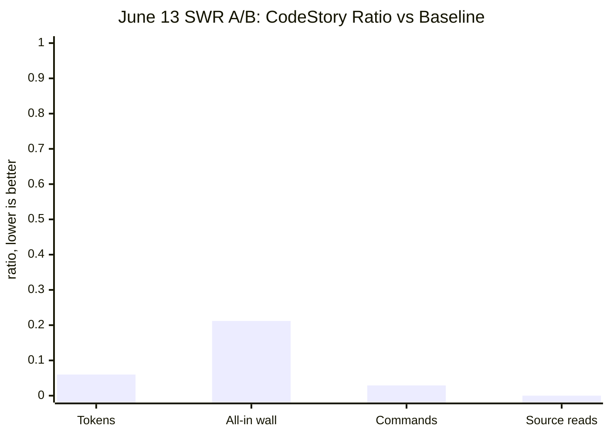

# CodeStory Benchmark Ledger

This page is the current benchmark scorecard. It should answer one question
quickly: does the latest evidence show CodeStory helping, hurting, or still
needing proof?

Short answer: there is fresh evidence from June 13-14, 2026. It is much better
than the stale May quick-check row, but it is not broad enough yet for a general
public savings claim.

## Current Answer

| Question | Answer |
| --- | --- |
| Is the May 23 "CodeStory used more tokens and time" row still the current answer? | No. It is historical context. |
| Is there benchmark data from this week? | Yes: a June 13 SWR A/B row and a June 14 18-repo packet-runtime language sweep. |
| Does the fresh data show CodeStory can be useful? | Yes. The SWR A/B row shows a large win, and the packet-runtime sweep shows broad language coverage. |
| Can we claim general agent savings yet? | No. The strongest A/B row is one repeat, non-publishable, and reused one baseline run. |

## Current Evidence At A Glance



| Lane | Fresh result | What it means | Claim status |
| --- | --- | --- | --- |
| SWR paired A/B | With CodeStory: `32,168` tokens, `42.67s` all-in wall, `1` command, `0` source reads, quality `1/1`. Without CodeStory: `535,632` tokens, `201.38s`, `35` commands, `30` source reads, quality `0/1`. | CodeStory was clearly useful on this task. | Strong single-task evidence, not a general savings claim. |
| 18-repo packet-runtime sweep | `18/18` packet runs succeeded; `12/18` passed full quality; `17/18` had full expected-file recall; median cold packet wall was `11.14s`. | Packet retrieval works across many languages, but quality is still uneven. | Broad runtime and coverage evidence, not an agent A/B savings claim. |
| May local-real Codex/Sourcetrail/VS Code rows | CodeStory won on selected realistic tasks, but rows were exploratory and single-repeat. | Useful supporting context. | Historical exploratory evidence. |
| May 23 quick CodeStory repo run | CodeStory arm used more tokens, wall time, and tool starts. | A real negative baseline from before the stricter packet-first and sidecar work. | Historical; do not use as the current scorecard. |

## Fresh Runs

### SWR Paired A/B

Evidence bundle:
`target/agent-benchmark/segment9-current-ab-swr-generic-final/summary.json`

Generated: `2026-06-13T11:15:27.190Z`

Scope:

- Task suite: `language-expansion-holdout`
- Task: `typescript-swr-hook-flow`
- Runner: `codex`
- Sidecar contract: `sidecar_primary_forced`
- Embeddings: `llamacpp`
- Retrieval mode for SWR cache: `full`
- Cache status: fresh, `254` files, `0` indexing errors, `38` semantic docs

| Arm | Quality | Packet first | Tokens | All-in wall | Commands | Source reads | File recall | Claim recall |
| --- | ---: | ---: | ---: | ---: | ---: | ---: | ---: | ---: |
| without CodeStory | `0/1` | n/a | `535,632` | `201.38s` | `35` | `30` | `66.7%` | `25%` |
| with CodeStory | `1/1` | `1/1` | `32,168` | `42.67s` | `1` | `0` | `100%` | `100%` |

Interpretation:

- This is the clearest current evidence that CodeStory can change the shape of
  agent work: fewer tokens, fewer commands, no source-read crawl, and better
  answer quality on the measured task.
- It is still one repeat. The run also reports `publishable: false`,
  `allow_failures: true`, and `reused_baseline_runs: 1`, so keep it out of
  broad marketing claims until rerun as a publishable repeated A/B.

### 18-Repo Packet Runtime Sweep

Evidence bundle:
`target/agent-benchmark/language-expansion-packet-runtime-current-after-claim-fixes/packet-runtime-summary.json`

Generated: `2026-06-14T01:10:57.739Z`

Scope:

- Mode: cold CLI packet
- Repeats: `1`
- Sidecar contract: `sidecar_primary_forced`
- Embeddings: `llamacpp`
- Compose profile: `real`

| Metric | Result |
| --- | ---: |
| Packet runs succeeded | `18/18` |
| Full quality pass | `12/18` |
| Full expected-file recall | `17/18` |
| Full expected-claim recall | `11/18` |
| Sufficient packets | `9/18` |
| Partial packets | `9/18` |
| Sufficiency / quality gaps | `4` |
| Packet SLA misses | `3` |
| Cold packet wall time | min `5.04s`, median `11.14s`, max `33.10s` |
| Retrieval time | min `4.45s`, median `10.29s`, max `30.93s` |

Quality by task:

| Repo | Task | Quality | Sufficiency | File recall | Claim recall |
| --- | --- | ---: | --- | ---: | ---: |
| psf-requests | python requests session flow | fail | sufficient | `100%` | `0%` |
| apache-commons-lang | Java StringUtils | pass | partial | `100%` | `100%` |
| ripgrep | Rust search pipeline | pass | partial | `100%` | `100%` |
| express | JavaScript routing flow | pass | partial | `100%` | `100%` |
| vercel-swr | TypeScript hook flow | pass | sufficient | `100%` | `100%` |
| fmt | C++ formatting flow | pass | sufficient | `100%` | `100%` |
| redis | C command loop | pass | partial | `75%` | `100%` |
| gin | Go route dispatch | pass | sufficient | `100%` | `100%` |
| jekyll | Ruby site build | fail | sufficient | `100%` | `50%` |
| monolog | PHP record flow | fail | sufficient | `100%` | `0%` |
| AutoMapper | C# map flow | fail | partial | `100%` | `0%` |
| okio | Kotlin buffer flow | fail | partial | `100%` | `50%` |
| Alamofire | Swift request flow | pass | partial | `100%` | `100%` |
| dart-http | Dart client flow | pass | sufficient | `100%` | `100%` |
| nvm | Bash install dispatch | pass | sufficient | `100%` | `100%` |
| MDN forms | HTML validation | fail | sufficient | `100%` | `0%` |
| animate.css | CSS base/keyframes | pass | partial | `100%` | `100%` |
| Chinook | SQL schema relations | pass | partial | `100%` | `100%` |

Interpretation:

- The runtime path is real: every packet completed under the forced sidecar
  contract with llama.cpp embeddings.
- The language expansion work is not done. File recall is mostly solved, but
  answer-claim quality still misses in Python, Ruby, PHP, C#, Kotlin, and HTML.
- This is a packet-runtime result, not a paired agent-cost benchmark.

## Older Rows

The May 23 quick run remains in the ledger because it is an honest baseline:

```sh
node ./scripts/codestory-agent-ab-benchmark.mjs --quick --repos codestory --repeats 3 --timeout-ms 900000 --sandbox danger-full-access --publishable --out-dir target/agent-benchmark/codestory-quick-2026-05-23-r3
```

It passed both arms, but the CodeStory arm was worse:

| Arm | Pass | Median wall | Total tokens | Tool starts |
| --- | ---: | ---: | ---: | ---: |
| without CodeStory | `3/3` | `214.90s` | `1,605,030` | `29` |
| with CodeStory | `3/3` | `306.24s` | `2,724,490` | `43` |

That row should not be deleted, but it should also not be treated as the latest
state of the project. It predates the stricter packet-first harness work, full
sidecar readiness checks, and the current language-expansion packet evidence.

May 25 local-real rows for Codex, Sourcetrail, and VS Code showed CodeStory
wins on realistic tasks, but they were still exploratory single-repeat rows
using local cache state. Keep them as supporting evidence, not promotion-grade
proof.

## What Is Solid

- CodeStory can produce a much better agent run on at least one current
  holdout-language task: SWR hook-flow.
- The current packet path runs through real sidecars, not stubbed or disabled
  retrieval.
- Packet runtime works across an 18-repo, multi-language sweep.
- File-level recall is strong in the fresh packet sweep: `17/18` tasks reached
  full expected-file recall.

## What Is Not Claimed

- No general "CodeStory saves tokens" claim yet.
- No universal language-support claim yet.
- No publishable paired benchmark claim from the June 13 SWR row.
- No claim that a sufficient packet always means answer quality passes; the
  June 14 sweep has `4` sufficiency/quality gaps.

## Next Runs Needed

Run these before promoting the current story beyond "promising current
evidence":

1. Repeat the SWR A/B row with `--publishable`, no reused baseline, and at least
   `3` repeats.
2. Rerun the 18-repo packet sweep after fixing the six claim-quality misses.
3. Add at least two more paired A/B rows from the language-expansion holdout set.
4. Keep the May 23 negative row visible until repeated current rows make the
   trend obvious.

## How To Rerun

List available tasks:

```sh
node ./scripts/codestory-agent-ab-benchmark.mjs --list
node ./scripts/codestory-agent-ab-benchmark.mjs --task-suite language-expansion-holdout --list
```

Packet-runtime sweep:

```sh
node ./scripts/codestory-agent-ab-benchmark.mjs --packet-runtime --task-suite language-expansion-holdout --repeats 1 --packet-runtime-mode cold-cli --codestory-cli ./target/release/codestory-cli --out-dir target/agent-benchmark/language-expansion-packet-runtime-current --timeout-ms 120000
```

Publishable SWR A/B target:

```sh
node ./scripts/codestory-agent-ab-benchmark.mjs --task-suite language-expansion-holdout --task-ids typescript-swr-hook-flow --repeats 3 --publishable --max-source-reads-after-packet 0 --codestory-cli ./target/release/codestory-cli --out-dir target/agent-benchmark/swr-publishable-r3
```

## Harness Contract

The agent A/B harness runs the same repository prompt in two arms:

- `without_codestory`: avoid CodeStory and use normal repository exploration.
- `with_codestory`: use CodeStory grounding first, run `packet` for broad
  repository questions, then ordinary source reads only for named gaps.

The harness writes raw stdout/stderr per run, a JSONL run log, transcript
analysis, a machine summary, and a Markdown summary under
`target/agent-benchmark/<run-dir>`.

Use `--publishable` only when:

- both arms have token usage,
- every required run succeeds,
- repository provenance is pinned,
- CodeStory cache provenance is recorded,
- the with-CodeStory arm runs an answer packet first, and
- post-packet source reads stay inside the explicit budget.

Cold repo-scale timings are owned by
[codestory-e2e-stats-log.md](codestory-e2e-stats-log.md). Warm stdio loop
timings are owned by
[codestory-stdio-warm-loop-stats.md](codestory-stdio-warm-loop-stats.md).
