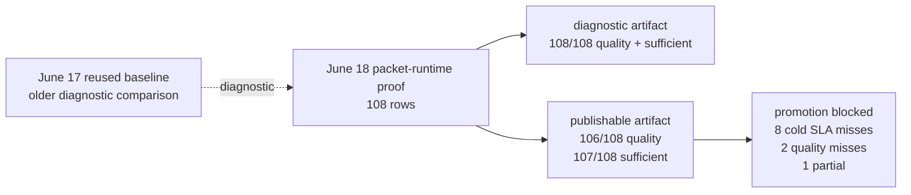

# CodeStory Benchmark Ledger

This page is the current benchmark scorecard. It should answer a reader's first
question quickly: did CodeStory help, hurt, or still need proof?

Short answer: the June 18, 2026 packet-runtime proof is the current scorecard.
The diagnostic full form+command run passed `108/108` success, quality, and
sufficiency gates but missed `9` cold SLAs. The publishable full run passed
`108/108` success, `106/108` quality, and `107/108` sufficiency, with one
partial row and `8` cold SLA misses. Promotion is blocked.

## Plain English

| Term in raw artifacts | Reader meaning |
| --- | --- |
| Answer bundle | A CodeStory response with cited files, likely owners, and the explanation it can support. |
| Quality pass | The answer covered the expected files and explanation points for that task. |
| Files found | How many expected files CodeStory found or cited. |
| Explanation points | How many expected claims were actually present in the answer. |
| Follow-up needed | Extra commands CodeStory said a user should run because the answer bundle was incomplete. |
| Comparison run | The same task run twice: once without CodeStory and once with CodeStory. |

## Current Answer

| Question | Answer |
| --- | --- |
| Is there benchmark data from this week? | Yes: two June 18 full packet-runtime artifacts over `language-expansion-holdout`, cold and warm packet shapes, and three repeats. |
| Does the fresh data show CodeStory can be useful? | Yes. The diagnostic artifact completed `108/108` rows with full quality and sufficiency. The publishable artifact completed `108/108` rows but exposed the remaining promotion blockers. |
| Can we claim general answer-quality superiority yet? | Not as a public promotion claim. The current publishable artifact still has quality misses, a sufficiency gap, and cold SLA misses. Older fixed-baseline comparisons remain development diagnostics. |

## Current Evidence At A Glance



| Lane | Current result | What it means | Claim status |
| --- | --- | --- | --- |
| Publishable full packet-runtime proof | `target/agent-benchmark/language-expansion-publishable-full-form-command-shapes`, generated `2026-06-18T12:23:54.418Z`: `108/108` success, `106/108` quality, `107/108` sufficient, `1` partial, `8` cold SLA misses. | CodeStory is close to promotion readiness, but the current publishable artifact still exposes blocker rows. | Current scorecard; promotion blocked. |
| Diagnostic full packet-runtime proof | `target/agent-benchmark/language-expansion-proof-full-form-command-shapes`, generated `2026-06-18T12:03:23.059Z`: `108/108` success, `108/108` quality, `108/108` sufficient, `9` cold SLA misses. | Packet shape and command coverage work across the full suite, but latency is not promotion-clean. | Development proof only; non-publishable. |
| Older fixed-baseline language comparison | With CodeStory: `54/54` success, `54/54` quality, `3,383,687 ms` all-in wall, `2,141,124` tokens, `54` commands, `0` source reads. Without CodeStory: `54/54` success, `24/54` quality, `7,943,578 ms`, `9,692,559` tokens, `471` commands, `417` source reads. | CodeStory materially reduced operating cost, stayed packet-first, and was quality-equal or better on every measured language task in that comparison. | Older development comparison. Reused-baseline or fixed no-CodeStory comparisons are diagnostic unless fingerprints match, and are never enough for packet-runtime promotion by themselves. |
| TypeScript React library comparison | With CodeStory: `32,168` tokens, `42.67s` elapsed including setup check, `1` command, `0` source files opened, quality `1/1`. Without CodeStory: `535,632` tokens, `201.38s`, `35` commands, `30` source files opened, quality `0/1`. | CodeStory was clearly useful on this task. | Strong historical single-task evidence, not a general savings claim. |

## Older Full A/B By Language

Source: `target/agent-benchmark/language-expansion-holdout-20260617-fixed-baseline-vs-round24-codeonly-offline/reanalyzed-summary.md`

This June 17 reused-baseline composite is older development evidence. It is not
the current scorecard and cannot prove packet-runtime promotion readiness.

| Language | Example project | With CodeStory quality | Baseline quality | Read |
| --- | --- | ---: | ---: | --- |
| Python | requests | `3/3` | `3/3` | Quality tie; CodeStory uses `3` commands and `0` source reads versus baseline `27` commands and `24` source reads. |
| Java | Commons Lang | `3/3` | `0/3` | CodeStory quality win with lower command and source-read cost. |
| Rust | ripgrep | `3/3` | `0/3` | CodeStory quality win with lower command and source-read cost. |
| JavaScript | Express | `3/3` | `3/3` | Quality tie; CodeStory wins operationally and stays packet-first. |
| TypeScript | SWR | `3/3` | `0/3` | CodeStory quality win with lower command and source-read cost. |
| C++ | fmt | `3/3` | `3/3` | Quality tie; CodeStory wins operationally and stays packet-first. |
| C | Redis | `3/3` | `3/3` | Quality tie; CodeStory wins operationally and stays packet-first. |
| Go | Gin | `3/3` | `3/3` | Quality tie; CodeStory wins operationally and stays packet-first. |
| Ruby | Jekyll | `3/3` | `2/3` | CodeStory quality win with lower command and source-read cost. |
| PHP | Monolog | `3/3` | `2/3` | CodeStory quality win with lower command and source-read cost. |
| C# | AutoMapper | `3/3` | `0/3` | CodeStory quality win with lower command and source-read cost. |
| Kotlin | Okio | `3/3` | `0/3` | CodeStory quality win with lower command and source-read cost. |
| Swift | Alamofire | `3/3` | `1/3` | CodeStory quality win with lower command and source-read cost. |
| Dart | http | `3/3` | `1/3` | CodeStory quality win with lower command and source-read cost. |
| Bash | nvm | `3/3` | `3/3` | Quality tie; CodeStory wins operationally and stays packet-first. |
| HTML | MDN forms | `3/3` | `0/3` | CodeStory quality win with lower command and source-read cost. |
| CSS | animate.css | `3/3` | `0/3` | CodeStory quality win with lower command and source-read cost. |
| SQL | Chinook | `3/3` | `0/3` | CodeStory quality win with lower command and source-read cost. |

## Packet Runtime Performance By Language

The current packet-runtime scorecard is the June 18 full form+command pair:

| Artifact | Generated | Success | Quality | Sufficiency | Cold SLA | Promotion status |
| --- | --- | ---: | ---: | ---: | ---: | --- |
| `target/agent-benchmark/language-expansion-proof-full-form-command-shapes` | `2026-06-18T12:03:23.059Z` | `108/108` | `108/108` | `108/108` | `9` misses | Diagnostic/development proof only. |
| `target/agent-benchmark/language-expansion-publishable-full-form-command-shapes` | `2026-06-18T12:23:54.418Z` | `108/108` | `106/108` | `107/108`, `1` partial | `8` misses | Promotion blocked. |

Current blockers:

| Row | Blocker |
| --- | --- |
| apache-commons-lang | Cold SLA `3/3`. |
| redis | Cold SLA `3/3`. |
| AutoMapper | Cold SLA `1/3`. |
| dart-http | Cold SLA `1/3`. |
| square-okio | Cold quality `2/3`. |
| Alamofire | Cold quality `2/3` plus `1` partial sufficiency. |

The older packet-runtime diagnostic below remains useful for packet composition
and claim-quality archaeology only.

Source: `target/agent-benchmark/language-expansion-packet-runtime-current-after-claim-fixes/packet-runtime-summary.json`

Generated: `2026-06-14T01:10:57.739Z`

Sorted best to worst: quality pass first, then higher explanation coverage,
higher file coverage, lower elapsed time, and fewer follow-up commands.

| Language | Example project | Task kind | Result | Elapsed | Files found | Explanation points | Follow-up needed |
| --- | --- | --- | ---: | ---: | ---: | ---: | ---: |
| Bash | nvm | install dispatch | pass | `5.04s` | `100%` | `100%` | `0` |
| SQL | Chinook | schema relations | pass | `5.12s` | `100%` | `100%` | `8` |
| CSS | animate.css | animation base/keyframes | pass | `5.60s` | `100%` | `100%` | `8` |
| Go | Gin | route dispatch | pass | `6.50s` | `100%` | `100%` | `0` |
| JavaScript | Express | routing flow | pass | `7.71s` | `100%` | `100%` | `8` |
| TypeScript | SWR | React data-fetching hook flow | pass | `7.78s` | `100%` | `100%` | `0` |
| C++ | fmt | formatting flow | pass | `11.86s` | `100%` | `100%` | `0` |
| Swift | Alamofire | request flow | pass | `12.89s` | `100%` | `100%` | `8` |
| Rust | ripgrep | search pipeline | pass | `13.07s` | `100%` | `100%` | `3` |
| Java | Commons Lang | string utility flow | pass | `33.03s` | `100%` | `100%` | `8` |
| C | Redis | command loop | pass | `33.10s` | `75%` | `100%` | `8` |
| Dart | http | HTTP client flow | pass | `18.63s` | `100%` | `75%` | `0` |
| Ruby | Jekyll | site build | miss | `10.42s` | `100%` | `50%` | `0` |
| Kotlin | Okio | buffer flow | miss | `22.30s` | `100%` | `50%` | `8` |
| HTML | MDN forms | form validation | miss | `14.59s` | `100%` | `25%` | `0` |
| PHP | Monolog | log record flow | miss | `5.19s` | `100%` | `0%` | `0` |
| Python | requests | HTTP client flow | miss | `8.19s` | `100%` | `0%` | `0` |
| C# | AutoMapper | mapping flow | miss | `12.01s` | `100%` | `0%` | `3` |

What this says:

- File discovery is mostly working: only Redis missed expected file coverage.
- Explanation quality is the real gap: Python, Ruby, PHP, C#, Kotlin, and HTML
  found the right files but failed or partially failed the expected claims.
- Slow passing rows are Java and C at about `33s`.

## Performance By Framework Or Domain Kind

This groups the same 18 rows by the kind of code a user might recognize. It is
more useful than a repo-name-only table when deciding where CodeStory is ready.

Sorted best to worst: higher quality-pass rate first, then lower median elapsed
time.

| Framework / domain kind | Examples | Quality pass | Median elapsed | What it tells us |
| --- | --- | ---: | ---: | --- |
| Web routing and data fetching | Express, Gin, SWR | `3/3` | `7.71s` | Historically strong lane: fast, complete file coverage, complete explanation coverage. |
| Systems and data engines | ripgrep, Redis, Chinook SQL | `3/3` | `13.07s` | Quality passed; Redis still missed one expected file and was slow. |
| Text and formatting utilities | Commons Lang, fmt | `2/2` | `22.45s` | Quality passed, but Java was one of the slow rows. |
| HTTP client libraries | requests, Alamofire, Dart http | `2/3` | `12.89s` | Swift and Dart passed; Python found files but failed explanation points. |
| Build, install, and site tooling | nvm, Jekyll | `1/2` | `7.73s` | Bash passed; Jekyll found files but only half the expected explanation points. |
| Web documents and styling | MDN forms, animate.css | `1/2` | `10.09s` | CSS passed; HTML found files but missed explanation points. |
| App support libraries | Monolog, AutoMapper, Okio | `0/3` | `12.01s` | Main weak lane: PHP, C#, and Kotlin need claim-quality work. |

## TypeScript React Library Example

Source: `target/agent-benchmark/segment9-current-ab-swr-generic-final/summary.json`

Generated: `2026-06-13T11:15:27.190Z`

SWR is Vercel's TypeScript/React data-fetching library. This row asks the same
repository question with and without CodeStory.

| Run | Quality | Tokens | Elapsed | Commands | Source files opened | Files found | Explanation points |
| --- | ---: | ---: | ---: | ---: | ---: | ---: | ---: |
| Without CodeStory | `0/1` | `535,632` | `201.38s` | `35` | `30` | `66.7%` | `25%` |
| With CodeStory | `1/1` | `32,168` | `42.67s` | `1` | `0` | `100%` | `100%` |

Why this matters:

- It is a real example where CodeStory changed the work from a source-file crawl
  into one cited answer bundle.
- It is not enough for a broad savings claim. The raw run reports
  `publishable: false`, `allow_failures: true`, and `reused_baseline_runs: 1`.

## What Is Solid

- The June 18 diagnostic full form+command packet-runtime artifact completed
  `108/108` rows with full success, quality, and sufficiency.
- The June 18 publishable artifact completed `108/108` rows and precisely names
  the remaining blockers: `106/108` quality, `107/108` sufficiency, one
  partial row, and `8` cold SLA misses.
- The older June 17 fixed-baseline composite lowered all-in wall time, total
  tokens, commands, and direct source reads overall.
- The older with-CodeStory arm stayed packet-first: `54` commands and `0`
  direct source reads across the full suite.

## What Is Not Claimed

- No general public savings claim beyond the measured fixed-baseline artifacts.
- No universal language-support or answer-quality claim yet.
- No publishable public benchmark claim yet: the June 18 publishable
  packet-runtime artifact is blocked, the June 17 composite is an offline
  reused-baseline artifact, and the June 13 TypeScript row is a non-publishable
  single task.
- No claim that the holdout suite alone proves every supported framework or
  domain surface. Broader language/framework claims still need a promotion-clean
  packet-runtime run and breadth beyond the measured holdout tasks.

## Next Runs Needed

Run these before promoting the current story beyond "promising current
evidence":

1. Clear the June 18 publishable packet-runtime blockers: apache-commons-lang,
   redis, AutoMapper, and dart-http cold SLA; square-okio and Alamofire cold
   quality; and Alamofire partial sufficiency.
2. Rerun the promotion-eligible shape: full `language-expansion-holdout`
   packet-runtime, cold and warm modes, repeats `3`, `--jobs 4`, prepared
   sidecars, `--publishable`, no `--allow-failures`, full sidecar provenance,
   no quality misses, no sufficiency gaps, and no SLA misses.
3. Treat stale `--reuse-baseline-from` and fixed no-CodeStory comparisons as
   diagnostic unless fingerprints are compatible; never use them alone for
   packet-runtime promotion.

## How To Rerun

List available tasks:

```sh
node ./scripts/codestory-agent-ab-benchmark.mjs --list
node ./scripts/codestory-agent-ab-benchmark.mjs --task-suite language-expansion-holdout --list
```

Promotion-eligible language packet-runtime run:

```sh
node ./scripts/codestory-agent-ab-benchmark.mjs \
  --packet-runtime \
  --packet-runtime-mode both \
  --task-suite language-expansion-holdout \
  --repeats 3 \
  --materialize-repos \
  --jobs 4 \
  --prepare-codestory-jobs 2 \
  --codestory-cli ./target/release/codestory-cli \
  --out-dir target/agent-benchmark/language-expansion-publishable-full-form-command-shapes \
  --timeout-ms 180000 \
  --publishable
```

Diagnostic language comparison with fixed baseline reuse:

```sh
node ./scripts/codestory-agent-ab-benchmark.mjs \
  --task-suite language-expansion-holdout \
  --arms without_codestory,with_codestory \
  --repeats 3 \
  --materialize-repos \
  --prepare-codestory-cache \
  --reuse-baseline-from target/agent-benchmark/language-expansion-holdout-20260617-baseline-j4 \
  --out-dir target/agent-benchmark/language-expansion-holdout \
  --timeout-ms 600000
```

With `--reuse-baseline-from`, matching without-CodeStory rows are reused from
the fixed artifact rather than executed. This is diagnostic unless the current
harness accepts matching fingerprints, and it is never enough for packet-runtime
promotion by itself. A new no-CodeStory control artifact is only justified when
the task suite, pinned repo state, harness contract, or scorer boundary changes
with explicit approval.

Publishable TypeScript React comparison target:

```sh
node ./scripts/codestory-agent-ab-benchmark.mjs --task-suite language-expansion-holdout --task-ids typescript-swr-hook-flow --repeats 3 --publishable --max-source-reads-after-packet 0 --codestory-cli ./target/release/codestory-cli --out-dir target/agent-benchmark/swr-publishable-r3
```

## Harness Contract

The agent benchmark harness runs the same repository prompt in two arms:

- `without_codestory`: avoid CodeStory and use normal repository exploration.
- `with_codestory`: use CodeStory grounding first, run an answer bundle for
  broad repository questions, then ordinary source reads only for named gaps.

The harness writes raw stdout/stderr per run, a JSONL run log, transcript
analysis, a machine summary, and a Markdown summary under
`target/agent-benchmark/<run-dir>`.

Use `--publishable` only when:

- both arms have token usage,
- every required run succeeds,
- repository provenance is pinned,
- CodeStory cache provenance is recorded,
- the with-CodeStory arm runs an answer bundle first, and
- post-bundle source reads stay inside the explicit budget.

For packet-runtime promotion, use `--packet-runtime`,
`--packet-runtime-mode both`, `--repeats 3`, `--jobs 4`, and `--publishable`
with prepared sidecars and no `--allow-failures`. The artifact must have full
sidecar provenance, zero quality misses, zero sufficiency gaps, and zero SLA
misses.

Cold repo-scale timings are owned by
[codestory-e2e-stats-log.md](codestory-e2e-stats-log.md). Warm stdio loop
timings are owned by
[codestory-stdio-warm-loop-stats.md](codestory-stdio-warm-loop-stats.md).
