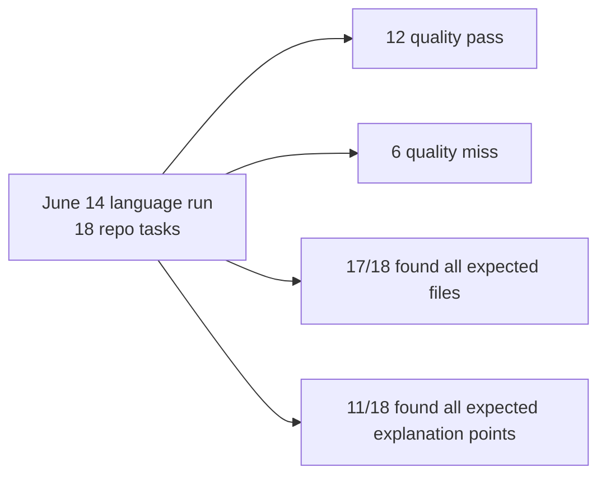

# CodeStory Benchmark Ledger

This page is the current benchmark scorecard. It should answer a reader's first
question quickly: did CodeStory help, hurt, or still need proof?

Short answer: the June 13-14, 2026 evidence is promising, especially for
TypeScript/React routing-style work, but it is not broad enough yet for a
general public savings claim.

## Plain English

| Term in raw artifacts | Reader meaning |
| --- | --- |
| Answer bundle | A CodeStory response with cited files, likely owners, and the explanation it can support. |
| Quality pass | The answer covered the expected files and explanation points for that task. |
| Files found | How many expected files CodeStory found or cited. |
| Explanation points | How many expected claims were actually present in the answer. |
| Follow-up needed | Extra commands CodeStory said a user should run because the answer bundle was incomplete. |
| Comparison run | The same task run twice: once without CodeStory and once with CodeStory. |

## Current Answer

| Question | Answer |
| --- | --- |
| Is there benchmark data from this week? | Yes: one TypeScript/React comparison run and one 18-language answer-bundle run. |
| Does the fresh data show CodeStory can be useful? | Yes. The TypeScript/React row shows a large win, and the 18-language run shows broad file-finding coverage. |
| Can we claim general agent savings yet? | No. The strongest comparison row is one repeat, non-publishable, and reused one baseline run. |

## Current Evidence At A Glance



| Lane | Fresh result | What it means | Claim status |
| --- | --- | --- | --- |
| TypeScript React library comparison | With CodeStory: `32,168` tokens, `42.67s` elapsed including setup check, `1` command, `0` source files opened, quality `1/1`. Without CodeStory: `535,632` tokens, `201.38s`, `35` commands, `30` source files opened, quality `0/1`. | CodeStory was clearly useful on this task. | Strong single-task evidence, not a general savings claim. |
| 18-language answer-bundle run | `18/18` answer bundles completed; `12/18` passed full quality; `17/18` found all expected files; median elapsed time was `11.14s`. | CodeStory usually found the right files, but explanation quality is still uneven. | Broad runtime and coverage evidence, not a comparison-run savings claim. |

## Performance By Language

Source: `target/agent-benchmark/language-expansion-packet-runtime-current-after-claim-fixes/packet-runtime-summary.json`

Generated: `2026-06-14T01:10:57.739Z`

Sorted best to worst: quality pass first, then higher explanation coverage,
higher file coverage, lower elapsed time, and fewer follow-up commands.

| Language | Example project | Task kind | Result | Elapsed | Files found | Explanation points | Follow-up needed |
| --- | --- | --- | ---: | ---: | ---: | ---: | ---: |
| Bash | nvm | install dispatch | pass | `5.04s` | `100%` | `100%` | `0` |
| SQL | Chinook | schema relations | pass | `5.12s` | `100%` | `100%` | `8` |
| CSS | animate.css | animation base/keyframes | pass | `5.60s` | `100%` | `100%` | `8` |
| Go | Gin | route dispatch | pass | `6.50s` | `100%` | `100%` | `0` |
| JavaScript | Express | routing flow | pass | `7.71s` | `100%` | `100%` | `8` |
| TypeScript | SWR | React data-fetching hook flow | pass | `7.78s` | `100%` | `100%` | `0` |
| C++ | fmt | formatting flow | pass | `11.86s` | `100%` | `100%` | `0` |
| Swift | Alamofire | request flow | pass | `12.89s` | `100%` | `100%` | `8` |
| Rust | ripgrep | search pipeline | pass | `13.07s` | `100%` | `100%` | `3` |
| Java | Commons Lang | string utility flow | pass | `33.03s` | `100%` | `100%` | `8` |
| C | Redis | command loop | pass | `33.10s` | `75%` | `100%` | `8` |
| Dart | http | HTTP client flow | pass | `18.63s` | `100%` | `75%` | `0` |
| Ruby | Jekyll | site build | miss | `10.42s` | `100%` | `50%` | `0` |
| Kotlin | Okio | buffer flow | miss | `22.30s` | `100%` | `50%` | `8` |
| HTML | MDN forms | form validation | miss | `14.59s` | `100%` | `25%` | `0` |
| PHP | Monolog | log record flow | miss | `5.19s` | `100%` | `0%` | `0` |
| Python | requests | HTTP client flow | miss | `8.19s` | `100%` | `0%` | `0` |
| C# | AutoMapper | mapping flow | miss | `12.01s` | `100%` | `0%` | `3` |

What this says:

- File discovery is mostly working: only Redis missed expected file coverage.
- Explanation quality is the real gap: Python, Ruby, PHP, C#, Kotlin, and HTML
  found the right files but failed or partially failed the expected claims.
- Slow passing rows are Java and C at about `33s`.

## Performance By Framework Or Domain Kind

This groups the same 18 rows by the kind of code a user might recognize. It is
more useful than a repo-name-only table when deciding where CodeStory is ready.

Sorted best to worst: higher quality-pass rate first, then lower median elapsed
time.

| Framework / domain kind | Examples | Quality pass | Median elapsed | What it tells us |
| --- | --- | ---: | ---: | --- |
| Web routing and data fetching | Express, Gin, SWR | `3/3` | `7.71s` | Strong current lane: fast, complete file coverage, complete explanation coverage. |
| Systems and data engines | ripgrep, Redis, Chinook SQL | `3/3` | `13.07s` | Quality passed; Redis still missed one expected file and was slow. |
| Text and formatting utilities | Commons Lang, fmt | `2/2` | `22.45s` | Quality passed, but Java was one of the slow rows. |
| HTTP client libraries | requests, Alamofire, Dart http | `2/3` | `12.89s` | Swift and Dart passed; Python found files but failed explanation points. |
| Build, install, and site tooling | nvm, Jekyll | `1/2` | `7.73s` | Bash passed; Jekyll found files but only half the expected explanation points. |
| Web documents and styling | MDN forms, animate.css | `1/2` | `10.09s` | CSS passed; HTML found files but missed explanation points. |
| App support libraries | Monolog, AutoMapper, Okio | `0/3` | `12.01s` | Main weak lane: PHP, C#, and Kotlin need claim-quality work. |

## TypeScript React Library Example

Source: `target/agent-benchmark/segment9-current-ab-swr-generic-final/summary.json`

Generated: `2026-06-13T11:15:27.190Z`

SWR is Vercel's TypeScript/React data-fetching library. This row asks the same
repository question with and without CodeStory.

| Run | Quality | Tokens | Elapsed | Commands | Source files opened | Files found | Explanation points |
| --- | ---: | ---: | ---: | ---: | ---: | ---: | ---: |
| Without CodeStory | `0/1` | `535,632` | `201.38s` | `35` | `30` | `66.7%` | `25%` |
| With CodeStory | `1/1` | `32,168` | `42.67s` | `1` | `0` | `100%` | `100%` |

Why this matters:

- It is a real example where CodeStory changed the work from a source-file crawl
  into one cited answer bundle.
- It is not enough for a broad savings claim. The raw run reports
  `publishable: false`, `allow_failures: true`, and `reused_baseline_runs: 1`.

## What Is Solid

- CodeStory produced a much better agent run on one current holdout-language
  task: the TypeScript React data-fetching row.
- The current answer-bundle path runs through real sidecars, not stubbed or
  disabled retrieval.
- The 18-language run completed for every task.
- File-level recall is strong in the fresh language run: `17/18` tasks found all
  expected files.

## What Is Not Claimed

- No general "CodeStory saves tokens" claim yet.
- No universal language-support claim yet.
- No publishable paired benchmark claim from the June 13 TypeScript React row.
- No claim that a complete-looking answer bundle always means answer quality
  passes; the June 14 run has `4` sufficiency/quality gaps.

## Next Runs Needed

Run these before promoting the current story beyond "promising current
evidence":

1. Repeat the TypeScript React comparison row with `--publishable`, no reused
   baseline, and at least `3` repeats.
2. Rerun the 18-language answer-bundle check after fixing the six
   claim-quality misses.
3. Add at least two more comparison rows from the language-expansion holdout
   set.

## How To Rerun

List available tasks:

```sh
node ./scripts/codestory-agent-ab-benchmark.mjs --list
node ./scripts/codestory-agent-ab-benchmark.mjs --task-suite language-expansion-holdout --list
```

Language answer-bundle run:

```sh
node ./scripts/codestory-agent-ab-benchmark.mjs --packet-runtime --task-suite language-expansion-holdout --repeats 1 --packet-runtime-mode cold-cli --codestory-cli ./target/release/codestory-cli --out-dir target/agent-benchmark/language-expansion-packet-runtime-current --timeout-ms 120000
```

Publishable TypeScript React comparison target:

```sh
node ./scripts/codestory-agent-ab-benchmark.mjs --task-suite language-expansion-holdout --task-ids typescript-swr-hook-flow --repeats 3 --publishable --max-source-reads-after-packet 0 --codestory-cli ./target/release/codestory-cli --out-dir target/agent-benchmark/swr-publishable-r3
```

## Harness Contract

The agent benchmark harness runs the same repository prompt in two arms:

- `without_codestory`: avoid CodeStory and use normal repository exploration.
- `with_codestory`: use CodeStory grounding first, run an answer bundle for
  broad repository questions, then ordinary source reads only for named gaps.

The harness writes raw stdout/stderr per run, a JSONL run log, transcript
analysis, a machine summary, and a Markdown summary under
`target/agent-benchmark/<run-dir>`.

Use `--publishable` only when:

- both arms have token usage,
- every required run succeeds,
- repository provenance is pinned,
- CodeStory cache provenance is recorded,
- the with-CodeStory arm runs an answer bundle first, and
- post-bundle source reads stay inside the explicit budget.

Cold repo-scale timings are owned by
[codestory-e2e-stats-log.md](codestory-e2e-stats-log.md). Warm stdio loop
timings are owned by
[codestory-stdio-warm-loop-stats.md](codestory-stdio-warm-loop-stats.md).
