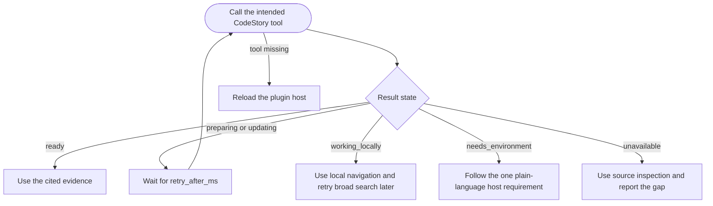

# Troubleshooting

Fix a blocked or stale CodeStory session. Start with the decision tree, then
work through the steps in order.

Trust boundaries: [Trust and readiness](trust-and-readiness.md). Terms:
[Glossary](../glossary.md).

**Need JSON field names?** Normal tools report their capability state and a
retry delay when preparation is still running. Full agent contract:
[status-contract](../../plugins/codestory/skills/codestory-grounding/references/status-contract.md).
CLI commands are maintainer/debug transcripts: [CLI reference](cli-reference.md#readiness-and-repair).

## Quick reference

| Symptom | Supported action | Healthy result |
| --- | --- | --- |
| Repo map stale | Retry `ground`; CodeStory refreshes the map automatically | `ground` returns current files and symbols |
| Broad search preparing | Retry the same `packet`, `search`, or `context` call after `retry_after_ms` | The requested tool returns cited evidence |
| MCP down, need handoff | Reload/fix host MCP; CLI can collect a debug transcript only | `codestory://status` becomes visible in the agent host |
| Managed runtime failed | Use `codestory://status` or CLI diagnostics only after automatic retries stop converging | The requested tool returns `ready` instead of `needs_environment` or `unavailable` |

## Decision tree



## Host x symptom

| Symptom | Codex | Cursor | Claude Code | Copilot |
| --- | --- | --- | --- | --- |
| MCP missing | Fresh thread after `/plugins` install | Check `.cursor/mcp.json`; reload MCP server | MCP configured separately from hooks | MCP not auto-started; configure or use CLI |
| Stale index / wrong symbols | Retry `ground`; CodeStory refreshes automatically | Retry `ground` | Retry `ground` | Run [local repair](cli-reference.md#readiness-and-repair) |
| Broad search preparing | Retry the same tool after its delay | Same | Same | Use CLI [retrieval status](cli-reference.md#readiness-and-repair) only as a debug transcript |
| Version drift after update | Refresh marketplace, refresh plugin package, restart host, fresh status read | Reload MCP server | Restart session | Reinstall or point to current binary |

Host-specific steps: [Codex](codex.md#troubleshooting), [Cursor](cursor.md#troubleshooting), [Claude Code](claude-code.md#troubleshooting), [Copilot](copilot.md).

## Good session vs blocked session

Examples in plain English. Full trust rules: [Trust and readiness](trust-and-readiness.md).

**Good.** You ask "Where is `parse_config` defined?" The agent names a file
under `src/`, lists two callers, and those paths open correctly in your editor.

**Blocked (local).** The agent says a symbol does not exist even though you can
grep it, or cites files that were deleted last week. The repo map is stale or
not built.

**Good (broad search).** You ask "How does indexing flow from workspace
discovery to SQLite?" The agent says broad search is ready, returns a compact
answer with multiple cited files, and each path exists.

**Blocked (broad search).** The agent gives a long essay with no file citations,
or says packet/search is unavailable. Do not treat the answer as proof; let
CodeStory finish preparing or ask narrower local questions.

## Step 1 -- Is my repo map ready?

**You:** In a fresh session, ask yourself:

- Can the agent find symbols and cite real file paths?
- Do trails and snippets match what is on disk?

If yes, local navigation is likely good. If no, go to [Local navigation stale or blocked](#local-navigation-stale-or-blocked).

<details>
<summary>Agent prompt (secondary)</summary>

Ask the agent:

```text
Call the CodeStory tool needed for this task. If it does not converge, read codestory://status and report the capability state in plain language.
```

The agent retries the intended tool while CodeStory prepares. It reads status
only when that automatic path stops converging.

</details>

If MCP is not connected, go to step 2.

## Step 2 -- CLI health transcript (power user)

**You:** Run diagnostics when MCP is missing or status looks wrong. Full command
reference: [CLI reference](cli-reference.md).

```sh
codestory-cli agent preflight --project <repo> --format json
codestory-cli doctor --project <repo>
```

**Agent:** Treats CLI output as a debug transcript only. CLI output does not
make CodeStory MCP live in the agent host.

On Windows PowerShell, use `.\target\release\codestory-cli.exe` for a
source-built binary.

## Local navigation stale or blocked

Symptoms: missing symbols, old file list, `ground` or `files` not allowed.

**Agent (MCP live):** Retry `ground`, `files`, or the requested local graph
tool. CodeStory refreshes the repository map as part of the call.

**You (CLI debug transcript):**

```sh
codestory-cli fix --project <repo> --format json
codestory-cli doctor --project <repo>
```

If a maintainer has evidence of cache corruption after supported repair fails,
get the exact cache path from `doctor`, move only that project cache aside, and
rebuild. This is a destructive diagnostic fallback, not the normal managed
repair path. Details: [CLI reference - stale cache](cli-reference.md#stale-local-cache).

Dirty-marker Git hooks (optional, local freshness after Git rewrite):

```sh
node plugins/codestory/hooks/codestory-dirty-hook.cjs install --project <repo> --plugin-data <plugin-data-dir>
```

## Packet/search degraded or blocked

Symptoms: `packet`, `search`, or `context` not allowed; retrieval mode not
`full`.

**Agent:** Retry the same `packet`, `search`, or `context` request after the
returned delay. Use local graph tools while the state is `working_locally`.
If the result becomes `needs_environment`, report its single host requirement
without exposing internal processes or services. Do not treat an unavailable
or partial result as proof. See [Trust and readiness](trust-and-readiness.md#proof-vs-hint).

**Maintainer:** Runtime lifecycle details are kept in
[retrieval operations](../ops/retrieval-sidecars.md).

CLI check:

```sh
codestory-cli retrieval status --project <repo> --format json
codestory-cli fix --project <repo> --format json
```

Require `retrieval_mode: "full"` before trusting packet/search evidence.
Command table: [CLI reference - readiness and repair](cli-reference.md#readiness-and-repair).

### macOS broad search

Apple Silicon uses managed Metal acceleration automatically. Retry the original
broad-search tool while CodeStory reports `preparing`; local navigation remains
available in the meantime.

Intel Macs support local navigation by default. If broad search needs an
explicit CPU or trusted external configuration, CodeStory reports that as one
plain `needs_environment` requirement. The agent should relay that requirement
without process, service, model, or port details.

Maintainer-only acceleration evidence and recovery commands are in
[retrieval operations](../ops/retrieval-sidecars.md).

## MCP visibility failure

Symptoms: skill or rule loads but no `codestory://status` or `mcp__codestory` tools.

| Host | Check |
| --- | --- |
| Codex | If resources are visible but `mcp__codestory` tools are hidden, report the host tool-visibility blocker; reload only after plugin install/config changes; see [Codex guide](codex.md#troubleshooting) |
| Cursor | MCP config path to `plugins/codestory/scripts/codestory-mcp.cjs`; reload server |
| Claude Code | MCP configured separately; hooks alone do not expose tools |
| Copilot | MCP not auto-started; configure manually or use CLI |

CLI health does not prove MCP is live in the agent host.

## Runtime drift after update

Symptoms: `runtime_update.state=available`, a stale `server_executable`, or an
actual runtime launch/compatibility failure reported as `repair_setup`.

Release availability is advisory: it never disables otherwise compatible
surfaces. Keep using the current runtime according to `allowed_surfaces`. If
`runtime_update.restart_recommended=true`, restart the host when convenient so
MCP launches the already-installed newer CLI. If status reports
`repair_setup`, follow `recommended_next_calls`; that state is reserved for an
actual runtime startup or compatibility problem. Confirm any runtime change
with a fresh `codestory://status` read.

**Local dev:** Set `CODESTORY_CLI` to a built binary; status labels this
`local_dev_override`.

### Codex marketplace refresh vs runtime reload

For Codex, marketplace refresh, package refresh, and runtime reload are separate.
These are Windows terminal commands; in Unix shells, use `codex` instead of
`codex.cmd`:

```powershell
codex.cmd plugin marketplace upgrade TheGreenCedar
codex.cmd plugin add codestory@TheGreenCedar
```

The first command only updates Codex's marketplace snapshot. The second refreshes
the installed plugin package when your Codex build supports terminal plugin
management. A running Codex host can still keep the old MCP adapter and managed
CLI alive until you start a fresh host session.

On Windows, older running CodeStory MCP processes can make
`codex.cmd plugin add codestory@TheGreenCedar` fail with `Access is denied` while
backing up the plugin cache. Current MCP adapters move their long-lived working
directory out of the plugin cache, but stale hosts from older packages can still
hold files open. Quit stale Codex windows, start a fresh host session, and retry
the `/plugins` refresh or Windows terminal install. After refresh, confirm the
active runtime through `codestory://status`, not only `codex.cmd plugin list`.

## Still stuck?

- [Trust and readiness](trust-and-readiness.md) -- when to trust output
- [CLI reference - command by situation](cli-reference.md#command-by-situation) for command-by-situation table
- [Contributor debugging](../contributors/debugging.md) for crate-level investigation
- [Managed search operations](../ops/retrieval-sidecars.md) for maintainer-only backend diagnostics
