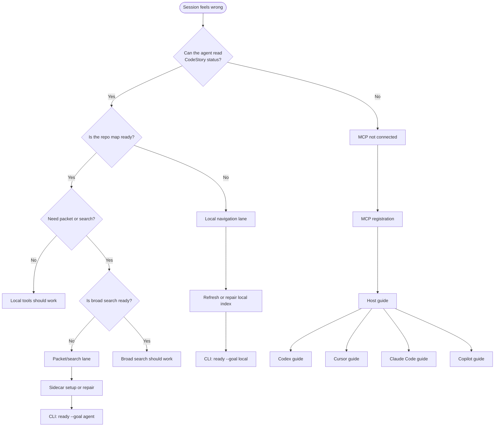

# Troubleshooting

Fix a blocked or stale CodeStory session. Start with the decision tree, then
work through the steps in order.

Trust boundaries: [Trust and readiness](trust-and-readiness.md). Terms:
[Glossary](../glossary.md).

**Need JSON field names?** Common status keys: `allowed_surfaces`, `retrieval_mode`, `repair_command`. Full agent contract: [status-contract](../../plugins/codestory/skills/codestory-grounding/references/status-contract.md). CLI repair commands: [CLI reference](cli-reference.md#readiness-and-repair).

## Repair quick reference

| Symptom | CLI command | Check in output |
| --- | --- | --- |
| Repo map stale or blocked | `codestory-cli ready --goal local --repair --project <repo> --format json` | `verdicts[].goal` is `local_navigation`; `status` is `ready` or follow `minimum_next` |
| Broad search blocked | `codestory-cli ready --goal agent --repair --project <repo> --format json` | `verdicts[].goal` is `agent_packet_search`; `retrieval_mode` is `full` in retrieval status |
| MCP down, need handoff | `codestory-cli agent preflight --project <repo> --format json` | `safe_surfaces`, `blocked_surfaces`, `repair_command` |
| Sidecar health | `codestory-cli retrieval status --project <repo> --format json` | `retrieval_mode` is `full` before trusting packet/search |

## Decision tree



## Host x symptom

| Symptom | Codex | Cursor | Claude Code | Copilot |
| --- | --- | --- | --- | --- |
| MCP missing | Fresh thread after `/plugins` install | Check `.cursor/mcp.json`; reload MCP server | MCP configured separately from hooks | MCP not auto-started; configure or use CLI |
| Stale index / wrong symbols | New thread; hooks refresh on session start | Reload MCP; run local repair | New session; run local repair | New session; run [local repair](cli-reference.md#readiness-and-repair) |
| Packet/search blocked | Agent calls sidecar setup when status says so | Same; verify retrieval mode | Same | Use CLI [retrieval status](cli-reference.md#readiness-and-repair) |
| Version drift after update | Restart host; fresh status read | Reload MCP server | Restart session | Reinstall or point to current binary |

Host-specific steps: [Codex](codex.md#troubleshooting), [Cursor](cursor.md#troubleshooting), [Claude Code](claude-code.md#troubleshooting), [Copilot](copilot.md).

## Good session vs blocked session

Examples in plain English. Full trust rules: [Trust and readiness](trust-and-readiness.md).

**Good.** You ask "Where is `parse_config` defined?" The agent names a file
under `src/`, lists two callers, and those paths open correctly in your editor.

**Blocked (local).** The agent says a symbol does not exist even though you can
grep it, or cites files that were deleted last week. The repo map is stale or
not built.

**Good (broad search).** You ask "How does indexing flow from workspace
discovery to SQLite?" The agent says broad search is ready, returns a compact
answer with multiple cited files, and each path exists.

**Blocked (broad search).** The agent gives a long essay with no file citations,
or says packet/search is unavailable. Do not treat the answer as proof; repair
sidecars or ask narrower local questions.

## Step 1 -- Is my repo map ready?

**You:** In a fresh session, ask yourself:

- Can the agent find symbols and cite real file paths?
- Do trails and snippets match what is on disk?

If yes, local navigation is likely good. If no, go to [Local navigation stale or blocked](#local-navigation-stale-or-blocked).

<details>
<summary>Agent prompt (secondary)</summary>

Ask the agent:

```text
Read codestory://status, report allowed_surfaces, and tell me what is blocked and the next repair action.
```

The agent uses MCP status, `codestory://agent-guide`, and `sidecar_setup` when
packet/search needs repair. Re-read status after any repair.

</details>

If MCP is not connected, go to step 2.

## Step 2 -- CLI health transcript (power user)

**You:** Run diagnostics when MCP is missing or status looks wrong. Full command
reference: [CLI reference](cli-reference.md).

```sh
codestory-cli agent preflight --project <repo> --format json
codestory-cli doctor --project <repo>
```

**Agent:** Can interpret `safe_surfaces`, `blocked_surfaces`, and
`repair_command` from preflight when MCP is down.

On Windows PowerShell, use `.\target\release\codestory-cli.exe` for a
source-built binary.

## Local navigation stale or blocked

Symptoms: missing symbols, old file list, `ground` or `files` not allowed.

**Agent (MCP live):** Use allowed local graph tools only; request index refresh
through status guidance.

**You (CLI fallback):**

```sh
codestory-cli ready --goal local --repair --project <repo> --format json
codestory-cli doctor --project <repo>
```

If the cache is suspect, get the cache path from `doctor`, move it aside, and
rebuild. Details: [CLI reference - stale cache](cli-reference.md#stale-local-cache).

Dirty-marker Git hooks (optional, local freshness after Git rewrite):

```sh
node plugins/codestory/hooks/codestory-dirty-hook.cjs install --project <repo> --plugin-data <plugin-data-dir>
```

## Packet/search degraded or blocked

Symptoms: `packet`, `search`, or `context` not allowed; retrieval mode not
`full`.

**Agent:** Call `sidecar_setup` with `enable` or `repair` when status says so.
Do not treat degraded output as proof. See [Trust and readiness](trust-and-readiness.md#proof-vs-hint).

**You:** Sidecar model download and lifecycle:
[Retrieval sidecars ops](../ops/retrieval-sidecars.md).

CLI check:

```sh
codestory-cli retrieval status --project <repo> --format json
codestory-cli ready --goal agent --repair --project <repo> --format json
```

Require `retrieval_mode: "full"` before trusting packet/search evidence.
Command table: [CLI reference - readiness and repair](cli-reference.md#readiness-and-repair).

## MCP registration failure

Symptoms: skill or rule loads but no `codestory://status` or `mcp__codestory` tools.

| Host | Check |
| --- | --- |
| Codex | Fresh host session after `/plugins` install; see [Codex guide](codex.md#troubleshooting) |
| Cursor | MCP config path to `plugins/codestory/scripts/codestory-mcp.cjs`; reload server |
| Claude Code | MCP configured separately; hooks alone do not expose tools |
| Copilot | MCP not auto-started; configure manually or use CLI |

CLI health does not prove MCP is live in the agent host.

## Runtime drift after update

Symptoms: `repair_setup`, stale `server_executable`, or version mismatch in status.

**You:** Let the plugin provision the current release, or restart the host after
install. Confirm with a fresh `codestory://status` read.

**Local dev:** Set `CODESTORY_CLI` to a built binary; status labels this
`local_dev_override`.

## Still stuck?

- [Trust and readiness](trust-and-readiness.md) -- when to trust output
- [CLI reference - command by situation](cli-reference.md#command-by-situation) for command-by-situation table
- [Contributor debugging](../contributors/debugging.md) for crate-level investigation
- [Retrieval sidecars ops](../ops/retrieval-sidecars.md) for embedding backend repair
